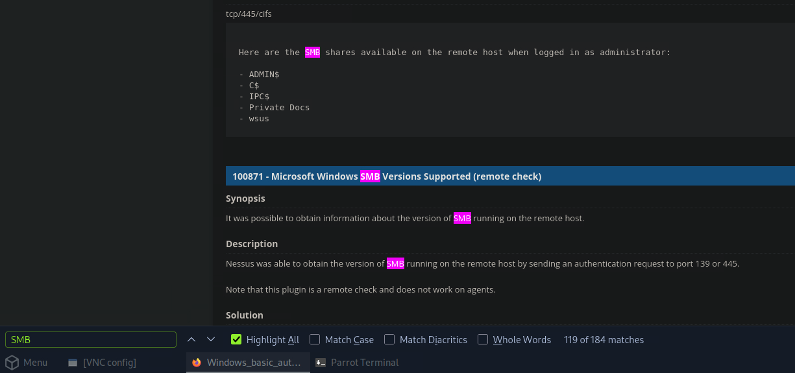
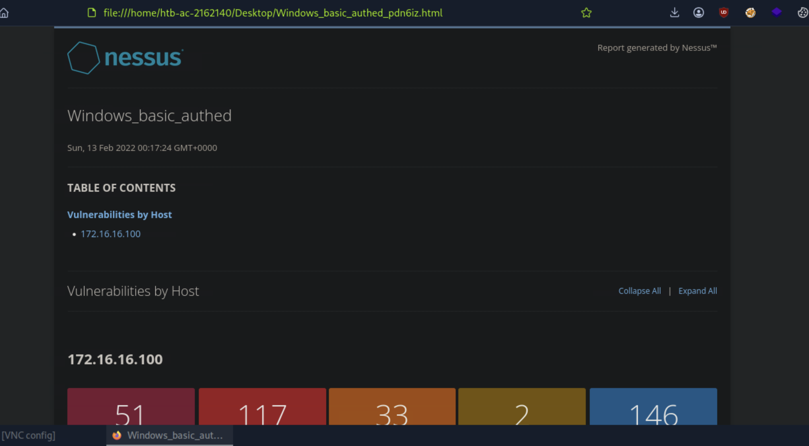
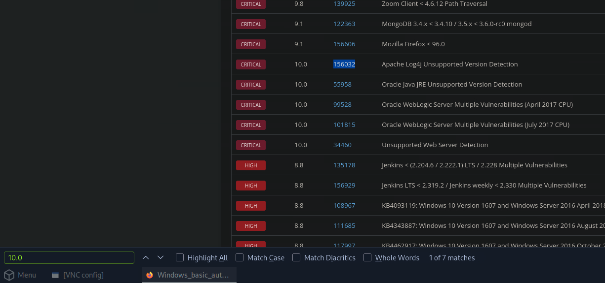
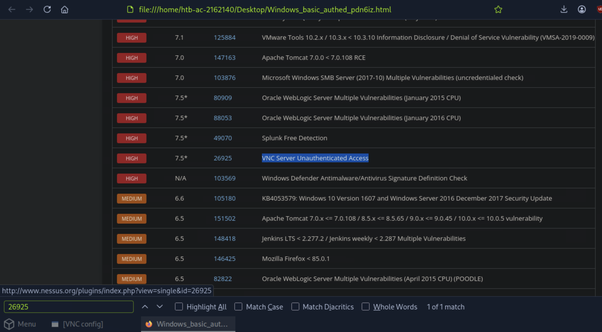
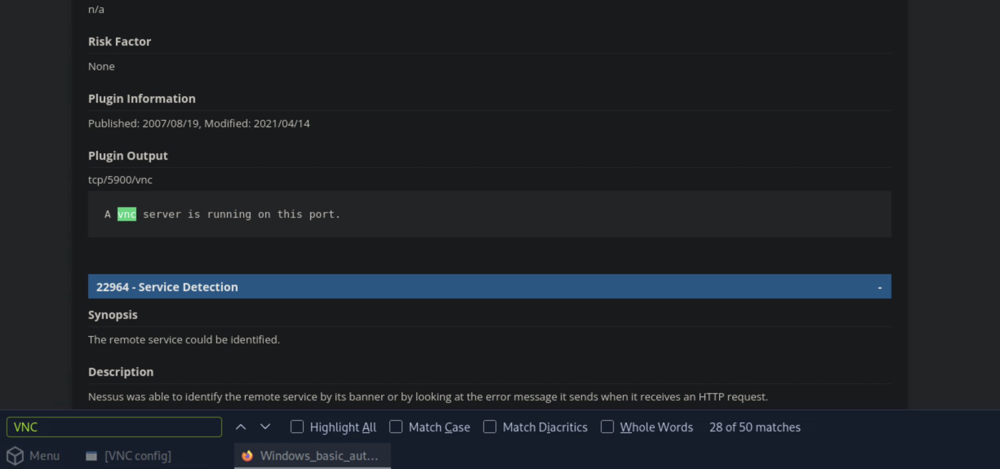

# Section 12: Nessus Skills Assessment

Module: 06. Vulnerability Assessment

---

## Questions & Answers

### 1. What is the name of one of the accessible SMB shares from the authenticated Windows scan? (One word)

Context:
Using the Detailed Vulnerabilities by Host report

**Answer:** `wsus`

---

### 2. What was the target for the authenticated scan?

Context:
Using the HTML Complete List of Vulnerabilities by Host

**Answer:** `172.16.16.100`

---

### 3. What is the plugin ID of the highest criticality vulnerability for the Windows authenticated scan?

Context:
Using the HTML Complete List of Vulnerabilities by Host report

**Answer:** `156032`

---

### 4. What is the name of the vulnerability with plugin ID 26925 from the Windows authenticated scan? (Case sensitive)

Context:
Using the HTML Complete List of Vulnerabilities by Host report

**Answer:** `VNC Server Unauthenticated Access`

---

### 5. What port is the VNC server running on in the authenticated Windows scan?

Context:
Using the Detailed Vulnerabilities by Host report

**Answer:** ``

---

[Back to Module Index](./README.md)
