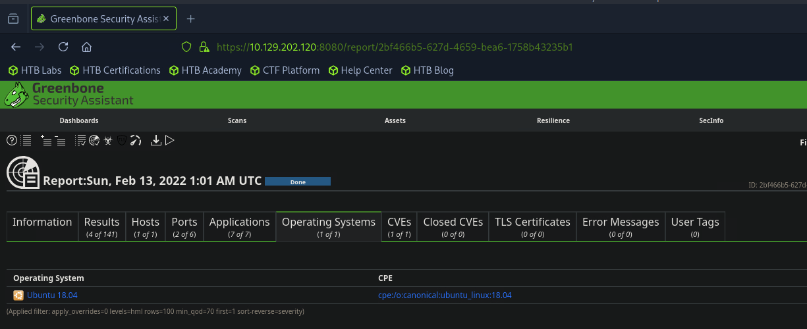
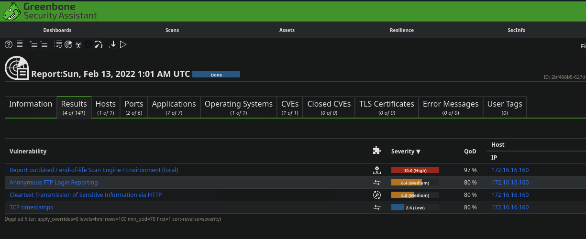

# Section 16: OpenVAS Skills Assessment

Module: 06. Vulnerability Assessment

---

## Questions & Answers

### 1. What type of operating system is the Linux host running? (one word)

Context:
Navigate to `Linux_basic` scan, then `Operating Systems`

**Answer:** `Ubuntu`

---

### 2. What type of FTP vulnerability is on the Linux host? (Case Sensitive, four words)

Context:
Navigate to `Linux_basic` scan, then `Results`

**Answer:** `Anonymous FTP Login Reporting`

---

### 3. What is the IP of the Linux host targeted for the scan?

Context:
Navigate to `Linux_basic` scan, then `Results`

**Answer:** `172.16.16.160`

---

### 4. What vulnerability is associated with the HTTP server? (Case-sensitive)

Context:
Navigate to `Linux_basic` scan, then `Results`

**Answer:** `Cleartext Transmission of Sensitive information via HTTP`

---

[Back to Module Index](./README.md)
