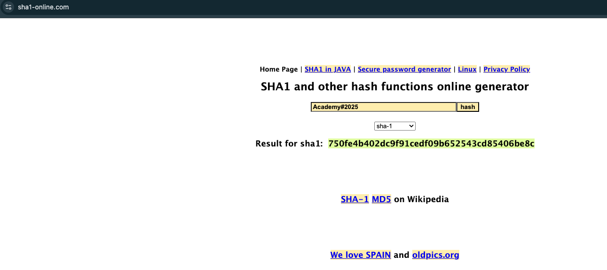

# Section 02: Introduction to Password Cracking

Module: 10. Password Attacks

---

## Questions & Answers

### 1. What is the SHA1 hash for `Academy#2025`?

Context:

**Answer:** `750fe4b402dc9f91cedf09b652543cd85406be8c`

---

[Back to Module Index](./README.md)
