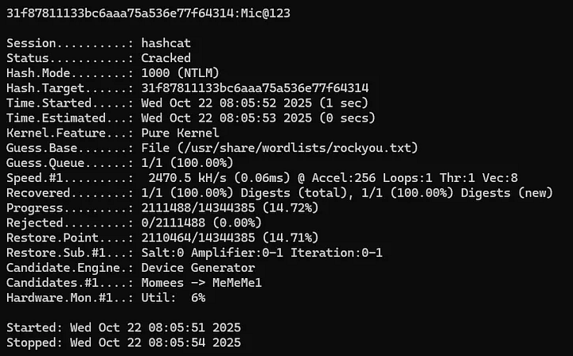

# Section 12: Attacking LSASS

Module: 10. Password Attacks

---

## Questions & Answers

### 1. What is the name of the executable file associated with the Local Security Authority Process?


**Answer:** `lsass.exe`

---

### 2. Apply the concepts taught in this section to obtain the password to the Vendor user account on the target. Submit the clear-text password as the answer. (Format: Case sensitive)

Context:
```bash
┌─[eu-academy-2]─[10.10.14.98]─[htb-ac-2162140@htb-y3nt6hf04j]─[~]
└──╼ [★]$ KRB5_CONFIG=/dev/null xfreerdp /v:10.129.202.149 /u:htb-student /p:'HTB_@cademy_stdnt!' /dynamic-resolution /cert:ignore +clipboard
```

Crack:
```bash
hashcat -a 0 -m 1000 31f87811133bc6aaa75a536e77f64314 /usr/share/wordlists/rockyou.txt
```

**Answer:** `Mic@123`

---

[Back to Module Index](./README.md)
