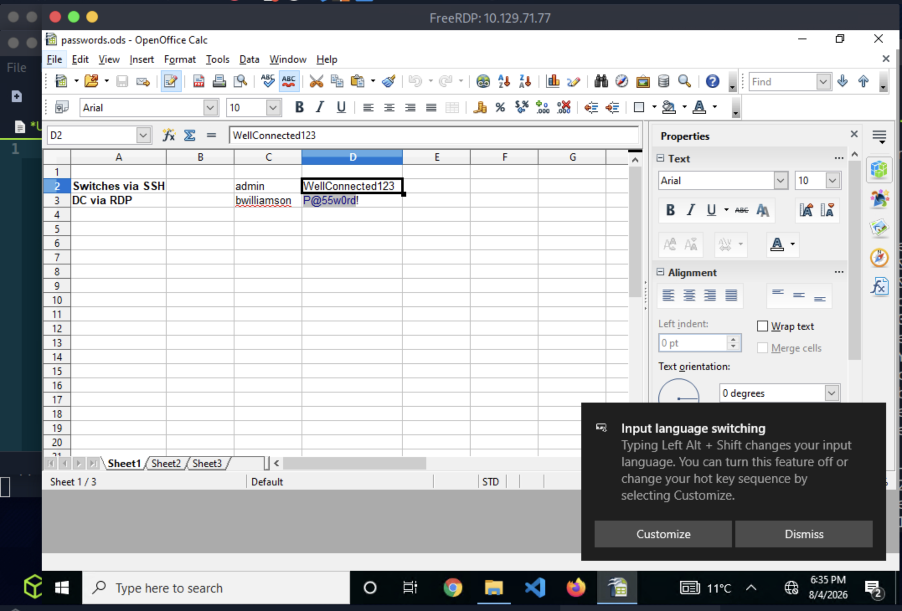
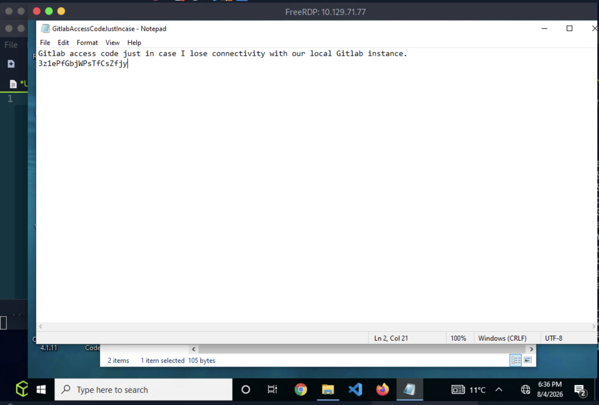
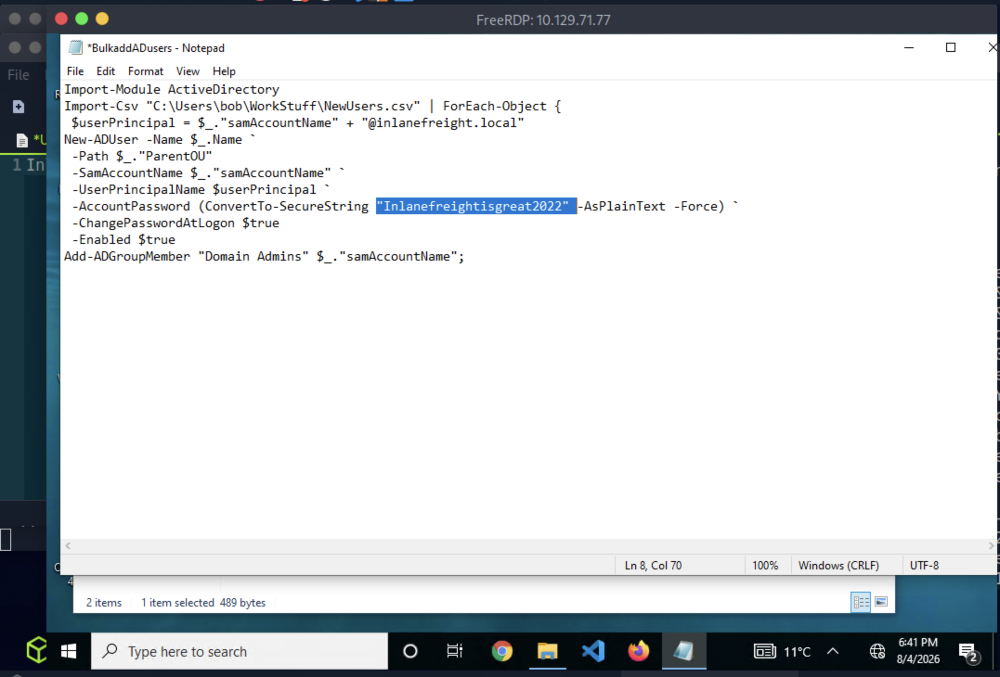
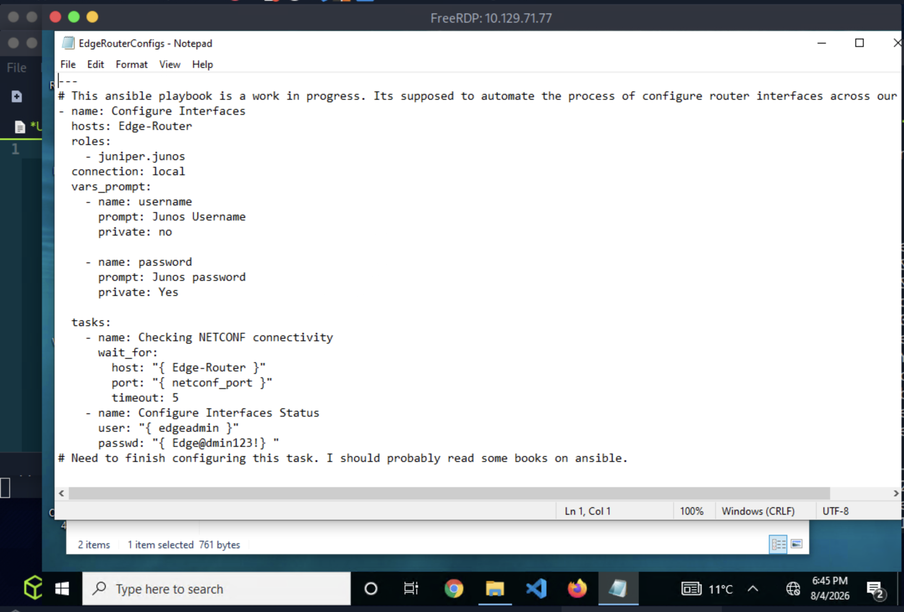

# Section 15: Credential Hunting in Windows

Module: 10. Password Attacks

---

## Questions & Answers

### 1. What password does Bob use to connect to the Switches via SSH? (Format: Case-Sensitive)

Context:
- In Desktop, found folder `WorkStuff`, inside there is a `Creds > passwords.ods`, open it and found the answer:

**Answer:** `WellConnected123`

---

### 2. What is the GitLab access code Bob uses? (Format: Case-Sensitive)

Context:
- In the same `WorkStuff`, found a text file `GitlabAccessCodeJustInCase`

**Answer:** `3z1ePfGbjWPsTfCsZfjy`

---

### 3. What credentials does Bob use with WinSCP to connect to the file server? (Format: username:password, Case-Sensitive)

Context:
- Use LaZagne to get the credentials

**Answer:** `ubuntu:FSadmin123`

---

### 4. What is the default password of every newly created Inlanefreight Domain user account? (Format: Case-Sensitive)

Context:
- Searching in the `This PC > Automations&Scripts` found `BulkaddADusers`, where we can find the default password.

**Answer:** `Inlanefreightisgreat2022`

---

### 5. What are the credentials to access the Edge-Router? (Format: username:password, Case-Sensitive)

Context:
- In `Automations&Scripts > AnsibleScripts` found `EdgeRouterConfigs` where we can find the credentials:

**Answer:** `edgeadmin:Edge@dmin123!`

---

[Back to Module Index](./README.md)
