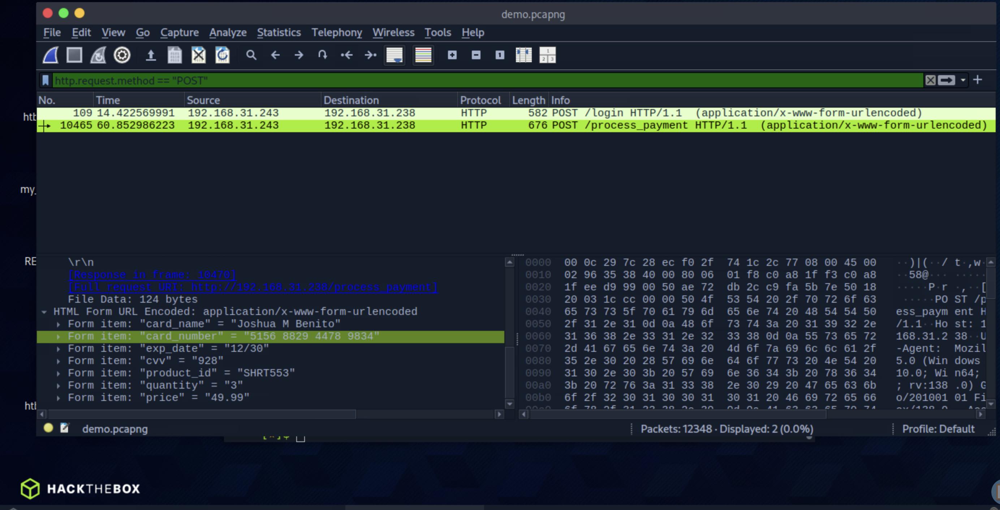
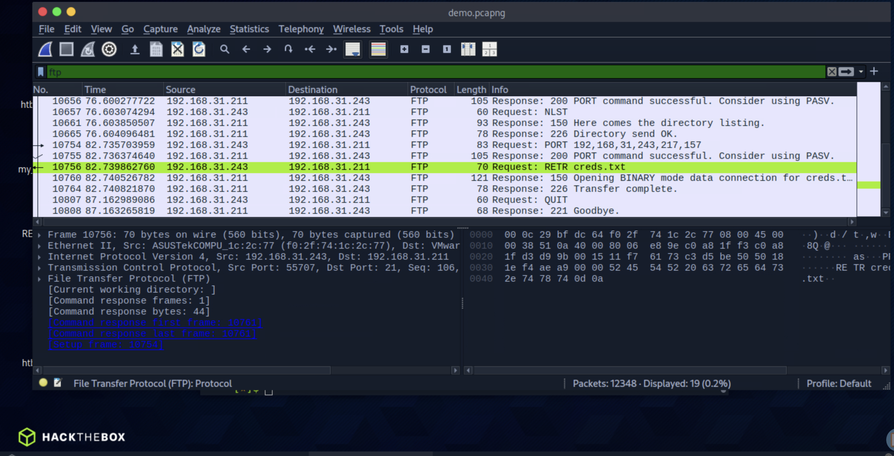

# Section 18: Credential Hunting in Network Traffic

Module: 10. Password Attacks

---

## Questions & Answers

### 1. The packet capture contains cleartext credit card information. What is the number that was transmitted?

Context:
- Open the `demo.pcapng` with Wireshard and search for `http.request.method == "POST"` to find the credit card information:


**Answer:** `5156 8829 4478 9834`

---

### 2. What is the SNMPv2 community string that was used?

Context:
```bash
┌─[eu-academy-2]─[10.10.14.98]─[htb-ac-2162140@pwnbox7]─[~/PCredz]
└──╼ [★]$ ./Pcredz -f demo.pcapng 
PCredz 2.1.0
Author: Laurent Gaffie
Contact: lgaffie@secorizon.com
X: @secorizon

CC number scanning activated

Parsing demo.pcapng...
192.168.31.243:55692 > 192.168.31.238:80
Potential password submission:
Request: username=jbenito&password=Password987%21

192.168.31.211:59022 > 192.168.31.238:161
Found SNMPv2c Community string: s3cr3tSNMPC0mmun1ty

192.168.31.243:55707 > 192.168.31.211:21
FTP User: leah

192.168.31.243:55707 > 192.168.31.211:21
FTP Pass: qwerty123


demo.pcapng parsed in: 0.8017 seconds (12,348 packets, 15.5 MB).
```

**Answer:** `s3cr3tSNMPC0mmun1ty`

---

### 3. What is the password of the user who logged into FTP?

Context:
```bash
192.168.31.243:55707 > 192.168.31.211:21
FTP Pass: qwerty123
```

**Answer:** ``

---

### 4. What file did the user download over FTP?

Context:
- In Wireshark, find `ftp` and found the file downloaded through FTP


**Answer:** `creds.txt`

---

[Back to Module Index](./README.md)
