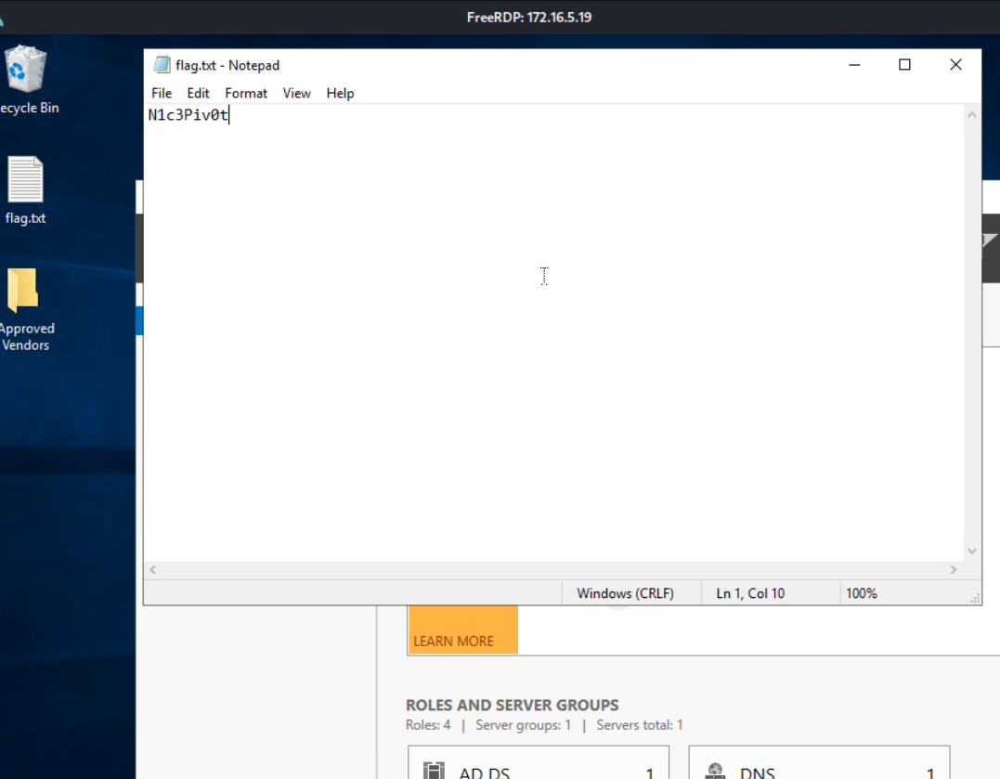

# Section 03: Dynamic Port Forwarding with SSH and SOCKS Tunneling

Module: 12. Pivoting, Tunneling, and Port Forwarding

---

## Questions & Answers

### 1. You have successfully captured credentials to an external facing Web Server. Connect to the target and list the network interfaces. How many network interfaces does the target web server have? (Including the loopback interface)

Context:
```bash
ubuntu@WEB01:~$ ifconfig
ens192: flags=4163<UP,BROADCAST,RUNNING,MULTICAST>  mtu 1500
        inet 10.129.105.49  netmask 255.255.0.0  broadcast 10.129.255.255
        inet6 fe80::a0de:adff:fe27:1681  prefixlen 64  scopeid 0x20<link>
        inet6 dead:beef::a0de:adff:fe27:1681  prefixlen 64  scopeid 0x0<global>
        ether a2:de:ad:27:16:81  txqueuelen 1000  (Ethernet)
        RX packets 8444  bytes 547403 (547.4 KB)
        RX errors 0  dropped 0  overruns 0  frame 0
        TX packets 296  bytes 26374 (26.3 KB)
        TX errors 0  dropped 0 overruns 0  carrier 0  collisions 0

ens224: flags=4163<UP,BROADCAST,RUNNING,MULTICAST>  mtu 1500
        inet 172.16.5.129  netmask 255.255.254.0  broadcast 172.16.5.255
        inet6 fe80::a0de:adff:fe4f:cbd1  prefixlen 64  scopeid 0x20<link>
        ether a2:de:ad:4f:cb:d1  txqueuelen 1000  (Ethernet)
        RX packets 149  bytes 11854 (11.8 KB)
        RX errors 0  dropped 12  overruns 0  frame 0
        TX packets 125  bytes 9022 (9.0 KB)
        TX errors 0  dropped 0 overruns 0  carrier 0  collisions 0

lo: flags=73<UP,LOOPBACK,RUNNING>  mtu 65536
        inet 127.0.0.1  netmask 255.0.0.0
        inet6 ::1  prefixlen 128  scopeid 0x10<host>
        loop  txqueuelen 1000  (Local Loopback)
        RX packets 760  bytes 59950 (59.9 KB)
        RX errors 0  dropped 0  overruns 0  frame 0
        TX packets 760  bytes 59950 (59.9 KB)
        TX errors 0  dropped 0 overruns 0  carrier 0  collisions 0
```

**Answer:** `3`

---

### 2. Apply the concepts taught in this section to pivot to the internal network and use RDP (credentials: victor:pass@123) to take control of the Windows target on 172.16.5.19. Submit the contents of Flag.txt located on the Desktop.

Context:
```bash
┌──(jameskaois㉿kali)-[~]
└─$ ssh -D 9999 ubuntu@10.129.105.49
┌──(jameskaois㉿kali)-[~]
└─$ proxychains4 xfreerdp /v:172.16.5.19 /u:victor /p:pass@123 /dynamic-resolution /cert:ignore +clipboard /sound:sys:pulse
```


**Answer:** `N1c3Piv0t`

---

[Back to Module Index](./README.md)
