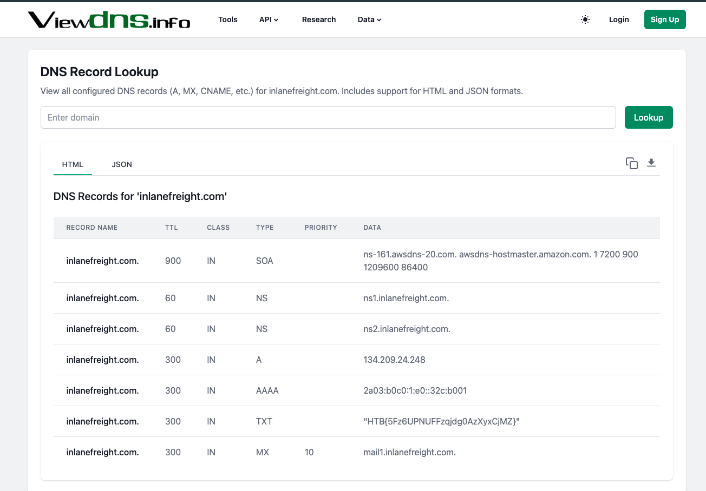

# Section 04: External Recon and Emuneration Principles

Module: 13. Active Directory Enumeration & Attacks

---

## Questions & Answers

### 1. While looking at inlanefreights public records; A flag can be seen. Find the flag and submit it. ( format == HTB{******} )

Context:

**Answer:** `HTB{5Fz6UPNUFFzqjdg0AzXyxCjMZ}`

---

[Back to Module Index](./README.md)
