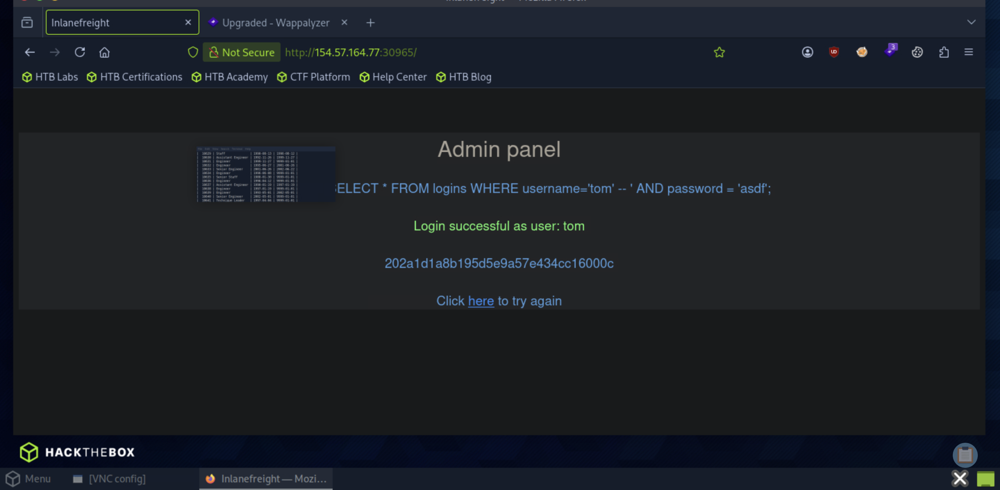

# Section 09: Subverting Query Logic

Module: 17. SQL Injection Fundamentals

---

## Questions & Answers

### 1. Try to log in as the user 'tom'. What is the flag value shown after you successfully log in?

Context:
- Login with `tom:abc` got
```sql
 Executing query: SELECT * FROM logins WHERE username='tom' AND password = 'abc';
```
- Injection with `tom' -- :<anything>`:


**Answer:** `202a1d1a8b195d5e9a57e434cc16000c`

---

[Back to Module Index](./README.md)
