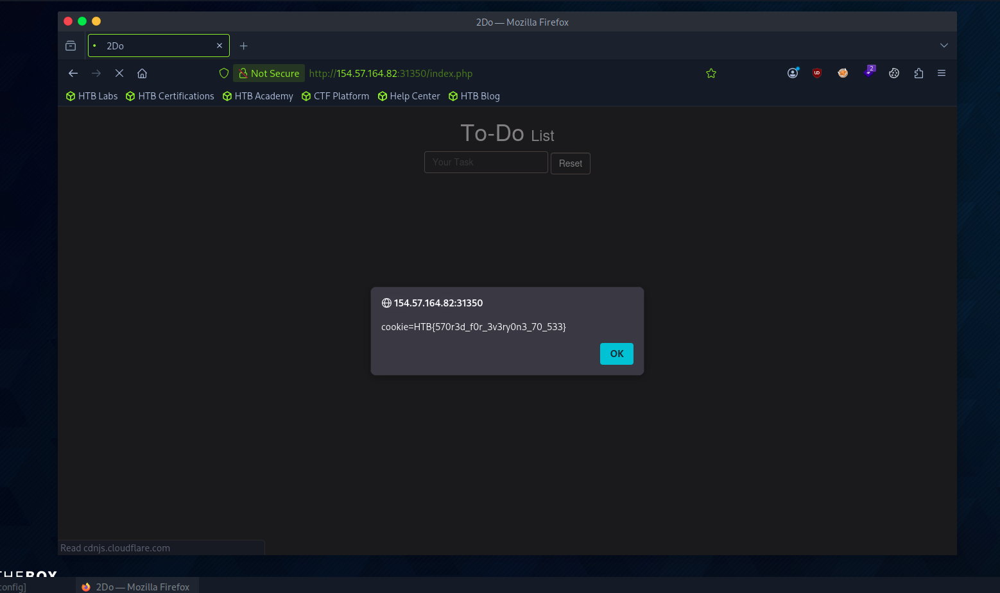

# Section 02: Stored XSS

Module: 19. Cross-Site Scripting (XSS)

---

## Questions & Answers

### 1. To get the flag, use the same payload we used above, but change its JavaScript code to show the cookie instead of showing the url.

Context:
```html
<script>alert(document.cookie)</script>
```


**Answer:** `HTB{570r3d_f0r_3v3ry0n3_70_533}`

---

[Back to Module Index](./README.md)
