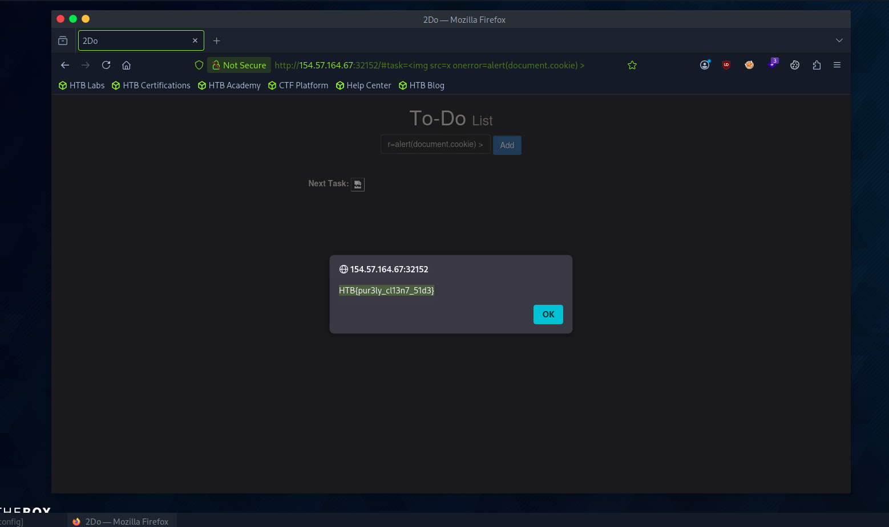

# Section 04: DOM XSS

Module: 19. Cross-Site Scripting (XSS)

---

## Questions & Answers

### 1. To get the flag, use the same payload we used above, but change its JavaScript code to show the cookie instead of showing the url.

Context:
```

```


**Answer:** `HTB{pur3ly_cl13n7_51d3}`

---

[Back to Module Index](./README.md)
