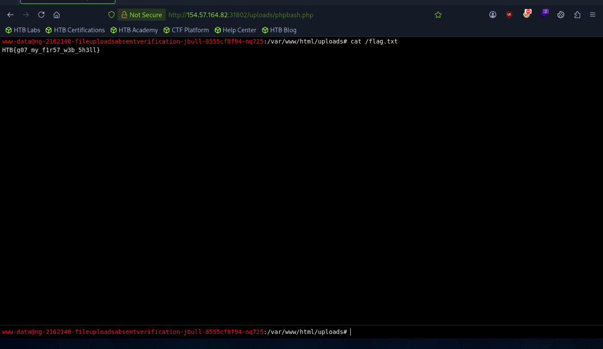

# Section 03: Upload Exploitation

Module: 21. File Upload Attacks

---

## Questions & Answers

### 1. Try to exploit the upload feature to upload a web shell and get the content of /flag.txt

Context:
- Use the webshell [phpbash](https://github.com/Arrexel/phpbash), upload it, and get access through `/uploads/phpbash.php`, then `cat /flag.txt`

**Answer:** `HTB{g07_my_f1r57_w3b_5h3ll}`

---

[Back to Module Index](./README.md)
