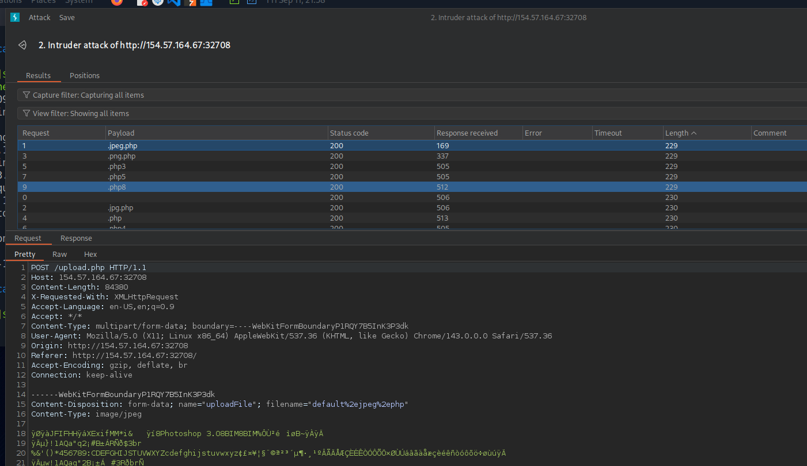
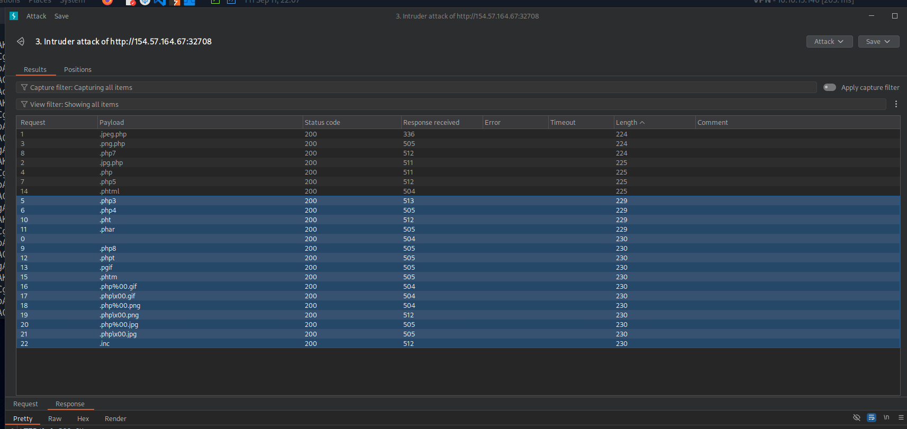
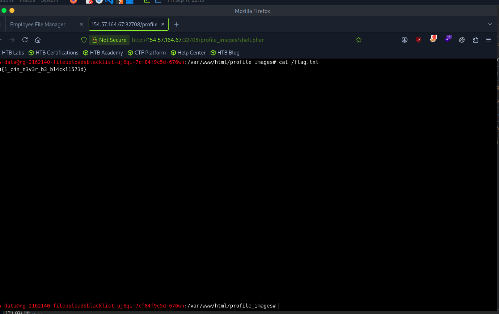

# Section 05: Blacklist Filters

Module: 21. File Upload Attacks

---

## Questions & Answers

### 1. Try to find an extension that is not blacklisted and can execute PHP code on the web server, and use it to read "/flag.txt"

Context:
- Catch the request to `upload.php` and fuzzing for allowed extensions:

- `229` and `230` in the raw response indicates the file was uploaded successfully, all extensions allowed:

- The only extension that works correctly is `.phar`:

**Answer:** `HTB{1_c4n_n3v3r_b3_bl4ckl1573d}`

---

[Back to Module Index](./README.md)
