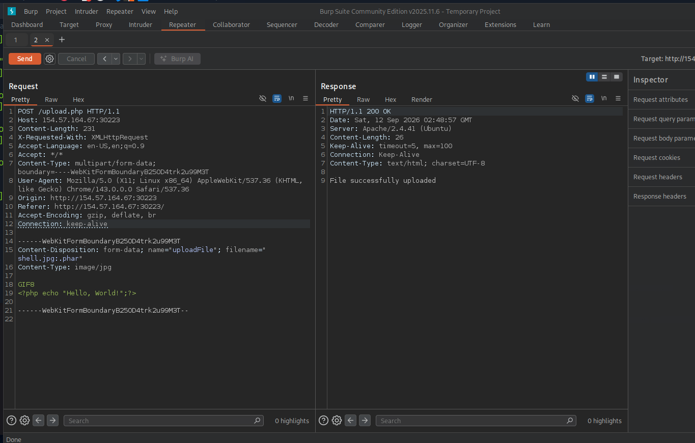
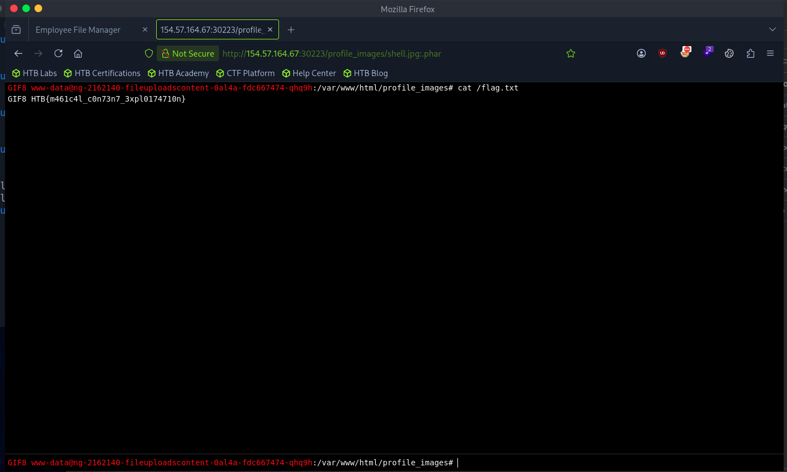

# Section 07: Type Filters

Module: 21. File Upload Attacks

---

## Questions & Answers

### 1. The above server employs Client-Side, Blacklist, Whitelist, Content-Type, and MIME-Type filters to ensure the uploaded file is an image. Try to combine all of the attacks you learned so far to bypass these filters and upload a PHP file and read the flag at "/flag.txt"

Context:
- Use the wordlist from previous exercise and fuzzing the allowed extension with `GIF8` content and `Content-Type: image/jpg` in the request, got this allowed extension `shell.jpg:.phar`:

- Upload the shell and get the flag:

**Answer:** `HTB{m461c4l_c0n73n7_3xpl0174710n}`

---

[Back to Module Index](./README.md)
