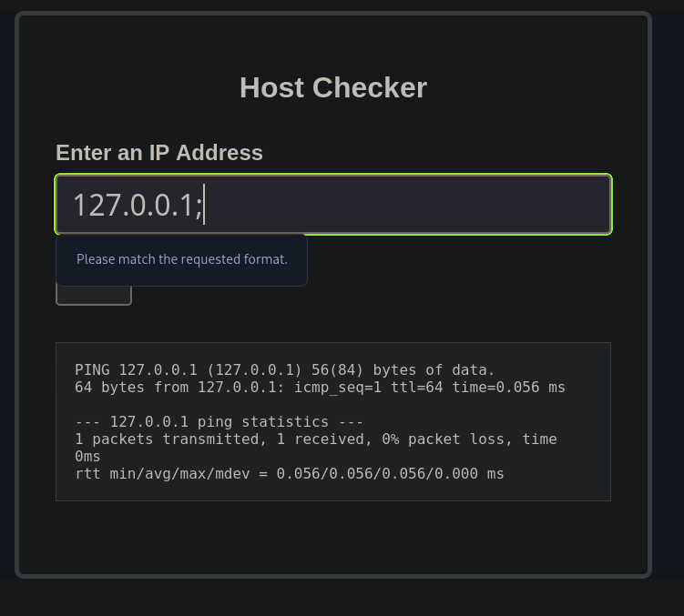

# Section 02: Detection

Module: 22. Command Injections

---

## Questions & Answers

### 1. Try adding any of the injection operators after the ip in IP field. What did the error message say (in English)?

Context:
- Tried `127.0.0.1;`

**Answer:** `Please match the request format.`

---

[Back to Module Index](./README.md)
