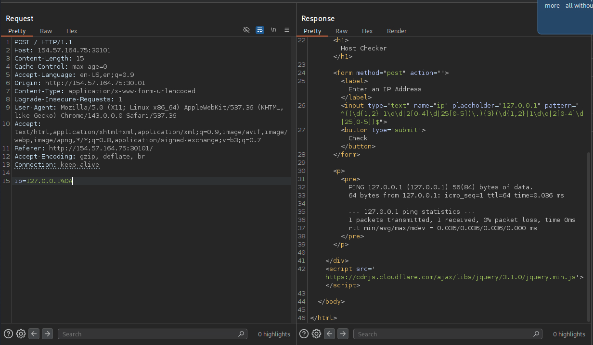

# Section 05: Identifying Filters

Module: 22. Command Injections

---

## Questions & Answers

### 1. Try all other injection operators to see if any of them is not blacklisted. Which of (new-line, &, |) is not blacklisted by the web application?

Context:
- Capture the request with Burp Suite for easier emunerating, tried all variants of (new-line, &, |), all the variants got `Invalid input` except:

**Answer:** `new-line`

---

[Back to Module Index](./README.md)
