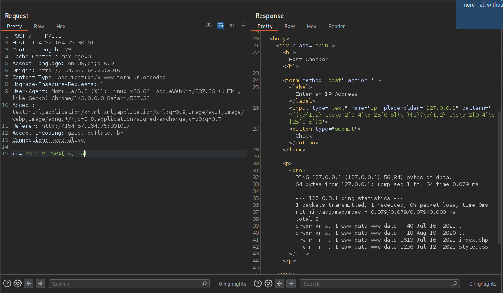

# Section 06: Bypassing Space Filters

Module: 22. Command Injections

---

## Questions & Answers

### 1. Use what you learned in this section to execute the command 'ls -la'. What is the size of the 'index.php' file?

Context:

**Answer:** `1613`

---

[Back to Module Index](./README.md)
