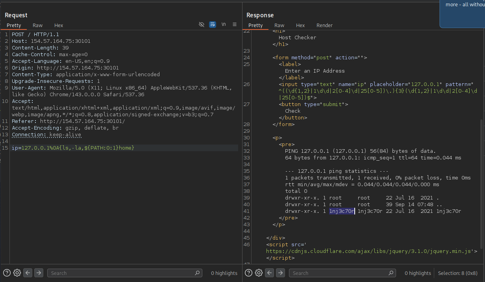

# Section 07: Bypassing Other Blacklisted Characters

Module: 22. Command Injections

---

## Questions & Answers

### 1. Use what you learned in this section to find name of the user in the '/home' folder. What user did you find?

Context:
- Use this payload `ip=127.0.0.1%0A{ls,-la,${PATH:0:1}home}`

**Answer:** `1nj3c70r`

---

[Back to Module Index](./README.md)
