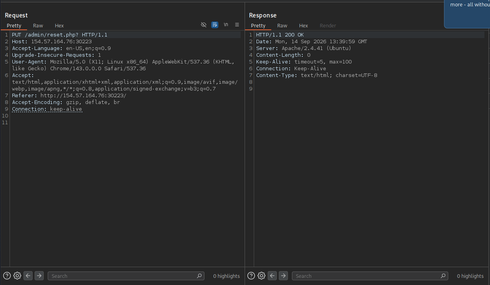

# Section 03: Bypassing Basic Authentication

Module: 23. Web Attacks

---

## Questions & Answers

### 1. Try to use what you learned in this section to access the 'reset.php' page and delete all files. Once all files are deleted, you should get the flag.

Context:
- Intercept the `/admin/reset.php` request, send the request to Repeater, `PUT` is what we're looking for:

**Answer:** `HTB{4lw4y5_c0v3r_4ll_v3rb5}`

---

[Back to Module Index](./README.md)
